# AWS RAG Agent Architecture

This document provides a comprehensive overview of the RAG (Retrieval-Augmented Generation) Agent architecture, including system diagrams, data flows, and component interactions.

---

## Table of Contents

1. [System Overview](#system-overview)
2. [High-Level Architecture](#high-level-architecture)
3. [Component Architecture](#component-architecture)
4. [Document Ingestion Pipeline](#document-ingestion-pipeline)
5. [Query & Retrieval Flow](#query--retrieval-flow)
6. [Deployment Architecture](#deployment-architecture)
7. [Data Models](#data-models)
8. [Tool System](#tool-system)

---

## System Overview

The RAG Agent is an AI-powered question-answering system that combines:

- **Retrieval**: Finding relevant documents from a knowledge base
- **Augmentation**: Enriching prompts with retrieved context
- **Generation**: Using LLMs to generate accurate, grounded responses

### Key Technologies

| Component        | Technology                  |
| ---------------- | --------------------------- |
| LLM Provider     | AWS Bedrock (Claude, Titan) |
| Vector Storage   | Amazon S3 Vectors           |
| Metadata Storage | Amazon DynamoDB             |
| Document Storage | Amazon S3                   |
| Embeddings       | Bedrock Titan Embeddings    |
| API Framework    | FastAPI                     |
| Infrastructure   | AWS CDK                     |

---

## High-Level Architecture

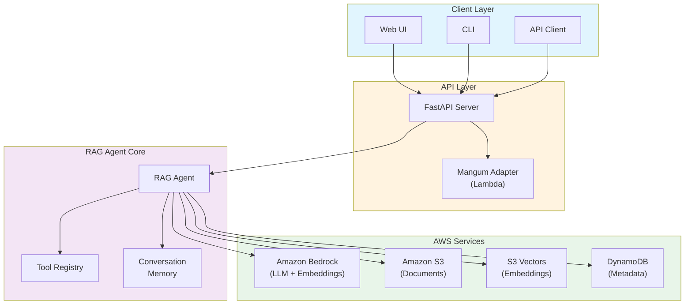
```mermaid
flowchart TB
    subgraph Client["Client Layer"]
        WebUI["Web UI"]
        CLI["CLI"]
        API_Client["API Client"]
    end

    subgraph API["API Layer"]
        FastAPI["FastAPI Server"]
        Mangum["Mangum Adapter<br/>(Lambda)"]
    end

    subgraph Agent["RAG Agent Core"]
        RAGAgent["RAG Agent"]
        ToolRegistry["Tool Registry"]
        ConvMemory["Conversation<br/>Memory"]
    end

    subgraph Services["AWS Services"]
        Bedrock["Amazon Bedrock<br/>(LLM + Embeddings)"]
        S3["Amazon S3<br/>(Documents)"]
        S3Vectors["S3 Vectors<br/>(Embeddings)"]
        DynamoDB["DynamoDB<br/>(Metadata)"]
    end

    WebUI --> FastAPI
    CLI --> FastAPI
    API_Client --> FastAPI
    FastAPI --> Mangum
    FastAPI --> RAGAgent
    RAGAgent --> ToolRegistry
    RAGAgent --> ConvMemory
    RAGAgent --> Bedrock
    RAGAgent --> S3
    RAGAgent --> S3Vectors
    RAGAgent --> DynamoDB

    style Client fill:#e1f5fe
    style API fill:#fff3e0
    style Agent fill:#f3e5f5
    style Services fill:#e8f5e9
```

---

## Component Architecture

### Core Components

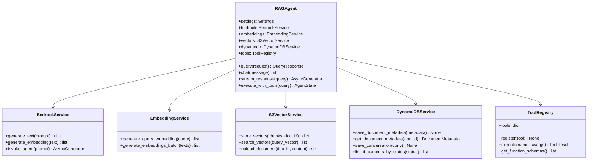
```mermaid
classDiagram
    class RAGAgent {
        +settings: Settings
        +bedrock: BedrockService
        +embeddings: EmbeddingService
        +vectors: S3VectorService
        +dynamodb: DynamoDBService
        +tools: ToolRegistry
        +query(request) QueryResponse
        +chat(message) str
        +stream_response(query) AsyncGenerator
        +execute_with_tools(query) AgentState
    }

    class BedrockService {
        +generate_text(prompt) dict
        +generate_embedding(text) list
        +invoke_agent(prompt) AsyncGenerator
    }

    class EmbeddingService {
        +generate_query_embedding(query) list
        +generate_embeddings_batch(texts) list
    }

    class S3VectorService {
        +store_vectors(chunks, doc_id) dict
        +search_vectors(query_vector) list
        +upload_document(doc_id, content) str
    }

    class DynamoDBService {
        +save_document_metadata(metadata) None
        +get_document_metadata(doc_id) DocumentMetadata
        +save_conversation(conv) None
        +list_documents_by_status(status) list
    }

    class ToolRegistry {
        +tools: dict
        +register(tool) None
        +execute(name, kwargs) ToolResult
        +get_function_schemas() list
    }

    RAGAgent --> BedrockService
    RAGAgent --> EmbeddingService
    RAGAgent --> S3VectorService
    RAGAgent --> DynamoDBService
    RAGAgent --> ToolRegistry
```

### Service Layer

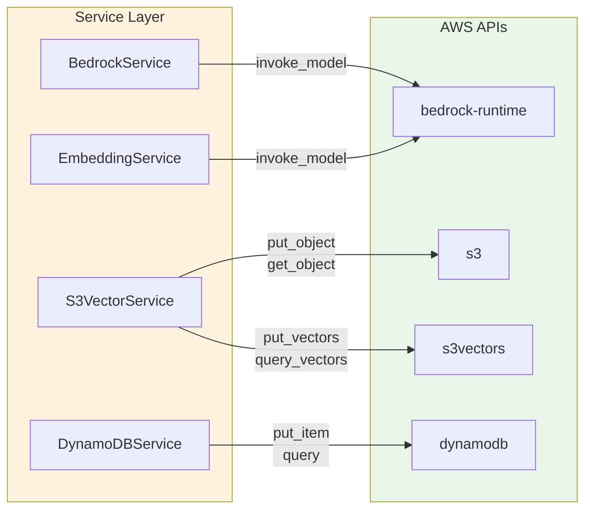
```mermaid
flowchart LR
    subgraph Services["Service Layer"]
        direction TB
        BS["BedrockService"]
        ES["EmbeddingService"]
        VS["S3VectorService"]
        DS["DynamoDBService"]
    end

    subgraph AWS["AWS APIs"]
        direction TB
        BR["bedrock-runtime"]
        S3["s3"]
        S3V["s3vectors"]
        DDB["dynamodb"]
    end

    BS -->|"invoke_model"| BR
    ES -->|"invoke_model"| BR
    VS -->|"put_vectors<br/>query_vectors"| S3V
    VS -->|"put_object<br/>get_object"| S3
    DS -->|"put_item<br/>query"| DDB

    style Services fill:#fff3e0
    style AWS fill:#e8f5e9
```

---

## Document Ingestion Pipeline

The ingestion pipeline processes documents through several stages before they're available for retrieval.

### Pipeline Flow

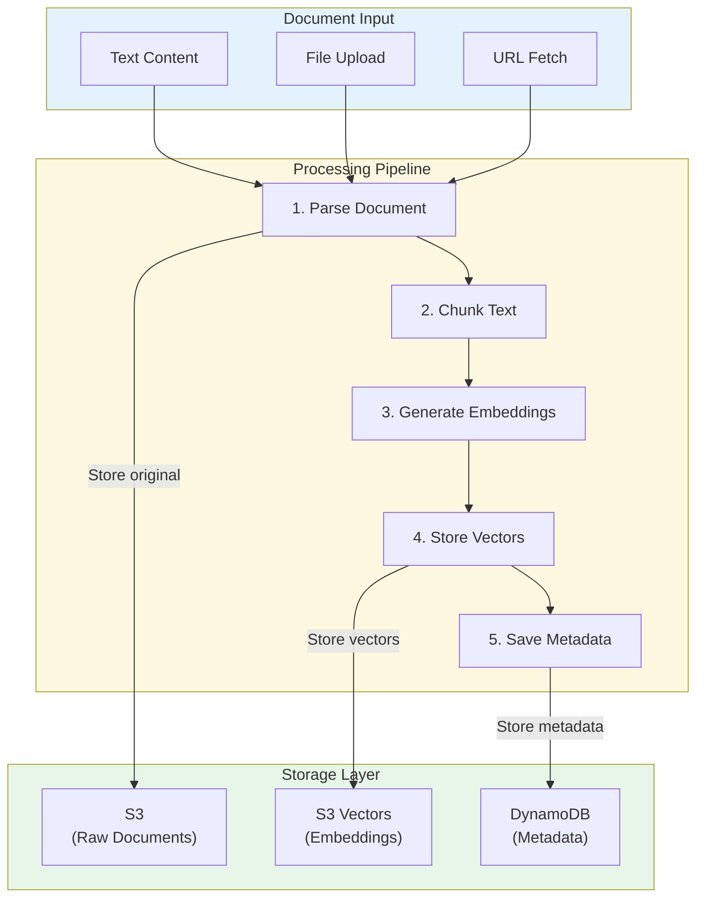
```mermaid
flowchart TD
    subgraph Input["Document Input"]
        TextInput["Text Content"]
        FileUpload["File Upload"]
        URLFetch["URL Fetch"]
    end

    subgraph Processing["Processing Pipeline"]
        Parse["1. Parse Document"]
        Chunk["2. Chunk Text"]
        Embed["3. Generate Embeddings"]
        Store["4. Store Vectors"]
        Meta["5. Save Metadata"]
    end

    subgraph Storage["Storage Layer"]
        S3Doc["S3<br/>(Raw Documents)"]
        S3Vec["S3 Vectors<br/>(Embeddings)"]
        DDB["DynamoDB<br/>(Metadata)"]
    end

    TextInput --> Parse
    FileUpload --> Parse
    URLFetch --> Parse

    Parse --> Chunk
    Chunk --> Embed
    Embed --> Store
    Store --> Meta

    Parse -->|"Store original"| S3Doc
    Store -->|"Store vectors"| S3Vec
    Meta -->|"Store metadata"| DDB

    style Input fill:#e3f2fd
    style Processing fill:#fff8e1
    style Storage fill:#e8f5e9
```

### Chunking Strategy

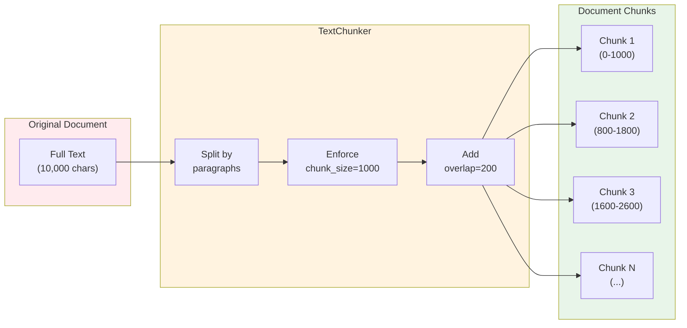
```mermaid
flowchart LR
    subgraph Document["Original Document"]
        Doc["Full Text<br/>(10,000 chars)"]
    end

    subgraph Chunker["TextChunker"]
        Split["Split by<br/>paragraphs"]
        Size["Enforce<br/>chunk_size=1000"]
        Overlap["Add<br/>overlap=200"]
    end

    subgraph Chunks["Document Chunks"]
        C1["Chunk 1<br/>(0-1000)"]
        C2["Chunk 2<br/>(800-1800)"]
        C3["Chunk 3<br/>(1600-2600)"]
        CN["Chunk N<br/>(...)"]
    end

    Doc --> Split --> Size --> Overlap
    Overlap --> C1
    Overlap --> C2
    Overlap --> C3
    Overlap --> CN

    style Document fill:#ffebee
    style Chunker fill:#fff3e0
    style Chunks fill:#e8f5e9
```

### Embedding Generation

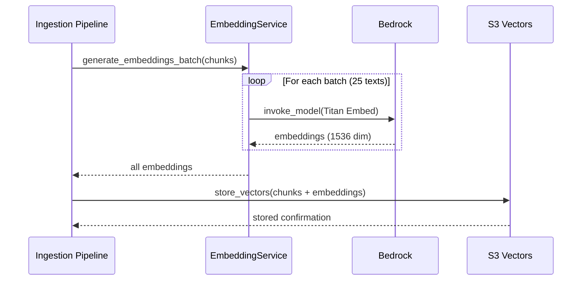
```mermaid
sequenceDiagram
    participant IP as Ingestion Pipeline
    participant ES as EmbeddingService
    participant BR as Bedrock
    participant S3V as S3 Vectors

    IP->>ES: generate_embeddings_batch(chunks)

    loop For each batch (25 texts)
        ES->>BR: invoke_model(Titan Embed)
        BR-->>ES: embeddings (1536 dim)
    end

    ES-->>IP: all embeddings

    IP->>S3V: store_vectors(chunks + embeddings)
    S3V-->>IP: stored confirmation
```

---

## Query & Retrieval Flow

### RAG Query Pipeline

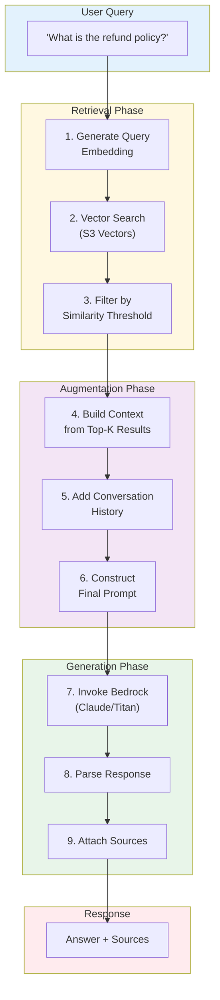
```mermaid
flowchart TD
    subgraph Query["User Query"]
        Q["'What is the refund policy?'"]
    end

    subgraph Retrieval["Retrieval Phase"]
        QE["1. Generate Query<br/>Embedding"]
        VS["2. Vector Search<br/>(S3 Vectors)"]
        Filter["3. Filter by<br/>Similarity Threshold"]
    end

    subgraph Augmentation["Augmentation Phase"]
        CTX["4. Build Context<br/>from Top-K Results"]
        HIST["5. Add Conversation<br/>History"]
        PROMPT["6. Construct<br/>Final Prompt"]
    end

    subgraph Generation["Generation Phase"]
        LLM["7. Invoke Bedrock<br/>(Claude/Titan)"]
        RESP["8. Parse Response"]
        SRC["9. Attach Sources"]
    end

    subgraph Output["Response"]
        ANS["Answer + Sources"]
    end

    Q --> QE --> VS --> Filter
    Filter --> CTX --> HIST --> PROMPT
    PROMPT --> LLM --> RESP --> SRC --> ANS

    style Query fill:#e3f2fd
    style Retrieval fill:#fff8e1
    style Augmentation fill:#f3e5f5
    style Generation fill:#e8f5e9
    style Output fill:#ffebee
```

### Detailed Query Sequence

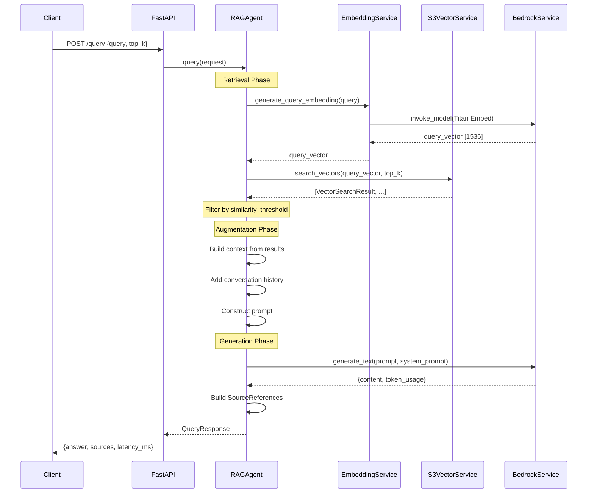
```mermaid
sequenceDiagram
    participant C as Client
    participant API as FastAPI
    participant RA as RAGAgent
    participant ES as EmbeddingService
    participant VS as S3VectorService
    participant BS as BedrockService

    C->>API: POST /query {query, top_k}
    API->>RA: query(request)

    Note over RA: Retrieval Phase
    RA->>ES: generate_query_embedding(query)
    ES->>BS: invoke_model(Titan Embed)
    BS-->>ES: query_vector [1536]
    ES-->>RA: query_vector

    RA->>VS: search_vectors(query_vector, top_k)
    VS-->>RA: [VectorSearchResult, ...]

    Note over RA: Filter by similarity_threshold

    Note over RA: Augmentation Phase
    RA->>RA: Build context from results
    RA->>RA: Add conversation history
    RA->>RA: Construct prompt

    Note over RA: Generation Phase
    RA->>BS: generate_text(prompt, system_prompt)
    BS-->>RA: {content, token_usage}

    RA->>RA: Build SourceReferences
    RA-->>API: QueryResponse
    API-->>C: {answer, sources, latency_ms}
```

### ReAct Agent Loop (Tool-based)

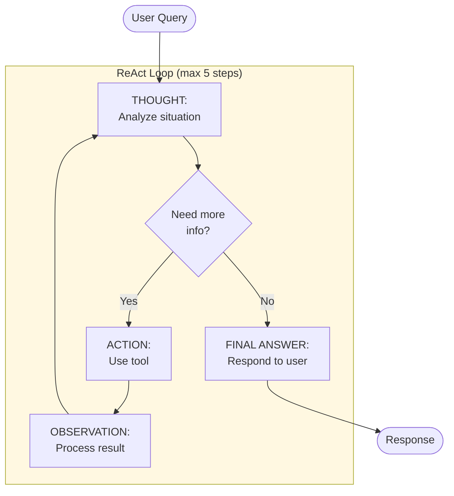
```mermaid
flowchart TD
    subgraph Loop["ReAct Loop (max 5 steps)"]
        Think["THOUGHT:<br/>Analyze situation"]
        Decide{"Need more<br/>info?"}
        Tool["ACTION:<br/>Use tool"]
        Observe["OBSERVATION:<br/>Process result"]
        Answer["FINAL ANSWER:<br/>Respond to user"]
    end

    Start([User Query]) --> Think
    Think --> Decide
    Decide -->|Yes| Tool
    Tool --> Observe
    Observe --> Think
    Decide -->|No| Answer
    Answer --> End([Response])

    style Loop fill:#fff8e1
```

---

## Deployment Architecture

### AWS Lambda Deployment

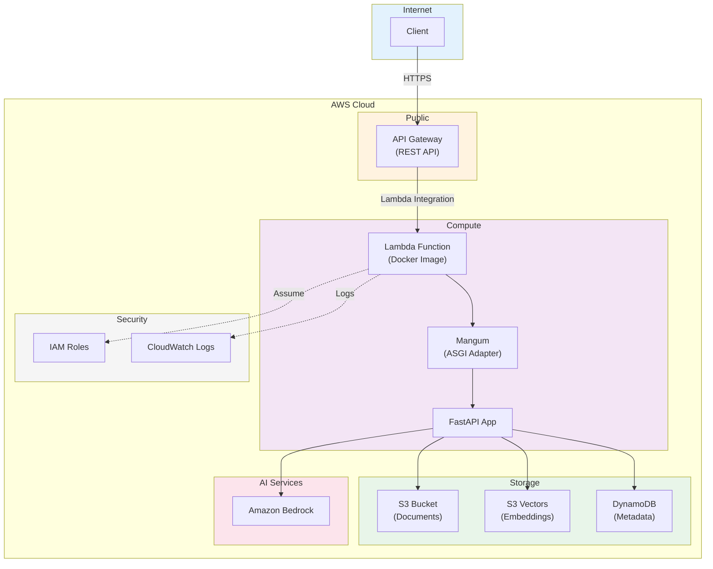
```mermaid
flowchart TB
    subgraph Internet["Internet"]
        Client["Client"]
    end

    subgraph AWS["AWS Cloud"]
        subgraph Public["Public"]
            APIGW["API Gateway<br/>(REST API)"]
        end

        subgraph Compute["Compute"]
            Lambda["Lambda Function<br/>(Docker Image)"]
            Mangum["Mangum<br/>(ASGI Adapter)"]
            FastAPI["FastAPI App"]
        end

        subgraph Storage["Storage"]
            S3["S3 Bucket<br/>(Documents)"]
            S3V["S3 Vectors<br/>(Embeddings)"]
            DDB["DynamoDB<br/>(Metadata)"]
        end

        subgraph AI["AI Services"]
            BR["Amazon Bedrock"]
        end

        subgraph Security["Security"]
            IAM["IAM Roles"]
            CW["CloudWatch Logs"]
        end
    end

    Client -->|HTTPS| APIGW
    APIGW -->|Lambda Integration| Lambda
    Lambda --> Mangum --> FastAPI
    FastAPI --> S3
    FastAPI --> S3V
    FastAPI --> DDB
    FastAPI --> BR
    Lambda -.->|Assume| IAM
    Lambda -.->|Logs| CW

    style Internet fill:#e3f2fd
    style Public fill:#fff3e0
    style Compute fill:#f3e5f5
    style Storage fill:#e8f5e9
    style AI fill:#fce4ec
    style Security fill:#f5f5f5
```

### CDK Stack Structure

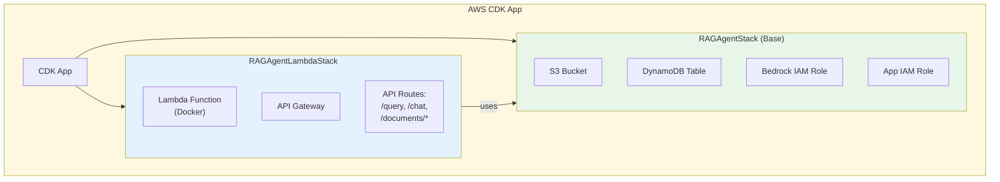
```mermaid
flowchart TB
    subgraph CDK["AWS CDK App"]
        App["CDK App"]

        subgraph BaseStack["RAGAgentStack (Base)"]
            S3B["S3 Bucket"]
            DDB["DynamoDB Table"]
            IAM_BR["Bedrock IAM Role"]
            IAM_APP["App IAM Role"]
        end

        subgraph LambdaStack["RAGAgentLambdaStack"]
            LFN["Lambda Function<br/>(Docker)"]
            APIGW["API Gateway"]
            Routes["API Routes:<br/>/query, /chat,<br/>/documents/*"]
        end
    end

    App --> BaseStack
    App --> LambdaStack
    LambdaStack -->|"uses"| BaseStack

    style CDK fill:#fff8e1
    style BaseStack fill:#e8f5e9
    style LambdaStack fill:#e3f2fd
```

---

## Data Models

### DynamoDB Table Schema

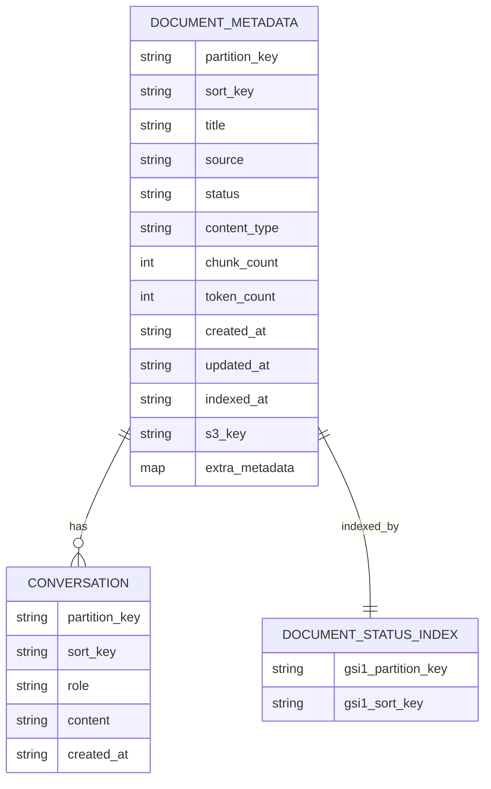
```mermaid
erDiagram
    DOCUMENT_METADATA {
        string partition_key
        string sort_key
        string title
        string source
        string status
        string content_type
        int chunk_count
        int token_count
        string created_at
        string updated_at
        string indexed_at
        string s3_key
        map extra_metadata
    }

    CONVERSATION {
        string partition_key
        string sort_key
        string role
        string content
        string created_at
    }

    DOCUMENT_STATUS_INDEX {
        string gsi1_partition_key
        string gsi1_sort_key
    }

    DOCUMENT_METADATA ||--o{ CONVERSATION : has
    DOCUMENT_METADATA ||--|| DOCUMENT_STATUS_INDEX : indexed_by
```

**Key Patterns:**

| Entity              | PK (Partition Key)       | SK (Sort Key)         |
| ------------------- | ------------------------ | --------------------- |
| Document Metadata   | `DOC#<document_id>`      | `METADATA`            |
| Conversation        | `CONV#<conversation_id>` | `MESSAGE#<timestamp>` |
| GSI1 (Status Index) | `STATUS#<status>`        | `<created_at>`        |

**Status Values:** `PENDING` | `PROCESSING` | `INDEXED` | `FAILED`

### Core Data Classes

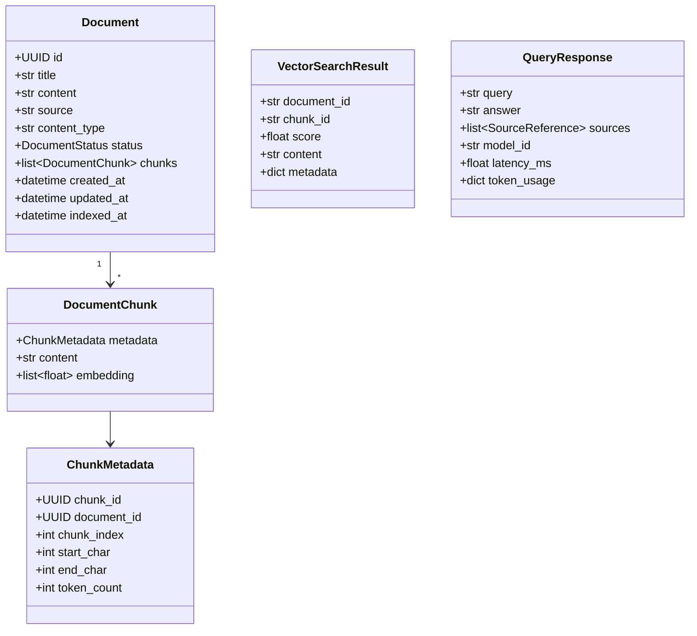
```mermaid
classDiagram
    class Document {
        +UUID id
        +str title
        +str content
        +str source
        +str content_type
        +DocumentStatus status
        +list~DocumentChunk~ chunks
        +datetime created_at
        +datetime updated_at
        +datetime indexed_at
    }

    class DocumentChunk {
        +ChunkMetadata metadata
        +str content
        +list~float~ embedding
    }

    class ChunkMetadata {
        +UUID chunk_id
        +UUID document_id
        +int chunk_index
        +int start_char
        +int end_char
        +int token_count
    }

    class VectorSearchResult {
        +str document_id
        +str chunk_id
        +float score
        +str content
        +dict metadata
    }

    class QueryResponse {
        +str query
        +str answer
        +list~SourceReference~ sources
        +str model_id
        +float latency_ms
        +dict token_usage
    }

    Document "1" --> "*" DocumentChunk
    DocumentChunk --> ChunkMetadata
```

---

## Tool System

The agent uses a tool-based architecture for extensibility, following the ReAct pattern.

### Available Tools

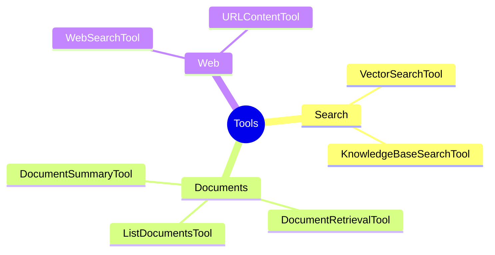
```mermaid
mindmap
    root((Tools))
        Search
            VectorSearchTool
            KnowledgeBaseSearchTool
        Documents
            DocumentRetrievalTool
            ListDocumentsTool
            DocumentSummaryTool
        Web
            WebSearchTool
            URLContentTool
```

### Tool Registry Architecture

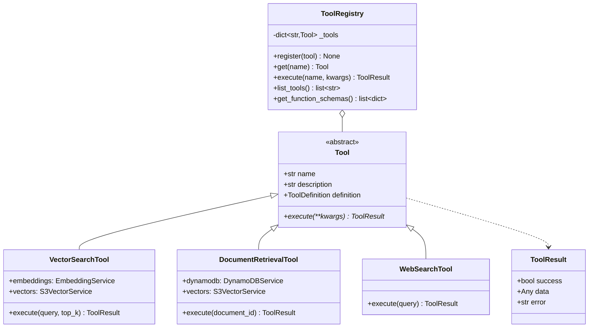
```mermaid
classDiagram
    class Tool {
        <<abstract>>
        +str name
        +str description
        +ToolDefinition definition
        +execute(**kwargs) ToolResult*
    }

    class ToolRegistry {
        -dict~str,Tool~ _tools
        +register(tool) None
        +get(name) Tool
        +execute(name, kwargs) ToolResult
        +list_tools() list~str~
        +get_function_schemas() list~dict~
    }

    class ToolResult {
        +bool success
        +Any data
        +str error
    }

    class VectorSearchTool {
        +embeddings: EmbeddingService
        +vectors: S3VectorService
        +execute(query, top_k) ToolResult
    }

    class DocumentRetrievalTool {
        +dynamodb: DynamoDBService
        +vectors: S3VectorService
        +execute(document_id) ToolResult
    }

    class WebSearchTool {
        +execute(query) ToolResult
    }

    Tool <|-- VectorSearchTool
    Tool <|-- DocumentRetrievalTool
    Tool <|-- WebSearchTool
    ToolRegistry o-- Tool
    Tool ..> ToolResult
```

### Tool Execution Flow

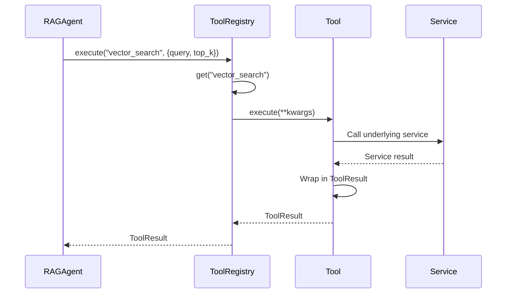
```mermaid
sequenceDiagram
    participant A as RAGAgent
    participant TR as ToolRegistry
    participant T as Tool
    participant S as Service

    A->>TR: execute("vector_search", {query, top_k})
    TR->>TR: get("vector_search")
    TR->>T: execute(**kwargs)
    T->>S: Call underlying service
    S-->>T: Service result
    T->>T: Wrap in ToolResult
    T-->>TR: ToolResult
    TR-->>A: ToolResult
```

---

## API Endpoints

### REST API Structure

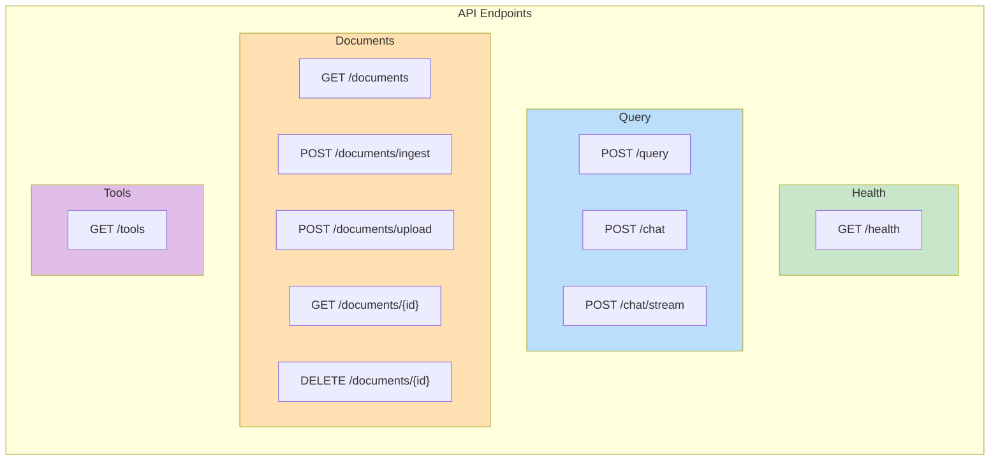
```mermaid
flowchart LR
    subgraph Endpoints["API Endpoints"]
        direction TB

        subgraph Health["Health"]
            GET_Health["GET /health"]
        end

        subgraph Query["Query"]
            POST_Query["POST /query"]
            POST_Chat["POST /chat"]
            POST_Stream["POST /chat/stream"]
        end

        subgraph Documents["Documents"]
            GET_Docs["GET /documents"]
            POST_Ingest["POST /documents/ingest"]
            POST_Upload["POST /documents/upload"]
            GET_Doc["GET /documents/{id}"]
            DEL_Doc["DELETE /documents/{id}"]
        end

        subgraph Tools["Tools"]
            GET_Tools["GET /tools"]
        end
    end

    style Health fill:#c8e6c9
    style Query fill:#bbdefb
    style Documents fill:#ffe0b2
    style Tools fill:#e1bee7
```

---

## Configuration

### Environment Variables

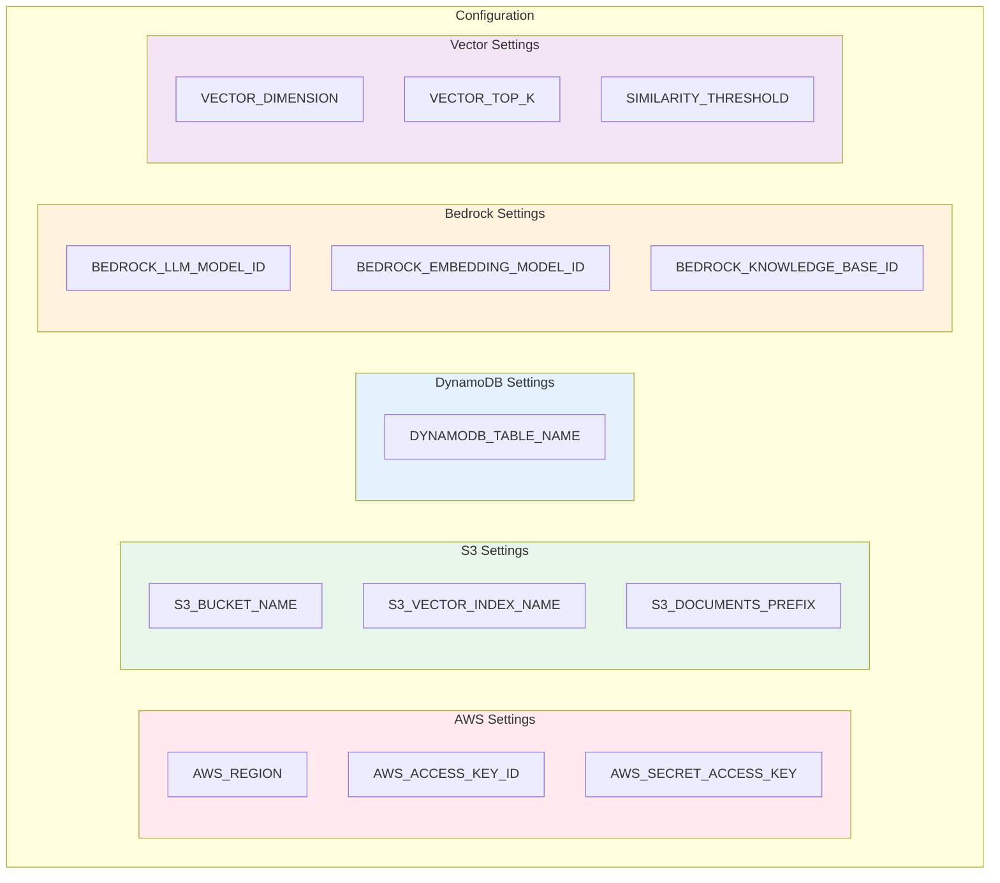
```mermaid
flowchart TB
    subgraph Config["Configuration"]
        subgraph AWS["AWS Settings"]
            Region["AWS_REGION"]
            AccessKey["AWS_ACCESS_KEY_ID"]
            SecretKey["AWS_SECRET_ACCESS_KEY"]
        end

        subgraph S3["S3 Settings"]
            Bucket["S3_BUCKET_NAME"]
            VecIndex["S3_VECTOR_INDEX_NAME"]
            DocPrefix["S3_DOCUMENTS_PREFIX"]
        end

        subgraph DynamoDB["DynamoDB Settings"]
            Table["DYNAMODB_TABLE_NAME"]
        end

        subgraph Bedrock["Bedrock Settings"]
            LLM_Model["BEDROCK_LLM_MODEL_ID"]
            Embed_Model["BEDROCK_EMBEDDING_MODEL_ID"]
            KB_ID["BEDROCK_KNOWLEDGE_BASE_ID"]
        end

        subgraph Vector["Vector Settings"]
            Dimension["VECTOR_DIMENSION"]
            TopK["VECTOR_TOP_K"]
            Threshold["SIMILARITY_THRESHOLD"]
        end
    end

    style AWS fill:#ffebee
    style S3 fill:#e8f5e9
    style DynamoDB fill:#e3f2fd
    style Bedrock fill:#fff3e0
    style Vector fill:#f3e5f5
```

---

## Security Architecture

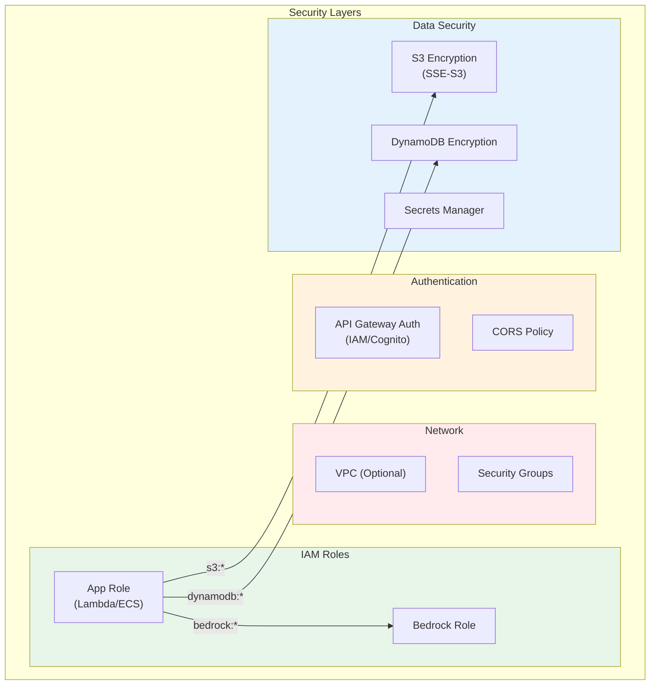
```mermaid
flowchart TB
    subgraph Security["Security Layers"]
        subgraph Network["Network"]
            VPC["VPC (Optional)"]
            SG["Security Groups"]
        end

        subgraph Auth["Authentication"]
            APIGW_Auth["API Gateway Auth<br/>(IAM/Cognito)"]
            CORS["CORS Policy"]
        end

        subgraph IAM_Roles["IAM Roles"]
            AppRole["App Role<br/>(Lambda/ECS)"]
            BedrockRole["Bedrock Role"]
        end

        subgraph Data["Data Security"]
            S3_Enc["S3 Encryption<br/>(SSE-S3)"]
            DDB_Enc["DynamoDB Encryption"]
            Secrets["Secrets Manager"]
        end
    end

    AppRole -->|"s3:*"| S3_Enc
    AppRole -->|"dynamodb:*"| DDB_Enc
    AppRole -->|"bedrock:*"| BedrockRole

    style Network fill:#ffebee
    style Auth fill:#fff3e0
    style IAM_Roles fill:#e8f5e9
    style Data fill:#e3f2fd
```

---

## Performance Considerations

| Component         | Optimization                                   |
| ----------------- | ---------------------------------------------- |
| **Embeddings**    | Batch processing (25 texts/batch)              |
| **Vector Search** | Top-K limiting, similarity threshold filtering |
| **Lambda**        | 1024MB memory, 60s timeout                     |
| **DynamoDB**      | On-demand capacity, GSI for status queries     |
| **S3**            | Lifecycle rules for old versions               |

---

## Future Enhancements

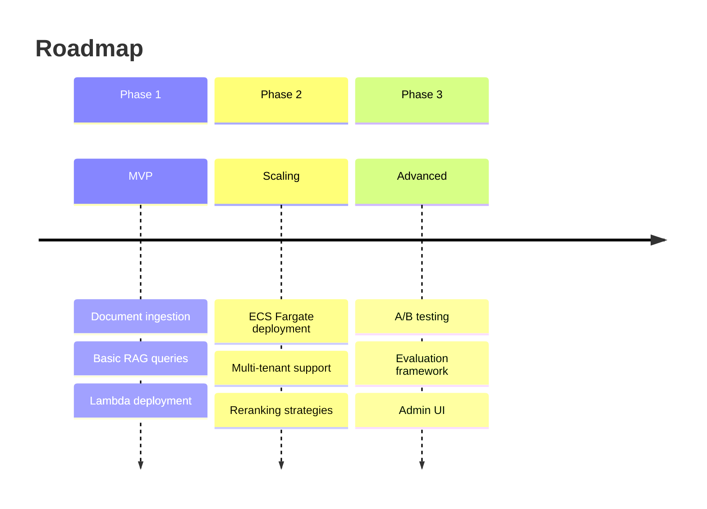
```mermaid
timeline
    title Roadmap
    section Phase 1
        MVP : Document ingestion
            : Basic RAG queries
            : Lambda deployment
    section Phase 2
        Scaling : ECS Fargate deployment
               : Multi-tenant support
               : Reranking strategies
    section Phase 3
        Advanced : A/B testing
                : Evaluation framework
                : Admin UI
```

---

## References

- [Amazon Bedrock Documentation](https://docs.aws.amazon.com/bedrock/)
- [Amazon S3 Vectors](https://docs.aws.amazon.com/s3/vectors/)
- [AWS CDK Python Reference](https://docs.aws.amazon.com/cdk/api/v2/python/)
- [FastAPI Documentation](https://fastapi.tiangolo.com/)

# NOTE: THis is an unrelated graph showing multi account accecss in Bedrock
```mermaid
graph TD
    subgraph Enterprise_Identity[Enterprise Identity]
        IDP[Enterprise IdP<br/>Okta / Azure AD / IAM Identity Center]
    end

    subgraph Central_Account[Central GenAI Gateway Account]
        OIDC[OIDC Provider<br/>backed by Enterprise IdP]
        ECS[ECS Tasks<br/>GenAI Gateway]
    end

    subgraph Shared_Model_Account_1[Shared Model Account A]
        RoleA[Role: GenAIGateway-UseCaseA-BedrockInvokeRole]
        BedrockA[Amazon Bedrock Runtime]
    end

    subgraph Shared_Model_Account_2[Shared Model Account B]
        RoleB[Role: GenAIGateway-UseCaseB-BedrockInvokeRole]
        BedrockB[Amazon Bedrock Runtime]
    end

    IDP -->|Issues Web Identity Token<br/>for use case identity| OIDC
    ECS -->|Uses Web Identity Token<br/>in AssumeRoleWithWebIdentity| RoleA
    ECS -->|Uses Web Identity Token<br/>in AssumeRoleWithWebIdentity| RoleB

    RoleA -->|Trusts OIDC Provider<br/>sts:AssumeRoleWithWebIdentity| OIDC
    RoleB -->|Trusts OIDC Provider<br/>sts:AssumeRoleWithWebIdentity| OIDC

    ECS -->|InvokeModel /<br/>InvokeModelWithResponseStream<br/>using STS creds| BedrockA
    ECS -->|InvokeModel /<br/>InvokeModelWithResponseStream<br/>using STS creds| BedrockB
```


---
Here’s a compact but complete take on both.

---

## Diagram showing the trust relationships

```mermaid
graph TD
    subgraph Enterprise_Identity[Enterprise Identity]
        IDP[Enterprise IdP<br/>Okta / Azure AD / IAM Identity Center]
    end

    subgraph Central_Account[Central GenAI Gateway Account]
        OIDC[OIDC Provider<br/>backed by Enterprise IdP]
        ECS[ECS Tasks<br/>GenAI Gateway]
    end

    subgraph Shared_Model_Account_1[Shared Model Account A]
        RoleA[Role: GenAIGateway-UseCaseA-BedrockInvokeRole]
        BedrockA[Amazon Bedrock Runtime]
    end

    subgraph Shared_Model_Account_2[Shared Model Account B]
        RoleB[Role: GenAIGateway-UseCaseB-BedrockInvokeRole]
        BedrockB[Amazon Bedrock Runtime]
    end

    IDP -->|Issues Web Identity Token<br/>for use case identity| OIDC
    ECS -->|Uses Web Identity Token<br/>in AssumeRoleWithWebIdentity| RoleA
    ECS -->|Uses Web Identity Token<br/>in AssumeRoleWithWebIdentity| RoleB

    RoleA -->|Trusts OIDC Provider<br/>sts:AssumeRoleWithWebIdentity| OIDC
    RoleB -->|Trusts OIDC Provider<br/>sts:AssumeRoleWithWebIdentity| OIDC

    ECS -->|InvokeModel /<br/>InvokeModelWithResponseStream<br/>using STS creds| BedrockA
    ECS -->|InvokeModel /<br/>InvokeModelWithResponseStream<br/>using STS creds| BedrockB
```


**Key ideas:**

- Shared model account roles **trust** the OIDC provider in the central account.
- ECS tasks **assume those roles with Web Identity** using IdP‑issued tokens.
- Each role is **scoped per use case and per model set**.

---

## Multi‑use‑case IAM layout for large enterprises

### 1. High‑level pattern

- **Central account**
  - **OIDC provider** configured against enterprise IdP.
  - **ECS tasks** that:
    - Receive requests tagged with `use_case_id`.
    - Obtain Web Identity tokens for that use case.
    - Call `AssumeRoleWithWebIdentity` into shared model accounts.
- **N shared model accounts**
  - Each has **one or more IAM roles per use case** (or per use‑case group).
  - Each role:
    - Trusts the central account’s OIDC provider.
    - Grants least‑privilege Bedrock permissions.

### 2. Example role layout across accounts

| Layer                    | Entity / Pattern                                      | Purpose                                      |
|--------------------------|--------------------------------------------------------|----------------------------------------------|
| Central account          | `OIDCProvider/enterprise-idp`                         | Federated identity from IdP                  |
| Central account          | `ECS Task Role: GenAIGatewayTaskRole`                 | Calls STS, ElastiCache, logging, etc.        |
| Shared model account A   | `Role: GenAIGateway-UseCaseA-BedrockInvokeRole`       | Use Case A → specific models in Account A    |
| Shared model account A   | `Role: GenAIGateway-UseCaseB-BedrockInvokeRole`       | Use Case B → specific models in Account A    |
| Shared model account B   | `Role: GenAIGateway-UseCaseA-BedrockInvokeRole`       | Use Case A → specific models in Account B    |
| Shared model account B   | `Role: GenAIGateway-UseCaseC-BedrockInvokeRole`       | Use Case C → specific models in Account B    |

You can choose:

- **Per‑use‑case roles** (most explicit, best for strong isolation).
- Or **per‑domain roles** (e.g., `GenAIGateway-Marketing-BedrockInvokeRole`) if you want coarser grouping.

### 3. Example trust policy for multiple use cases

Shared model account role that allows **multiple use cases** from the same IdP group:

```json
{
  "Version": "2012-10-17",
  "Statement": [
    {
      "Effect": "Allow",
      "Principal": {
        "Federated": "arn:aws:iam::<CENTRAL_ACCOUNT_ID>:oidc-provider/<IDP_PROVIDER>"
      },
      "Action": "sts:AssumeRoleWithWebIdentity",
      "Condition": {
        "ForAnyValue:StringEquals": {
          "<IDP_PROVIDER>:groups": [
            "genai-usecase-marketing",
            "genai-usecase-analytics"
          ]
        }
      }
    }
  ]
}
```

### 4. Example permissions policy per role

```json
{
  "Version": "2012-10-17",
  "Statement": [
    {
      "Sid": "AllowSpecificModels",
      "Effect": "Allow",
      "Action": [
        "bedrock:InvokeModel",
        "bedrock:InvokeModelWithResponseStream"
      ],
      "Resource": [
        "arn:aws:bedrock:us-east-1::foundation-model/anthropic.claude-3-sonnet-20240229-v1:0",
        "arn:aws:bedrock:us-east-1::foundation-model/amazon.titan-text-premier-v1:0"
      ]
    }
  ]
}
```

You’d vary the `Resource` list per role to encode:

- **Which models** a use case can access.
- **Which accounts/regions** they can hit.

---

If you want to go one level deeper, we can sketch:

- A **naming convention** for roles and policies across dozens of accounts.
- A **Terraform module layout** that lets you stamp out new use cases and model accounts with a single config block.

---


Absolutely — here’s a clean, scalable **enterprise‑grade naming convention** for IAM roles and policies that works across **dozens or even hundreds of AWS accounts**, including the multi‑account Bedrock model‑access pattern you’re building.

This is designed for clarity, automation, and long‑term maintainability in large organizations.

---

# 🧩 Core Principles Behind the Naming Convention

A good naming system must:

- Encode **account type** (central vs. shared model account)
- Encode **use case identity**
- Encode **model access scope**
- Be **machine‑parsable** for automation (Terraform, CDK, pipelines)
- Support **hundreds of roles** without collisions
- Support **grouping** (e.g., domain‑level roles)

The pattern below does all of that.

---

# 🏗️ Recommended Naming Convention

## 1. IAM Roles (in Shared Model Accounts)

### **Pattern**
```
<OrgPrefix>-<Layer>-<UseCaseOrGroup>-<Capability>Role
```

### **Example**
```
ACME-GenAI-UseCaseA-BedrockInvokeRole
ACME-GenAI-UseCaseB-BedrockInvokeRole
ACME-GenAI-Marketing-BedrockInvokeRole
ACME-GenAI-Analytics-BedrockInvokeRole
```

### Field meanings
- **OrgPrefix** — your company prefix (`ACME`, `CONTOSO`, etc.)
- **Layer** — `GenAI` or `GenAIGateway`
- **UseCaseOrGroup** — `UseCaseA`, `FraudDetection`, `Marketing`, etc.
- **Capability** — `BedrockInvoke`, `ModelAccess`, etc.

---

## 2. IAM Policies (Permissions Policies)

### **Pattern**
```
<OrgPrefix>-<Layer>-<UseCaseOrGroup>-<ModelProvider>-<PermissionType>Policy
```

### **Example**
```
ACME-GenAI-UseCaseA-Anthropic-InvokePolicy
ACME-GenAI-UseCaseA-AmazonTitan-InvokePolicy
ACME-GenAI-Analytics-MultiModel-InvokePolicy
```

### Why this works
- You can instantly see **which models** a use case can access.
- You can attach multiple model‑specific policies to the same role.
- You can automate policy generation per model provider.

---

## 3. Trust Policies (Role Trust Documents)

### **Pattern**
```
<OrgPrefix>-<Layer>-<UseCaseOrGroup>-TrustPolicy
```

### **Example**
```
ACME-GenAI-UseCaseA-TrustPolicy
ACME-GenAI-Marketing-TrustPolicy
```

These are usually embedded inline, but naming them helps when stored in IaC repos.

---

## 4. OIDC Provider Naming (Central Account)

### **Pattern**
```
<OrgPrefix>-IdP-<ProviderName>
```

### **Example**
```
ACME-IdP-Okta
ACME-IdP-AzureAD
```

This makes trust relationships readable across accounts.

---

## 5. ECS Task Roles (Central Account)

### **Pattern**
```
<OrgPrefix>-GenAIGateway-TaskRole
```

### **Example**
```
ACME-GenAIGateway-TaskRole
```

This role is the one that calls STS.

---

# 🗂️ How This Scales Across Dozens of Accounts

Imagine you have:

- 1 central account  
- 20 shared model accounts  
- 40 use cases  

Using the naming convention:

### Shared Model Account 17
```
ACME-GenAI-UseCaseA-BedrockInvokeRole
ACME-GenAI-UseCaseB-BedrockInvokeRole
ACME-GenAI-UseCaseC-BedrockInvokeRole
...
```

### Shared Model Account 18
```
ACME-GenAI-UseCaseA-BedrockInvokeRole
ACME-GenAI-UseCaseD-BedrockInvokeRole
ACME-GenAI-Marketing-BedrockInvokeRole
...
```

### Policies
```
ACME-GenAI-UseCaseA-Anthropic-InvokePolicy
ACME-GenAI-UseCaseA-AmazonTitan-InvokePolicy
ACME-GenAI-UseCaseB-Meta-InvokePolicy
ACME-GenAI-Marketing-MultiModel-InvokePolicy
```

### Trust Policies
```
ACME-GenAI-UseCaseA-TrustPolicy
ACME-GenAI-Marketing-TrustPolicy
```

Everything is:

- Predictable  
- Scriptable  
- Easy to audit  
- Easy to rotate  
- Easy to onboard new use cases  

---

# 🧠 Bonus: Naming Convention for Terraform Modules (Optional)

If you want to stamp out roles automatically:

```
module "usecaseA_bedrock_role" {
  source = "modules/genai-bedrock-role"
  use_case = "UseCaseA"
  model_providers = ["Anthropic", "AmazonTitan"]
}
```

This aligns perfectly with the naming scheme above.

---

If you want, I can also generate:

- A **full enterprise naming standard document**  
- A **Terraform module template** that implements this convention  
- A **diagram** showing how naming maps across accounts  

Just tell me what direction you want to take next.

#====

Below is a clean, readable diagram that shows **how the naming convention maps across the Central Account and multiple Shared Model Accounts**. It ties together roles, trust policies, and model‑specific permissions in a way that scales across dozens or hundreds of accounts.

---

## 🗺️ Diagram: Naming Convention Mapped Across Accounts

```mermaid
graph TD

    %% CENTRAL ACCOUNT
    subgraph Central_Account["Central GenAI Gateway Account"]
        OIDC["OIDC Provider\nACME-IdP-Okta"]
        TaskRole["ECS Task Role\nACME-GenAIGateway-TaskRole"]
    end

    %% SHARED MODEL ACCOUNT A
    subgraph SMA1["Shared Model Account A"]
        RoleA["ACME-GenAI-UseCaseA-BedrockInvokeRole"]
        PolicyA1["ACME-GenAI-UseCaseA-Anthropic-InvokePolicy"]
        PolicyA2["ACME-GenAI-UseCaseA-AmazonTitan-InvokePolicy"]
    end

    %% SHARED MODEL ACCOUNT B
    subgraph SMA2["Shared Model Account B"]
        RoleB["ACME-GenAI-Marketing-BedrockInvokeRole"]
        PolicyB1["ACME-GenAI-Marketing-MultiModel-InvokePolicy"]
    end

    %% SHARED MODEL ACCOUNT C
    subgraph SMA3["Shared Model Account C"]
        RoleC["ACME-GenAI-Analytics-BedrockInvokeRole"]
        PolicyC1["ACME-GenAI-Analytics-Anthropic-InvokePolicy"]
    end

    %% TRUST RELATIONSHIPS
    OIDC -->|"Trusts OIDC Provider\n(sts:AssumeRoleWithWebIdentity)"| RoleA
    OIDC -->|"Trusts OIDC Provider"| RoleB
    OIDC -->|"Trusts OIDC Provider"| RoleC

    %% ROLE → POLICY ATTACHMENTS
    RoleA --> PolicyA1
    RoleA --> PolicyA2

    RoleB --> PolicyB1

    RoleC --> PolicyC1

    %% ECS TASK ROLE → ASSUME ROLE
    TaskRole -->|"AssumeRoleWithWebIdentity\nper use case"| RoleA
    TaskRole -->|"AssumeRoleWithWebIdentity"| RoleB
    TaskRole -->|"AssumeRoleWithWebIdentity"| RoleC
```

---

## 🧠 What This Diagram Shows

### **1. Central Account**
- Hosts the **OIDC provider** (`ACME-IdP-Okta`)
- Hosts the **ECS Task Role** (`ACME-GenAIGateway-TaskRole`)
- ECS tasks use Web Identity tokens to assume roles in shared model accounts.

### **2. Shared Model Accounts**
Each shared model account contains:

- **One or more roles per use case or domain**
  - `ACME-GenAI-UseCaseA-BedrockInvokeRole`
  - `ACME-GenAI-Marketing-BedrockInvokeRole`
  - `ACME-GenAI-Analytics-BedrockInvokeRole`

- **Model‑specific permission policies**
  - `ACME-GenAI-UseCaseA-Anthropic-InvokePolicy`
  - `ACME-GenAI-UseCaseA-AmazonTitan-InvokePolicy`
  - `ACME-GenAI-Marketing-MultiModel-InvokePolicy`

### **3. Trust Relationships**
Every role in every shared model account trusts:

```
ACME-IdP-Okta
```

via:

```
sts:AssumeRoleWithWebIdentity
```

### **4. How Naming Helps**
The naming convention encodes:

- **Org** (`ACME`)
- **Layer** (`GenAI`, `GenAIGateway`)
- **Use case or domain** (`UseCaseA`, `Marketing`, `Analytics`)
- **Capability** (`BedrockInvoke`)
- **Model provider** (`Anthropic`, `AmazonTitan`, `MultiModel`)

This makes the system:

- Machine‑parsable  
- Easy to audit  
- Easy to automate  
- Easy to scale across dozens of accounts  

---

If you want, I can also generate:

- A **sequence diagram** showing the full AssumeRoleWithWebIdentity flow  
- A **Terraform module layout** that implements this naming convention  
- A **policy matrix** mapping use cases to models across accounts  

Just tell me where you want to go next.

=====
Here’s a clean, enterprise‑grade **sequence diagram** that captures the *entire* `AssumeRoleWithWebIdentity` flow end‑to‑end — from the use case request entering the Central Account to the Bedrock invocation in a Shared Model Account.

# NOTE: THis is an unrelated graph showing multi account accecss in Bedrock
```mermaid
graph TD
    subgraph Enterprise_Identity[Enterprise Identity]
        IDP[Enterprise IdP<br/>Okta / Azure AD / IAM Identity Center]
    end

    subgraph Central_Account[Central GenAI Gateway Account]
        OIDC[OIDC Provider<br/>backed by Enterprise IdP]
        ECS[ECS Tasks<br/>GenAI Gateway]
    end

    subgraph Shared_Model_Account_1[Shared Model Account A]
        RoleA[Role: GenAIGateway-UseCaseA-BedrockInvokeRole]
        BedrockA[Amazon Bedrock Runtime]
    end

    subgraph Shared_Model_Account_2[Shared Model Account B]
        RoleB[Role: GenAIGateway-UseCaseB-BedrockInvokeRole]
        BedrockB[Amazon Bedrock Runtime]
    end

    IDP -->|Issues Web Identity Token<br/>for use case identity| OIDC
    ECS -->|Uses Web Identity Token<br/>in AssumeRoleWithWebIdentity| RoleA
    ECS -->|Uses Web Identity Token<br/>in AssumeRoleWithWebIdentity| RoleB

    RoleA -->|Trusts OIDC Provider<br/>sts:AssumeRoleWithWebIdentity| OIDC
    RoleB -->|Trusts OIDC Provider<br/>sts:AssumeRoleWithWebIdentity| OIDC

    ECS -->|InvokeModel /<br/>InvokeModelWithResponseStream<br/>using STS creds| BedrockA
    ECS -->|InvokeModel /<br/>InvokeModelWithResponseStream<br/>using STS creds| BedrockB
```


---
Here’s a compact but complete take on both.

---

## Diagram showing the trust relationships

```mermaid
graph TD
    subgraph Enterprise_Identity[Enterprise Identity]
        IDP[Enterprise IdP<br/>Okta / Azure AD / IAM Identity Center]
    end

    subgraph Central_Account[Central GenAI Gateway Account]
        OIDC[OIDC Provider<br/>backed by Enterprise IdP]
        ECS[ECS Tasks<br/>GenAI Gateway]
    end

    subgraph Shared_Model_Account_1[Shared Model Account A]
        RoleA[Role: GenAIGateway-UseCaseA-BedrockInvokeRole]
        BedrockA[Amazon Bedrock Runtime]
    end

    subgraph Shared_Model_Account_2[Shared Model Account B]
        RoleB[Role: GenAIGateway-UseCaseB-BedrockInvokeRole]
        BedrockB[Amazon Bedrock Runtime]
    end

    IDP -->|Issues Web Identity Token<br/>for use case identity| OIDC
    ECS -->|Uses Web Identity Token<br/>in AssumeRoleWithWebIdentity| RoleA
    ECS -->|Uses Web Identity Token<br/>in AssumeRoleWithWebIdentity| RoleB

    RoleA -->|Trusts OIDC Provider<br/>sts:AssumeRoleWithWebIdentity| OIDC
    RoleB -->|Trusts OIDC Provider<br/>sts:AssumeRoleWithWebIdentity| OIDC

    ECS -->|InvokeModel /<br/>InvokeModelWithResponseStream<br/>using STS creds| BedrockA
    ECS -->|InvokeModel /<br/>InvokeModelWithResponseStream<br/>using STS creds| BedrockB
```


**Key ideas:**

- Shared model account roles **trust** the OIDC provider in the central account.
- ECS tasks **assume those roles with Web Identity** using IdP‑issued tokens.
- Each role is **scoped per use case and per model set**.

---

## Multi‑use‑case IAM layout for large enterprises

### 1. High‑level pattern

- **Central account**
  - **OIDC provider** configured against enterprise IdP.
  - **ECS tasks** that:
    - Receive requests tagged with `use_case_id`.
    - Obtain Web Identity tokens for that use case.
    - Call `AssumeRoleWithWebIdentity` into shared model accounts.
- **N shared model accounts**
  - Each has **one or more IAM roles per use case** (or per use‑case group).
  - Each role:
    - Trusts the central account’s OIDC provider.
    - Grants least‑privilege Bedrock permissions.

### 2. Example role layout across accounts

| Layer                    | Entity / Pattern                                      | Purpose                                      |
|--------------------------|--------------------------------------------------------|----------------------------------------------|
| Central account          | `OIDCProvider/enterprise-idp`                         | Federated identity from IdP                  |
| Central account          | `ECS Task Role: GenAIGatewayTaskRole`                 | Calls STS, ElastiCache, logging, etc.        |
| Shared model account A   | `Role: GenAIGateway-UseCaseA-BedrockInvokeRole`       | Use Case A → specific models in Account A    |
| Shared model account A   | `Role: GenAIGateway-UseCaseB-BedrockInvokeRole`       | Use Case B → specific models in Account A    |
| Shared model account B   | `Role: GenAIGateway-UseCaseA-BedrockInvokeRole`       | Use Case A → specific models in Account B    |
| Shared model account B   | `Role: GenAIGateway-UseCaseC-BedrockInvokeRole`       | Use Case C → specific models in Account B    |

You can choose:

- **Per‑use‑case roles** (most explicit, best for strong isolation).
- Or **per‑domain roles** (e.g., `GenAIGateway-Marketing-BedrockInvokeRole`) if you want coarser grouping.

### 3. Example trust policy for multiple use cases

Shared model account role that allows **multiple use cases** from the same IdP group:

```json
{
  "Version": "2012-10-17",
  "Statement": [
    {
      "Effect": "Allow",
      "Principal": {
        "Federated": "arn:aws:iam::<CENTRAL_ACCOUNT_ID>:oidc-provider/<IDP_PROVIDER>"
      },
      "Action": "sts:AssumeRoleWithWebIdentity",
      "Condition": {
        "ForAnyValue:StringEquals": {
          "<IDP_PROVIDER>:groups": [
            "genai-usecase-marketing",
            "genai-usecase-analytics"
          ]
        }
      }
    }
  ]
}
```

### 4. Example permissions policy per role

```json
{
  "Version": "2012-10-17",
  "Statement": [
    {
      "Sid": "AllowSpecificModels",
      "Effect": "Allow",
      "Action": [
        "bedrock:InvokeModel",
        "bedrock:InvokeModelWithResponseStream"
      ],
      "Resource": [
        "arn:aws:bedrock:us-east-1::foundation-model/anthropic.claude-3-sonnet-20240229-v1:0",
        "arn:aws:bedrock:us-east-1::foundation-model/amazon.titan-text-premier-v1:0"
      ]
    }
  ]
}
```

You’d vary the `Resource` list per role to encode:

- **Which models** a use case can access.
- **Which accounts/regions** they can hit.

---

If you want to go one level deeper, we can sketch:

- A **naming convention** for roles and policies across dozens of accounts.
- A **Terraform module layout** that lets you stamp out new use cases and model accounts with a single config block.

---


Absolutely — here’s a clean, scalable **enterprise‑grade naming convention** for IAM roles and policies that works across **dozens or even hundreds of AWS accounts**, including the multi‑account Bedrock model‑access pattern you’re building.

This is designed for clarity, automation, and long‑term maintainability in large organizations.

---

# 🧩 Core Principles Behind the Naming Convention

A good naming system must:

- Encode **account type** (central vs. shared model account)
- Encode **use case identity**
- Encode **model access scope**
- Be **machine‑parsable** for automation (Terraform, CDK, pipelines)
- Support **hundreds of roles** without collisions
- Support **grouping** (e.g., domain‑level roles)

The pattern below does all of that.

---

# 🏗️ Recommended Naming Convention

## 1. IAM Roles (in Shared Model Accounts)

### **Pattern**
```
<OrgPrefix>-<Layer>-<UseCaseOrGroup>-<Capability>Role
```

### **Example**
```
ACME-GenAI-UseCaseA-BedrockInvokeRole
ACME-GenAI-UseCaseB-BedrockInvokeRole
ACME-GenAI-Marketing-BedrockInvokeRole
ACME-GenAI-Analytics-BedrockInvokeRole
```

### Field meanings
- **OrgPrefix** — your company prefix (`ACME`, `CONTOSO`, etc.)
- **Layer** — `GenAI` or `GenAIGateway`
- **UseCaseOrGroup** — `UseCaseA`, `FraudDetection`, `Marketing`, etc.
- **Capability** — `BedrockInvoke`, `ModelAccess`, etc.

---

## 2. IAM Policies (Permissions Policies)

### **Pattern**
```
<OrgPrefix>-<Layer>-<UseCaseOrGroup>-<ModelProvider>-<PermissionType>Policy
```

### **Example**
```
ACME-GenAI-UseCaseA-Anthropic-InvokePolicy
ACME-GenAI-UseCaseA-AmazonTitan-InvokePolicy
ACME-GenAI-Analytics-MultiModel-InvokePolicy
```

### Why this works
- You can instantly see **which models** a use case can access.
- You can attach multiple model‑specific policies to the same role.
- You can automate policy generation per model provider.

---

## 3. Trust Policies (Role Trust Documents)

### **Pattern**
```
<OrgPrefix>-<Layer>-<UseCaseOrGroup>-TrustPolicy
```

### **Example**
```
ACME-GenAI-UseCaseA-TrustPolicy
ACME-GenAI-Marketing-TrustPolicy
```

These are usually embedded inline, but naming them helps when stored in IaC repos.

---

## 4. OIDC Provider Naming (Central Account)

### **Pattern**
```
<OrgPrefix>-IdP-<ProviderName>
```

### **Example**
```
ACME-IdP-Okta
ACME-IdP-AzureAD
```

This makes trust relationships readable across accounts.

---

## 5. ECS Task Roles (Central Account)

### **Pattern**
```
<OrgPrefix>-GenAIGateway-TaskRole
```

### **Example**
```
ACME-GenAIGateway-TaskRole
```

This role is the one that calls STS.

---

# 🗂️ How This Scales Across Dozens of Accounts

Imagine you have:

- 1 central account  
- 20 shared model accounts  
- 40 use cases  

Using the naming convention:

### Shared Model Account 17
```
ACME-GenAI-UseCaseA-BedrockInvokeRole
ACME-GenAI-UseCaseB-BedrockInvokeRole
ACME-GenAI-UseCaseC-BedrockInvokeRole
...
```

### Shared Model Account 18
```
ACME-GenAI-UseCaseA-BedrockInvokeRole
ACME-GenAI-UseCaseD-BedrockInvokeRole
ACME-GenAI-Marketing-BedrockInvokeRole
...
```

### Policies
```
ACME-GenAI-UseCaseA-Anthropic-InvokePolicy
ACME-GenAI-UseCaseA-AmazonTitan-InvokePolicy
ACME-GenAI-UseCaseB-Meta-InvokePolicy
ACME-GenAI-Marketing-MultiModel-InvokePolicy
```

### Trust Policies
```
ACME-GenAI-UseCaseA-TrustPolicy
ACME-GenAI-Marketing-TrustPolicy
```

Everything is:

- Predictable  
- Scriptable  
- Easy to audit  
- Easy to rotate  
- Easy to onboard new use cases  

---

# 🧠 Bonus: Naming Convention for Terraform Modules (Optional)

If you want to stamp out roles automatically:

```
module "usecaseA_bedrock_role" {
  source = "modules/genai-bedrock-role"
  use_case = "UseCaseA"
  model_providers = ["Anthropic", "AmazonTitan"]
}
```

This aligns perfectly with the naming scheme above.

---

If you want, I can also generate:

- A **full enterprise naming standard document**  
- A **Terraform module template** that implements this convention  
- A **diagram** showing how naming maps across accounts  

Just tell me what direction you want to take next.

#====

Below is a clean, readable diagram that shows **how the naming convention maps across the Central Account and multiple Shared Model Accounts**. It ties together roles, trust policies, and model‑specific permissions in a way that scales across dozens or hundreds of accounts.

---

## 🗺️ Diagram: Naming Convention Mapped Across Accounts

```mermaid
graph TD

    %% CENTRAL ACCOUNT
    subgraph Central_Account["Central GenAI Gateway Account"]
        OIDC["OIDC Provider\nACME-IdP-Okta"]
        TaskRole["ECS Task Role\nACME-GenAIGateway-TaskRole"]
    end

    %% SHARED MODEL ACCOUNT A
    subgraph SMA1["Shared Model Account A"]
        RoleA["ACME-GenAI-UseCaseA-BedrockInvokeRole"]
        PolicyA1["ACME-GenAI-UseCaseA-Anthropic-InvokePolicy"]
        PolicyA2["ACME-GenAI-UseCaseA-AmazonTitan-InvokePolicy"]
    end

    %% SHARED MODEL ACCOUNT B
    subgraph SMA2["Shared Model Account B"]
        RoleB["ACME-GenAI-Marketing-BedrockInvokeRole"]
        PolicyB1["ACME-GenAI-Marketing-MultiModel-InvokePolicy"]
    end

    %% SHARED MODEL ACCOUNT C
    subgraph SMA3["Shared Model Account C"]
        RoleC["ACME-GenAI-Analytics-BedrockInvokeRole"]
        PolicyC1["ACME-GenAI-Analytics-Anthropic-InvokePolicy"]
    end

    %% TRUST RELATIONSHIPS
    OIDC -->|"Trusts OIDC Provider\n(sts:AssumeRoleWithWebIdentity)"| RoleA
    OIDC -->|"Trusts OIDC Provider"| RoleB
    OIDC -->|"Trusts OIDC Provider"| RoleC

    %% ROLE → POLICY ATTACHMENTS
    RoleA --> PolicyA1
    RoleA --> PolicyA2

    RoleB --> PolicyB1

    RoleC --> PolicyC1

    %% ECS TASK ROLE → ASSUME ROLE
    TaskRole -->|"AssumeRoleWithWebIdentity\nper use case"| RoleA
    TaskRole -->|"AssumeRoleWithWebIdentity"| RoleB
    TaskRole -->|"AssumeRoleWithWebIdentity"| RoleC
```

---

## 🧠 What This Diagram Shows

### **1. Central Account**
- Hosts the **OIDC provider** (`ACME-IdP-Okta`)
- Hosts the **ECS Task Role** (`ACME-GenAIGateway-TaskRole`)
- ECS tasks use Web Identity tokens to assume roles in shared model accounts.

### **2. Shared Model Accounts**
Each shared model account contains:

- **One or more roles per use case or domain**
  - `ACME-GenAI-UseCaseA-BedrockInvokeRole`
  - `ACME-GenAI-Marketing-BedrockInvokeRole`
  - `ACME-GenAI-Analytics-BedrockInvokeRole`

- **Model‑specific permission policies**
  - `ACME-GenAI-UseCaseA-Anthropic-InvokePolicy`
  - `ACME-GenAI-UseCaseA-AmazonTitan-InvokePolicy`
  - `ACME-GenAI-Marketing-MultiModel-InvokePolicy`

### **3. Trust Relationships**
Every role in every shared model account trusts:

```
ACME-IdP-Okta
```

via:

```
sts:AssumeRoleWithWebIdentity
```

### **4. How Naming Helps**
The naming convention encodes:

- **Org** (`ACME`)
- **Layer** (`GenAI`, `GenAIGateway`)
- **Use case or domain** (`UseCaseA`, `Marketing`, `Analytics`)
- **Capability** (`BedrockInvoke`)
- **Model provider** (`Anthropic`, `AmazonTitan`, `MultiModel`)

This makes the system:

- Machine‑parsable  
- Easy to audit  
- Easy to automate  
- Easy to scale across dozens of accounts  

---

If you want, I can also generate:

- A **sequence diagram** showing the full AssumeRoleWithWebIdentity flow  
- A **Terraform module layout** that implements this naming convention  
- A **policy matrix** mapping use cases to models across accounts  

Just tell me where you want to go next.

=====
Here’s a clean, enterprise‑grade **sequence diagram** that captures the *entire* `AssumeRoleWithWebIdentity` flow end‑to‑end — from the use case request entering the Central Account to the Bedrock invocation in a Shared Model Account.

# NOTE: THis is an unrelated graph showing multi account accecss in Bedrock
```mermaid
graph TD
    subgraph Enterprise_Identity[Enterprise Identity]
        IDP[Enterprise IdP<br/>Okta / Azure AD / IAM Identity Center]
    end

    subgraph Central_Account[Central GenAI Gateway Account]
        OIDC[OIDC Provider<br/>backed by Enterprise IdP]
        ECS[ECS Tasks<br/>GenAI Gateway]
    end

    subgraph Shared_Model_Account_1[Shared Model Account A]
        RoleA[Role: GenAIGateway-UseCaseA-BedrockInvokeRole]
        BedrockA[Amazon Bedrock Runtime]
    end

    subgraph Shared_Model_Account_2[Shared Model Account B]
        RoleB[Role: GenAIGateway-UseCaseB-BedrockInvokeRole]
        BedrockB[Amazon Bedrock Runtime]
    end

    IDP -->|Issues Web Identity Token<br/>for use case identity| OIDC
    ECS -->|Uses Web Identity Token<br/>in AssumeRoleWithWebIdentity| RoleA
    ECS -->|Uses Web Identity Token<br/>in AssumeRoleWithWebIdentity| RoleB

    RoleA -->|Trusts OIDC Provider<br/>sts:AssumeRoleWithWebIdentity| OIDC
    RoleB -->|Trusts OIDC Provider<br/>sts:AssumeRoleWithWebIdentity| OIDC

    ECS -->|InvokeModel /<br/>InvokeModelWithResponseStream<br/>using STS creds| BedrockA
    ECS -->|InvokeModel /<br/>InvokeModelWithResponseStream<br/>using STS creds| BedrockB
```


---
Here’s a compact but complete take on both.

---

## Diagram showing the trust relationships

```mermaid
graph TD
    subgraph Enterprise_Identity[Enterprise Identity]
        IDP[Enterprise IdP<br/>Okta / Azure AD / IAM Identity Center]
    end

    subgraph Central_Account[Central GenAI Gateway Account]
        OIDC[OIDC Provider<br/>backed by Enterprise IdP]
        ECS[ECS Tasks<br/>GenAI Gateway]
    end

    subgraph Shared_Model_Account_1[Shared Model Account A]
        RoleA[Role: GenAIGateway-UseCaseA-BedrockInvokeRole]
        BedrockA[Amazon Bedrock Runtime]
    end

    subgraph Shared_Model_Account_2[Shared Model Account B]
        RoleB[Role: GenAIGateway-UseCaseB-BedrockInvokeRole]
        BedrockB[Amazon Bedrock Runtime]
    end

    IDP -->|Issues Web Identity Token<br/>for use case identity| OIDC
    ECS -->|Uses Web Identity Token<br/>in AssumeRoleWithWebIdentity| RoleA
    ECS -->|Uses Web Identity Token<br/>in AssumeRoleWithWebIdentity| RoleB

    RoleA -->|Trusts OIDC Provider<br/>sts:AssumeRoleWithWebIdentity| OIDC
    RoleB -->|Trusts OIDC Provider<br/>sts:AssumeRoleWithWebIdentity| OIDC

    ECS -->|InvokeModel /<br/>InvokeModelWithResponseStream<br/>using STS creds| BedrockA
    ECS -->|InvokeModel /<br/>InvokeModelWithResponseStream<br/>using STS creds| BedrockB
```


**Key ideas:**

- Shared model account roles **trust** the OIDC provider in the central account.
- ECS tasks **assume those roles with Web Identity** using IdP‑issued tokens.
- Each role is **scoped per use case and per model set**.

---

## Multi‑use‑case IAM layout for large enterprises

### 1. High‑level pattern

- **Central account**
  - **OIDC provider** configured against enterprise IdP.
  - **ECS tasks** that:
    - Receive requests tagged with `use_case_id`.
    - Obtain Web Identity tokens for that use case.
    - Call `AssumeRoleWithWebIdentity` into shared model accounts.
- **N shared model accounts**
  - Each has **one or more IAM roles per use case** (or per use‑case group).
  - Each role:
    - Trusts the central account’s OIDC provider.
    - Grants least‑privilege Bedrock permissions.

### 2. Example role layout across accounts

| Layer                    | Entity / Pattern                                      | Purpose                                      |
|--------------------------|--------------------------------------------------------|----------------------------------------------|
| Central account          | `OIDCProvider/enterprise-idp`                         | Federated identity from IdP                  |
| Central account          | `ECS Task Role: GenAIGatewayTaskRole`                 | Calls STS, ElastiCache, logging, etc.        |
| Shared model account A   | `Role: GenAIGateway-UseCaseA-BedrockInvokeRole`       | Use Case A → specific models in Account A    |
| Shared model account A   | `Role: GenAIGateway-UseCaseB-BedrockInvokeRole`       | Use Case B → specific models in Account A    |
| Shared model account B   | `Role: GenAIGateway-UseCaseA-BedrockInvokeRole`       | Use Case A → specific models in Account B    |
| Shared model account B   | `Role: GenAIGateway-UseCaseC-BedrockInvokeRole`       | Use Case C → specific models in Account B    |

You can choose:

- **Per‑use‑case roles** (most explicit, best for strong isolation).
- Or **per‑domain roles** (e.g., `GenAIGateway-Marketing-BedrockInvokeRole`) if you want coarser grouping.

### 3. Example trust policy for multiple use cases

Shared model account role that allows **multiple use cases** from the same IdP group:

```json
{
  "Version": "2012-10-17",
  "Statement": [
    {
      "Effect": "Allow",
      "Principal": {
        "Federated": "arn:aws:iam::<CENTRAL_ACCOUNT_ID>:oidc-provider/<IDP_PROVIDER>"
      },
      "Action": "sts:AssumeRoleWithWebIdentity",
      "Condition": {
        "ForAnyValue:StringEquals": {
          "<IDP_PROVIDER>:groups": [
            "genai-usecase-marketing",
            "genai-usecase-analytics"
          ]
        }
      }
    }
  ]
}
```

### 4. Example permissions policy per role

```json
{
  "Version": "2012-10-17",
  "Statement": [
    {
      "Sid": "AllowSpecificModels",
      "Effect": "Allow",
      "Action": [
        "bedrock:InvokeModel",
        "bedrock:InvokeModelWithResponseStream"
      ],
      "Resource": [
        "arn:aws:bedrock:us-east-1::foundation-model/anthropic.claude-3-sonnet-20240229-v1:0",
        "arn:aws:bedrock:us-east-1::foundation-model/amazon.titan-text-premier-v1:0"
      ]
    }
  ]
}
```

You’d vary the `Resource` list per role to encode:

- **Which models** a use case can access.
- **Which accounts/regions** they can hit.

---

If you want to go one level deeper, we can sketch:

- A **naming convention** for roles and policies across dozens of accounts.
- A **Terraform module layout** that lets you stamp out new use cases and model accounts with a single config block.

---


Absolutely — here’s a clean, scalable **enterprise‑grade naming convention** for IAM roles and policies that works across **dozens or even hundreds of AWS accounts**, including the multi‑account Bedrock model‑access pattern you’re building.

This is designed for clarity, automation, and long‑term maintainability in large organizations.

---

# 🧩 Core Principles Behind the Naming Convention

A good naming system must:

- Encode **account type** (central vs. shared model account)
- Encode **use case identity**
- Encode **model access scope**
- Be **machine‑parsable** for automation (Terraform, CDK, pipelines)
- Support **hundreds of roles** without collisions
- Support **grouping** (e.g., domain‑level roles)

The pattern below does all of that.

---

# 🏗️ Recommended Naming Convention

## 1. IAM Roles (in Shared Model Accounts)

### **Pattern**
```
<OrgPrefix>-<Layer>-<UseCaseOrGroup>-<Capability>Role
```

### **Example**
```
ACME-GenAI-UseCaseA-BedrockInvokeRole
ACME-GenAI-UseCaseB-BedrockInvokeRole
ACME-GenAI-Marketing-BedrockInvokeRole
ACME-GenAI-Analytics-BedrockInvokeRole
```

### Field meanings
- **OrgPrefix** — your company prefix (`ACME`, `CONTOSO`, etc.)
- **Layer** — `GenAI` or `GenAIGateway`
- **UseCaseOrGroup** — `UseCaseA`, `FraudDetection`, `Marketing`, etc.
- **Capability** — `BedrockInvoke`, `ModelAccess`, etc.

---

## 2. IAM Policies (Permissions Policies)

### **Pattern**
```
<OrgPrefix>-<Layer>-<UseCaseOrGroup>-<ModelProvider>-<PermissionType>Policy
```

### **Example**
```
ACME-GenAI-UseCaseA-Anthropic-InvokePolicy
ACME-GenAI-UseCaseA-AmazonTitan-InvokePolicy
ACME-GenAI-Analytics-MultiModel-InvokePolicy
```

### Why this works
- You can instantly see **which models** a use case can access.
- You can attach multiple model‑specific policies to the same role.
- You can automate policy generation per model provider.

---

## 3. Trust Policies (Role Trust Documents)

### **Pattern**
```
<OrgPrefix>-<Layer>-<UseCaseOrGroup>-TrustPolicy
```

### **Example**
```
ACME-GenAI-UseCaseA-TrustPolicy
ACME-GenAI-Marketing-TrustPolicy
```

These are usually embedded inline, but naming them helps when stored in IaC repos.

---

## 4. OIDC Provider Naming (Central Account)

### **Pattern**
```
<OrgPrefix>-IdP-<ProviderName>
```

### **Example**
```
ACME-IdP-Okta
ACME-IdP-AzureAD
```

This makes trust relationships readable across accounts.

---

## 5. ECS Task Roles (Central Account)

### **Pattern**
```
<OrgPrefix>-GenAIGateway-TaskRole
```

### **Example**
```
ACME-GenAIGateway-TaskRole
```

This role is the one that calls STS.

---

# 🗂️ How This Scales Across Dozens of Accounts

Imagine you have:

- 1 central account  
- 20 shared model accounts  
- 40 use cases  

Using the naming convention:

### Shared Model Account 17
```
ACME-GenAI-UseCaseA-BedrockInvokeRole
ACME-GenAI-UseCaseB-BedrockInvokeRole
ACME-GenAI-UseCaseC-BedrockInvokeRole
...
```

### Shared Model Account 18
```
ACME-GenAI-UseCaseA-BedrockInvokeRole
ACME-GenAI-UseCaseD-BedrockInvokeRole
ACME-GenAI-Marketing-BedrockInvokeRole
...
```

### Policies
```
ACME-GenAI-UseCaseA-Anthropic-InvokePolicy
ACME-GenAI-UseCaseA-AmazonTitan-InvokePolicy
ACME-GenAI-UseCaseB-Meta-InvokePolicy
ACME-GenAI-Marketing-MultiModel-InvokePolicy
```

### Trust Policies
```
ACME-GenAI-UseCaseA-TrustPolicy
ACME-GenAI-Marketing-TrustPolicy
```

Everything is:

- Predictable  
- Scriptable  
- Easy to audit  
- Easy to rotate  
- Easy to onboard new use cases  

---

# 🧠 Bonus: Naming Convention for Terraform Modules (Optional)

If you want to stamp out roles automatically:

```
module "usecaseA_bedrock_role" {
  source = "modules/genai-bedrock-role"
  use_case = "UseCaseA"
  model_providers = ["Anthropic", "AmazonTitan"]
}
```

This aligns perfectly with the naming scheme above.

---

If you want, I can also generate:

- A **full enterprise naming standard document**  
- A **Terraform module template** that implements this convention  
- A **diagram** showing how naming maps across accounts  

Just tell me what direction you want to take next.

#====

Below is a clean, readable diagram that shows **how the naming convention maps across the Central Account and multiple Shared Model Accounts**. It ties together roles, trust policies, and model‑specific permissions in a way that scales across dozens or hundreds of accounts.

---

## 🗺️ Diagram: Naming Convention Mapped Across Accounts

```mermaid
graph TD

    %% CENTRAL ACCOUNT
    subgraph Central_Account["Central GenAI Gateway Account"]
        OIDC["OIDC Provider\nACME-IdP-Okta"]
        TaskRole["ECS Task Role\nACME-GenAIGateway-TaskRole"]
    end

    %% SHARED MODEL ACCOUNT A
    subgraph SMA1["Shared Model Account A"]
        RoleA["ACME-GenAI-UseCaseA-BedrockInvokeRole"]
        PolicyA1["ACME-GenAI-UseCaseA-Anthropic-InvokePolicy"]
        PolicyA2["ACME-GenAI-UseCaseA-AmazonTitan-InvokePolicy"]
    end

    %% SHARED MODEL ACCOUNT B
    subgraph SMA2["Shared Model Account B"]
        RoleB["ACME-GenAI-Marketing-BedrockInvokeRole"]
        PolicyB1["ACME-GenAI-Marketing-MultiModel-InvokePolicy"]
    end

    %% SHARED MODEL ACCOUNT C
    subgraph SMA3["Shared Model Account C"]
        RoleC["ACME-GenAI-Analytics-BedrockInvokeRole"]
        PolicyC1["ACME-GenAI-Analytics-Anthropic-InvokePolicy"]
    end

    %% TRUST RELATIONSHIPS
    OIDC -->|"Trusts OIDC Provider\n(sts:AssumeRoleWithWebIdentity)"| RoleA
    OIDC -->|"Trusts OIDC Provider"| RoleB
    OIDC -->|"Trusts OIDC Provider"| RoleC

    %% ROLE → POLICY ATTACHMENTS
    RoleA --> PolicyA1
    RoleA --> PolicyA2

    RoleB --> PolicyB1

    RoleC --> PolicyC1

    %% ECS TASK ROLE → ASSUME ROLE
    TaskRole -->|"AssumeRoleWithWebIdentity\nper use case"| RoleA
    TaskRole -->|"AssumeRoleWithWebIdentity"| RoleB
    TaskRole -->|"AssumeRoleWithWebIdentity"| RoleC
```

---

## 🧠 What This Diagram Shows

### **1. Central Account**
- Hosts the **OIDC provider** (`ACME-IdP-Okta`)
- Hosts the **ECS Task Role** (`ACME-GenAIGateway-TaskRole`)
- ECS tasks use Web Identity tokens to assume roles in shared model accounts.

### **2. Shared Model Accounts**
Each shared model account contains:

- **One or more roles per use case or domain**
  - `ACME-GenAI-UseCaseA-BedrockInvokeRole`
  - `ACME-GenAI-Marketing-BedrockInvokeRole`
  - `ACME-GenAI-Analytics-BedrockInvokeRole`

- **Model‑specific permission policies**
  - `ACME-GenAI-UseCaseA-Anthropic-InvokePolicy`
  - `ACME-GenAI-UseCaseA-AmazonTitan-InvokePolicy`
  - `ACME-GenAI-Marketing-MultiModel-InvokePolicy`

### **3. Trust Relationships**
Every role in every shared model account trusts:

```
ACME-IdP-Okta
```

via:

```
sts:AssumeRoleWithWebIdentity
```

### **4. How Naming Helps**
The naming convention encodes:

- **Org** (`ACME`)
- **Layer** (`GenAI`, `GenAIGateway`)
- **Use case or domain** (`UseCaseA`, `Marketing`, `Analytics`)
- **Capability** (`BedrockInvoke`)
- **Model provider** (`Anthropic`, `AmazonTitan`, `MultiModel`)

This makes the system:

- Machine‑parsable  
- Easy to audit  
- Easy to automate  
- Easy to scale across dozens of accounts  

---

If you want, I can also generate:

- A **sequence diagram** showing the full AssumeRoleWithWebIdentity flow  
- A **Terraform module layout** that implements this naming convention  
- A **policy matrix** mapping use cases to models across accounts  

Just tell me where you want to go next.

=====
Here’s a clean, enterprise‑grade **sequence diagram** that captures the *entire* `AssumeRoleWithWebIdentity` flow end‑to‑end — from the use case request entering the Central Account to the Bedrock invocation in a Shared Model Account.

# NOTE: THis is an unrelated graph showing multi account accecss in Bedrock
```mermaid
graph TD
    subgraph Enterprise_Identity[Enterprise Identity]
        IDP[Enterprise IdP<br/>Okta / Azure AD / IAM Identity Center]
    end

    subgraph Central_Account[Central GenAI Gateway Account]
        OIDC[OIDC Provider<br/>backed by Enterprise IdP]
        ECS[ECS Tasks<br/>GenAI Gateway]
    end

    subgraph Shared_Model_Account_1[Shared Model Account A]
        RoleA[Role: GenAIGateway-UseCaseA-BedrockInvokeRole]
        BedrockA[Amazon Bedrock Runtime]
    end

    subgraph Shared_Model_Account_2[Shared Model Account B]
        RoleB[Role: GenAIGateway-UseCaseB-BedrockInvokeRole]
        BedrockB[Amazon Bedrock Runtime]
    end

    IDP -->|Issues Web Identity Token<br/>for use case identity| OIDC
    ECS -->|Uses Web Identity Token<br/>in AssumeRoleWithWebIdentity| RoleA
    ECS -->|Uses Web Identity Token<br/>in AssumeRoleWithWebIdentity| RoleB

    RoleA -->|Trusts OIDC Provider<br/>sts:AssumeRoleWithWebIdentity| OIDC
    RoleB -->|Trusts OIDC Provider<br/>sts:AssumeRoleWithWebIdentity| OIDC

    ECS -->|InvokeModel /<br/>InvokeModelWithResponseStream<br/>using STS creds| BedrockA
    ECS -->|InvokeModel /<br/>InvokeModelWithResponseStream<br/>using STS creds| BedrockB
```


---
Here’s a compact but complete take on both.

---

## Diagram showing the trust relationships

```mermaid
graph TD
    subgraph Enterprise_Identity[Enterprise Identity]
        IDP[Enterprise IdP<br/>Okta / Azure AD / IAM Identity Center]
    end

    subgraph Central_Account[Central GenAI Gateway Account]
        OIDC[OIDC Provider<br/>backed by Enterprise IdP]
        ECS[ECS Tasks<br/>GenAI Gateway]
    end

    subgraph Shared_Model_Account_1[Shared Model Account A]
        RoleA[Role: GenAIGateway-UseCaseA-BedrockInvokeRole]
        BedrockA[Amazon Bedrock Runtime]
    end

    subgraph Shared_Model_Account_2[Shared Model Account B]
        RoleB[Role: GenAIGateway-UseCaseB-BedrockInvokeRole]
        BedrockB[Amazon Bedrock Runtime]
    end

    IDP -->|Issues Web Identity Token<br/>for use case identity| OIDC
    ECS -->|Uses Web Identity Token<br/>in AssumeRoleWithWebIdentity| RoleA
    ECS -->|Uses Web Identity Token<br/>in AssumeRoleWithWebIdentity| RoleB

    RoleA -->|Trusts OIDC Provider<br/>sts:AssumeRoleWithWebIdentity| OIDC
    RoleB -->|Trusts OIDC Provider<br/>sts:AssumeRoleWithWebIdentity| OIDC

    ECS -->|InvokeModel /<br/>InvokeModelWithResponseStream<br/>using STS creds| BedrockA
    ECS -->|InvokeModel /<br/>InvokeModelWithResponseStream<br/>using STS creds| BedrockB
```


**Key ideas:**

- Shared model account roles **trust** the OIDC provider in the central account.
- ECS tasks **assume those roles with Web Identity** using IdP‑issued tokens.
- Each role is **scoped per use case and per model set**.

---

## Multi‑use‑case IAM layout for large enterprises

### 1. High‑level pattern

- **Central account**
  - **OIDC provider** configured against enterprise IdP.
  - **ECS tasks** that:
    - Receive requests tagged with `use_case_id`.
    - Obtain Web Identity tokens for that use case.
    - Call `AssumeRoleWithWebIdentity` into shared model accounts.
- **N shared model accounts**
  - Each has **one or more IAM roles per use case** (or per use‑case group).
  - Each role:
    - Trusts the central account’s OIDC provider.
    - Grants least‑privilege Bedrock permissions.

### 2. Example role layout across accounts

| Layer                    | Entity / Pattern                                      | Purpose                                      |
|--------------------------|--------------------------------------------------------|----------------------------------------------|
| Central account          | `OIDCProvider/enterprise-idp`                         | Federated identity from IdP                  |
| Central account          | `ECS Task Role: GenAIGatewayTaskRole`                 | Calls STS, ElastiCache, logging, etc.        |
| Shared model account A   | `Role: GenAIGateway-UseCaseA-BedrockInvokeRole`       | Use Case A → specific models in Account A    |
| Shared model account A   | `Role: GenAIGateway-UseCaseB-BedrockInvokeRole`       | Use Case B → specific models in Account A    |
| Shared model account B   | `Role: GenAIGateway-UseCaseA-BedrockInvokeRole`       | Use Case A → specific models in Account B    |
| Shared model account B   | `Role: GenAIGateway-UseCaseC-BedrockInvokeRole`       | Use Case C → specific models in Account B    |

You can choose:

- **Per‑use‑case roles** (most explicit, best for strong isolation).
- Or **per‑domain roles** (e.g., `GenAIGateway-Marketing-BedrockInvokeRole`) if you want coarser grouping.

### 3. Example trust policy for multiple use cases

Shared model account role that allows **multiple use cases** from the same IdP group:

```json
{
  "Version": "2012-10-17",
  "Statement": [
    {
      "Effect": "Allow",
      "Principal": {
        "Federated": "arn:aws:iam::<CENTRAL_ACCOUNT_ID>:oidc-provider/<IDP_PROVIDER>"
      },
      "Action": "sts:AssumeRoleWithWebIdentity",
      "Condition": {
        "ForAnyValue:StringEquals": {
          "<IDP_PROVIDER>:groups": [
            "genai-usecase-marketing",
            "genai-usecase-analytics"
          ]
        }
      }
    }
  ]
}
```

### 4. Example permissions policy per role

```json
{
  "Version": "2012-10-17",
  "Statement": [
    {
      "Sid": "AllowSpecificModels",
      "Effect": "Allow",
      "Action": [
        "bedrock:InvokeModel",
        "bedrock:InvokeModelWithResponseStream"
      ],
      "Resource": [
        "arn:aws:bedrock:us-east-1::foundation-model/anthropic.claude-3-sonnet-20240229-v1:0",
        "arn:aws:bedrock:us-east-1::foundation-model/amazon.titan-text-premier-v1:0"
      ]
    }
  ]
}
```

You’d vary the `Resource` list per role to encode:

- **Which models** a use case can access.
- **Which accounts/regions** they can hit.

---

If you want to go one level deeper, we can sketch:

- A **naming convention** for roles and policies across dozens of accounts.
- A **Terraform module layout** that lets you stamp out new use cases and model accounts with a single config block.

---


Absolutely — here’s a clean, scalable **enterprise‑grade naming convention** for IAM roles and policies that works across **dozens or even hundreds of AWS accounts**, including the multi‑account Bedrock model‑access pattern you’re building.

This is designed for clarity, automation, and long‑term maintainability in large organizations.

---

# 🧩 Core Principles Behind the Naming Convention

A good naming system must:

- Encode **account type** (central vs. shared model account)
- Encode **use case identity**
- Encode **model access scope**
- Be **machine‑parsable** for automation (Terraform, CDK, pipelines)
- Support **hundreds of roles** without collisions
- Support **grouping** (e.g., domain‑level roles)

The pattern below does all of that.

---

# 🏗️ Recommended Naming Convention

## 1. IAM Roles (in Shared Model Accounts)

### **Pattern**
```
<OrgPrefix>-<Layer>-<UseCaseOrGroup>-<Capability>Role
```

### **Example**
```
ACME-GenAI-UseCaseA-BedrockInvokeRole
ACME-GenAI-UseCaseB-BedrockInvokeRole
ACME-GenAI-Marketing-BedrockInvokeRole
ACME-GenAI-Analytics-BedrockInvokeRole
```

### Field meanings
- **OrgPrefix** — your company prefix (`ACME`, `CONTOSO`, etc.)
- **Layer** — `GenAI` or `GenAIGateway`
- **UseCaseOrGroup** — `UseCaseA`, `FraudDetection`, `Marketing`, etc.
- **Capability** — `BedrockInvoke`, `ModelAccess`, etc.

---

## 2. IAM Policies (Permissions Policies)

### **Pattern**
```
<OrgPrefix>-<Layer>-<UseCaseOrGroup>-<ModelProvider>-<PermissionType>Policy
```

### **Example**
```
ACME-GenAI-UseCaseA-Anthropic-InvokePolicy
ACME-GenAI-UseCaseA-AmazonTitan-InvokePolicy
ACME-GenAI-Analytics-MultiModel-InvokePolicy
```

### Why this works
- You can instantly see **which models** a use case can access.
- You can attach multiple model‑specific policies to the same role.
- You can automate policy generation per model provider.

---

## 3. Trust Policies (Role Trust Documents)

### **Pattern**
```
<OrgPrefix>-<Layer>-<UseCaseOrGroup>-TrustPolicy
```

### **Example**
```
ACME-GenAI-UseCaseA-TrustPolicy
ACME-GenAI-Marketing-TrustPolicy
```

These are usually embedded inline, but naming them helps when stored in IaC repos.

---

## 4. OIDC Provider Naming (Central Account)

### **Pattern**
```
<OrgPrefix>-IdP-<ProviderName>
```

### **Example**
```
ACME-IdP-Okta
ACME-IdP-AzureAD
```

This makes trust relationships readable across accounts.

---

## 5. ECS Task Roles (Central Account)

### **Pattern**
```
<OrgPrefix>-GenAIGateway-TaskRole
```

### **Example**
```
ACME-GenAIGateway-TaskRole
```

This role is the one that calls STS.

---

# 🗂️ How This Scales Across Dozens of Accounts

Imagine you have:

- 1 central account  
- 20 shared model accounts  
- 40 use cases  

Using the naming convention:

### Shared Model Account 17
```
ACME-GenAI-UseCaseA-BedrockInvokeRole
ACME-GenAI-UseCaseB-BedrockInvokeRole
ACME-GenAI-UseCaseC-BedrockInvokeRole
...
```

### Shared Model Account 18
```
ACME-GenAI-UseCaseA-BedrockInvokeRole
ACME-GenAI-UseCaseD-BedrockInvokeRole
ACME-GenAI-Marketing-BedrockInvokeRole
...
```

### Policies
```
ACME-GenAI-UseCaseA-Anthropic-InvokePolicy
ACME-GenAI-UseCaseA-AmazonTitan-InvokePolicy
ACME-GenAI-UseCaseB-Meta-InvokePolicy
ACME-GenAI-Marketing-MultiModel-InvokePolicy
```

### Trust Policies
```
ACME-GenAI-UseCaseA-TrustPolicy
ACME-GenAI-Marketing-TrustPolicy
```

Everything is:

- Predictable  
- Scriptable  
- Easy to audit  
- Easy to rotate  
- Easy to onboard new use cases  

---

# 🧠 Bonus: Naming Convention for Terraform Modules (Optional)

If you want to stamp out roles automatically:

```
module "usecaseA_bedrock_role" {
  source = "modules/genai-bedrock-role"
  use_case = "UseCaseA"
  model_providers = ["Anthropic", "AmazonTitan"]
}
```

This aligns perfectly with the naming scheme above.

---

If you want, I can also generate:

- A **full enterprise naming standard document**  
- A **Terraform module template** that implements this convention  
- A **diagram** showing how naming maps across accounts  

Just tell me what direction you want to take next.

#====

Below is a clean, readable diagram that shows **how the naming convention maps across the Central Account and multiple Shared Model Accounts**. It ties together roles, trust policies, and model‑specific permissions in a way that scales across dozens or hundreds of accounts.

---

## 🗺️ Diagram: Naming Convention Mapped Across Accounts

```mermaid
graph TD

    %% CENTRAL ACCOUNT
    subgraph Central_Account["Central GenAI Gateway Account"]
        OIDC["OIDC Provider\nACME-IdP-Okta"]
        TaskRole["ECS Task Role\nACME-GenAIGateway-TaskRole"]
    end

    %% SHARED MODEL ACCOUNT A
    subgraph SMA1["Shared Model Account A"]
        RoleA["ACME-GenAI-UseCaseA-BedrockInvokeRole"]
        PolicyA1["ACME-GenAI-UseCaseA-Anthropic-InvokePolicy"]
        PolicyA2["ACME-GenAI-UseCaseA-AmazonTitan-InvokePolicy"]
    end

    %% SHARED MODEL ACCOUNT B
    subgraph SMA2["Shared Model Account B"]
        RoleB["ACME-GenAI-Marketing-BedrockInvokeRole"]
        PolicyB1["ACME-GenAI-Marketing-MultiModel-InvokePolicy"]
    end

    %% SHARED MODEL ACCOUNT C
    subgraph SMA3["Shared Model Account C"]
        RoleC["ACME-GenAI-Analytics-BedrockInvokeRole"]
        PolicyC1["ACME-GenAI-Analytics-Anthropic-InvokePolicy"]
    end

    %% TRUST RELATIONSHIPS
    OIDC -->|"Trusts OIDC Provider\n(sts:AssumeRoleWithWebIdentity)"| RoleA
    OIDC -->|"Trusts OIDC Provider"| RoleB
    OIDC -->|"Trusts OIDC Provider"| RoleC

    %% ROLE → POLICY ATTACHMENTS
    RoleA --> PolicyA1
    RoleA --> PolicyA2

    RoleB --> PolicyB1

    RoleC --> PolicyC1

    %% ECS TASK ROLE → ASSUME ROLE
    TaskRole -->|"AssumeRoleWithWebIdentity\nper use case"| RoleA
    TaskRole -->|"AssumeRoleWithWebIdentity"| RoleB
    TaskRole -->|"AssumeRoleWithWebIdentity"| RoleC
```

---

## 🧠 What This Diagram Shows

### **1. Central Account**
- Hosts the **OIDC provider** (`ACME-IdP-Okta`)
- Hosts the **ECS Task Role** (`ACME-GenAIGateway-TaskRole`)
- ECS tasks use Web Identity tokens to assume roles in shared model accounts.

### **2. Shared Model Accounts**
Each shared model account contains:

- **One or more roles per use case or domain**
  - `ACME-GenAI-UseCaseA-BedrockInvokeRole`
  - `ACME-GenAI-Marketing-BedrockInvokeRole`
  - `ACME-GenAI-Analytics-BedrockInvokeRole`

- **Model‑specific permission policies**
  - `ACME-GenAI-UseCaseA-Anthropic-InvokePolicy`
  - `ACME-GenAI-UseCaseA-AmazonTitan-InvokePolicy`
  - `ACME-GenAI-Marketing-MultiModel-InvokePolicy`

### **3. Trust Relationships**
Every role in every shared model account trusts:

```
ACME-IdP-Okta
```

via:

```
sts:AssumeRoleWithWebIdentity
```

### **4. How Naming Helps**
The naming convention encodes:

- **Org** (`ACME`)
- **Layer** (`GenAI`, `GenAIGateway`)
- **Use case or domain** (`UseCaseA`, `Marketing`, `Analytics`)
- **Capability** (`BedrockInvoke`)
- **Model provider** (`Anthropic`, `AmazonTitan`, `MultiModel`)

This makes the system:

- Machine‑parsable  
- Easy to audit  
- Easy to automate  
- Easy to scale across dozens of accounts  

---

If you want, I can also generate:

- A **sequence diagram** showing the full AssumeRoleWithWebIdentity flow  
- A **Terraform module layout** that implements this naming convention  
- A **policy matrix** mapping use cases to models across accounts  

Just tell me where you want to go next.

=====
Here’s a clean, enterprise‑grade **sequence diagram** that captures the *entire* `AssumeRoleWithWebIdentity` flow end‑to‑end — from the use case request entering the Central Account to the Bedrock invocation in a Shared Model Account.

# NOTE: THis is an unrelated graph showing multi account accecss in Bedrock
```mermaid
graph TD
    subgraph Enterprise_Identity[Enterprise Identity]
        IDP[Enterprise IdP<br/>Okta / Azure AD / IAM Identity Center]
    end

    subgraph Central_Account[Central GenAI Gateway Account]
        OIDC[OIDC Provider<br/>backed by Enterprise IdP]
        ECS[ECS Tasks<br/>GenAI Gateway]
    end

    subgraph Shared_Model_Account_1[Shared Model Account A]
        RoleA[Role: GenAIGateway-UseCaseA-BedrockInvokeRole]
        BedrockA[Amazon Bedrock Runtime]
    end

    subgraph Shared_Model_Account_2[Shared Model Account B]
        RoleB[Role: GenAIGateway-UseCaseB-BedrockInvokeRole]
        BedrockB[Amazon Bedrock Runtime]
    end

    IDP -->|Issues Web Identity Token<br/>for use case identity| OIDC
    ECS -->|Uses Web Identity Token<br/>in AssumeRoleWithWebIdentity| RoleA
    ECS -->|Uses Web Identity Token<br/>in AssumeRoleWithWebIdentity| RoleB

    RoleA -->|Trusts OIDC Provider<br/>sts:AssumeRoleWithWebIdentity| OIDC
    RoleB -->|Trusts OIDC Provider<br/>sts:AssumeRoleWithWebIdentity| OIDC

    ECS -->|InvokeModel /<br/>InvokeModelWithResponseStream<br/>using STS creds| BedrockA
    ECS -->|InvokeModel /<br/>InvokeModelWithResponseStream<br/>using STS creds| BedrockB
```


---
Here’s a compact but complete take on both.

---

## Diagram showing the trust relationships

```mermaid
graph TD
    subgraph Enterprise_Identity[Enterprise Identity]
        IDP[Enterprise IdP<br/>Okta / Azure AD / IAM Identity Center]
    end

    subgraph Central_Account[Central GenAI Gateway Account]
        OIDC[OIDC Provider<br/>backed by Enterprise IdP]
        ECS[ECS Tasks<br/>GenAI Gateway]
    end

    subgraph Shared_Model_Account_1[Shared Model Account A]
        RoleA[Role: GenAIGateway-UseCaseA-BedrockInvokeRole]
        BedrockA[Amazon Bedrock Runtime]
    end

    subgraph Shared_Model_Account_2[Shared Model Account B]
        RoleB[Role: GenAIGateway-UseCaseB-BedrockInvokeRole]
        BedrockB[Amazon Bedrock Runtime]
    end

    IDP -->|Issues Web Identity Token<br/>for use case identity| OIDC
    ECS -->|Uses Web Identity Token<br/>in AssumeRoleWithWebIdentity| RoleA
    ECS -->|Uses Web Identity Token<br/>in AssumeRoleWithWebIdentity| RoleB

    RoleA -->|Trusts OIDC Provider<br/>sts:AssumeRoleWithWebIdentity| OIDC
    RoleB -->|Trusts OIDC Provider<br/>sts:AssumeRoleWithWebIdentity| OIDC

    ECS -->|InvokeModel /<br/>InvokeModelWithResponseStream<br/>using STS creds| BedrockA
    ECS -->|InvokeModel /<br/>InvokeModelWithResponseStream<br/>using STS creds| BedrockB
```


**Key ideas:**

- Shared model account roles **trust** the OIDC provider in the central account.
- ECS tasks **assume those roles with Web Identity** using IdP‑issued tokens.
- Each role is **scoped per use case and per model set**.

---

## Multi‑use‑case IAM layout for large enterprises

### 1. High‑level pattern

- **Central account**
  - **OIDC provider** configured against enterprise IdP.
  - **ECS tasks** that:
    - Receive requests tagged with `use_case_id`.
    - Obtain Web Identity tokens for that use case.
    - Call `AssumeRoleWithWebIdentity` into shared model accounts.
- **N shared model accounts**
  - Each has **one or more IAM roles per use case** (or per use‑case group).
  - Each role:
    - Trusts the central account’s OIDC provider.
    - Grants least‑privilege Bedrock permissions.

### 2. Example role layout across accounts

| Layer                    | Entity / Pattern                                      | Purpose                                      |
|--------------------------|--------------------------------------------------------|----------------------------------------------|
| Central account          | `OIDCProvider/enterprise-idp`                         | Federated identity from IdP                  |
| Central account          | `ECS Task Role: GenAIGatewayTaskRole`                 | Calls STS, ElastiCache, logging, etc.        |
| Shared model account A   | `Role: GenAIGateway-UseCaseA-BedrockInvokeRole`       | Use Case A → specific models in Account A    |
| Shared model account A   | `Role: GenAIGateway-UseCaseB-BedrockInvokeRole`       | Use Case B → specific models in Account A    |
| Shared model account B   | `Role: GenAIGateway-UseCaseA-BedrockInvokeRole`       | Use Case A → specific models in Account B    |
| Shared model account B   | `Role: GenAIGateway-UseCaseC-BedrockInvokeRole`       | Use Case C → specific models in Account B    |

You can choose:

- **Per‑use‑case roles** (most explicit, best for strong isolation).
- Or **per‑domain roles** (e.g., `GenAIGateway-Marketing-BedrockInvokeRole`) if you want coarser grouping.

### 3. Example trust policy for multiple use cases

Shared model account role that allows **multiple use cases** from the same IdP group:

```json
{
  "Version": "2012-10-17",
  "Statement": [
    {
      "Effect": "Allow",
      "Principal": {
        "Federated": "arn:aws:iam::<CENTRAL_ACCOUNT_ID>:oidc-provider/<IDP_PROVIDER>"
      },
      "Action": "sts:AssumeRoleWithWebIdentity",
      "Condition": {
        "ForAnyValue:StringEquals": {
          "<IDP_PROVIDER>:groups": [
            "genai-usecase-marketing",
            "genai-usecase-analytics"
          ]
        }
      }
    }
  ]
}
```

### 4. Example permissions policy per role

```json
{
  "Version": "2012-10-17",
  "Statement": [
    {
      "Sid": "AllowSpecificModels",
      "Effect": "Allow",
      "Action": [
        "bedrock:InvokeModel",
        "bedrock:InvokeModelWithResponseStream"
      ],
      "Resource": [
        "arn:aws:bedrock:us-east-1::foundation-model/anthropic.claude-3-sonnet-20240229-v1:0",
        "arn:aws:bedrock:us-east-1::foundation-model/amazon.titan-text-premier-v1:0"
      ]
    }
  ]
}
```

You’d vary the `Resource` list per role to encode:

- **Which models** a use case can access.
- **Which accounts/regions** they can hit.

---

If you want to go one level deeper, we can sketch:

- A **naming convention** for roles and policies across dozens of accounts.
- A **Terraform module layout** that lets you stamp out new use cases and model accounts with a single config block.

---


Absolutely — here’s a clean, scalable **enterprise‑grade naming convention** for IAM roles and policies that works across **dozens or even hundreds of AWS accounts**, including the multi‑account Bedrock model‑access pattern you’re building.

This is designed for clarity, automation, and long‑term maintainability in large organizations.

---

# 🧩 Core Principles Behind the Naming Convention

A good naming system must:

- Encode **account type** (central vs. shared model account)
- Encode **use case identity**
- Encode **model access scope**
- Be **machine‑parsable** for automation (Terraform, CDK, pipelines)
- Support **hundreds of roles** without collisions
- Support **grouping** (e.g., domain‑level roles)

The pattern below does all of that.

---

# 🏗️ Recommended Naming Convention

## 1. IAM Roles (in Shared Model Accounts)

### **Pattern**
```
<OrgPrefix>-<Layer>-<UseCaseOrGroup>-<Capability>Role
```

### **Example**
```
ACME-GenAI-UseCaseA-BedrockInvokeRole
ACME-GenAI-UseCaseB-BedrockInvokeRole
ACME-GenAI-Marketing-BedrockInvokeRole
ACME-GenAI-Analytics-BedrockInvokeRole
```

### Field meanings
- **OrgPrefix** — your company prefix (`ACME`, `CONTOSO`, etc.)
- **Layer** — `GenAI` or `GenAIGateway`
- **UseCaseOrGroup** — `UseCaseA`, `FraudDetection`, `Marketing`, etc.
- **Capability** — `BedrockInvoke`, `ModelAccess`, etc.

---

## 2. IAM Policies (Permissions Policies)

### **Pattern**
```
<OrgPrefix>-<Layer>-<UseCaseOrGroup>-<ModelProvider>-<PermissionType>Policy
```

### **Example**
```
ACME-GenAI-UseCaseA-Anthropic-InvokePolicy
ACME-GenAI-UseCaseA-AmazonTitan-InvokePolicy
ACME-GenAI-Analytics-MultiModel-InvokePolicy
```

### Why this works
- You can instantly see **which models** a use case can access.
- You can attach multiple model‑specific policies to the same role.
- You can automate policy generation per model provider.

---

## 3. Trust Policies (Role Trust Documents)

### **Pattern**
```
<OrgPrefix>-<Layer>-<UseCaseOrGroup>-TrustPolicy
```

### **Example**
```
ACME-GenAI-UseCaseA-TrustPolicy
ACME-GenAI-Marketing-TrustPolicy
```

These are usually embedded inline, but naming them helps when stored in IaC repos.

---

## 4. OIDC Provider Naming (Central Account)

### **Pattern**
```
<OrgPrefix>-IdP-<ProviderName>
```

### **Example**
```
ACME-IdP-Okta
ACME-IdP-AzureAD
```

This makes trust relationships readable across accounts.

---

## 5. ECS Task Roles (Central Account)

### **Pattern**
```
<OrgPrefix>-GenAIGateway-TaskRole
```

### **Example**
```
ACME-GenAIGateway-TaskRole
```

This role is the one that calls STS.

---

# 🗂️ How This Scales Across Dozens of Accounts

Imagine you have:

- 1 central account  
- 20 shared model accounts  
- 40 use cases  

Using the naming convention:

### Shared Model Account 17
```
ACME-GenAI-UseCaseA-BedrockInvokeRole
ACME-GenAI-UseCaseB-BedrockInvokeRole
ACME-GenAI-UseCaseC-BedrockInvokeRole
...
```

### Shared Model Account 18
```
ACME-GenAI-UseCaseA-BedrockInvokeRole
ACME-GenAI-UseCaseD-BedrockInvokeRole
ACME-GenAI-Marketing-BedrockInvokeRole
...
```

### Policies
```
ACME-GenAI-UseCaseA-Anthropic-InvokePolicy
ACME-GenAI-UseCaseA-AmazonTitan-InvokePolicy
ACME-GenAI-UseCaseB-Meta-InvokePolicy
ACME-GenAI-Marketing-MultiModel-InvokePolicy
```

### Trust Policies
```
ACME-GenAI-UseCaseA-TrustPolicy
ACME-GenAI-Marketing-TrustPolicy
```

Everything is:

- Predictable  
- Scriptable  
- Easy to audit  
- Easy to rotate  
- Easy to onboard new use cases  

---

# 🧠 Bonus: Naming Convention for Terraform Modules (Optional)

If you want to stamp out roles automatically:

```
module "usecaseA_bedrock_role" {
  source = "modules/genai-bedrock-role"
  use_case = "UseCaseA"
  model_providers = ["Anthropic", "AmazonTitan"]
}
```

This aligns perfectly with the naming scheme above.

---

If you want, I can also generate:

- A **full enterprise naming standard document**  
- A **Terraform module template** that implements this convention  
- A **diagram** showing how naming maps across accounts  

Just tell me what direction you want to take next.

#====

Below is a clean, readable diagram that shows **how the naming convention maps across the Central Account and multiple Shared Model Accounts**. It ties together roles, trust policies, and model‑specific permissions in a way that scales across dozens or hundreds of accounts.

---

## 🗺️ Diagram: Naming Convention Mapped Across Accounts

```mermaid
graph TD

    %% CENTRAL ACCOUNT
    subgraph Central_Account["Central GenAI Gateway Account"]
        OIDC["OIDC Provider\nACME-IdP-Okta"]
        TaskRole["ECS Task Role\nACME-GenAIGateway-TaskRole"]
    end

    %% SHARED MODEL ACCOUNT A
    subgraph SMA1["Shared Model Account A"]
        RoleA["ACME-GenAI-UseCaseA-BedrockInvokeRole"]
        PolicyA1["ACME-GenAI-UseCaseA-Anthropic-InvokePolicy"]
        PolicyA2["ACME-GenAI-UseCaseA-AmazonTitan-InvokePolicy"]
    end

    %% SHARED MODEL ACCOUNT B
    subgraph SMA2["Shared Model Account B"]
        RoleB["ACME-GenAI-Marketing-BedrockInvokeRole"]
        PolicyB1["ACME-GenAI-Marketing-MultiModel-InvokePolicy"]
    end

    %% SHARED MODEL ACCOUNT C
    subgraph SMA3["Shared Model Account C"]
        RoleC["ACME-GenAI-Analytics-BedrockInvokeRole"]
        PolicyC1["ACME-GenAI-Analytics-Anthropic-InvokePolicy"]
    end

    %% TRUST RELATIONSHIPS
    OIDC -->|"Trusts OIDC Provider\n(sts:AssumeRoleWithWebIdentity)"| RoleA
    OIDC -->|"Trusts OIDC Provider"| RoleB
    OIDC -->|"Trusts OIDC Provider"| RoleC

    %% ROLE → POLICY ATTACHMENTS
    RoleA --> PolicyA1
    RoleA --> PolicyA2

    RoleB --> PolicyB1

    RoleC --> PolicyC1

    %% ECS TASK ROLE → ASSUME ROLE
    TaskRole -->|"AssumeRoleWithWebIdentity\nper use case"| RoleA
    TaskRole -->|"AssumeRoleWithWebIdentity"| RoleB
    TaskRole -->|"AssumeRoleWithWebIdentity"| RoleC
```

---

## 🧠 What This Diagram Shows

### **1. Central Account**
- Hosts the **OIDC provider** (`ACME-IdP-Okta`)
- Hosts the **ECS Task Role** (`ACME-GenAIGateway-TaskRole`)
- ECS tasks use Web Identity tokens to assume roles in shared model accounts.

### **2. Shared Model Accounts**
Each shared model account contains:

- **One or more roles per use case or domain**
  - `ACME-GenAI-UseCaseA-BedrockInvokeRole`
  - `ACME-GenAI-Marketing-BedrockInvokeRole`
  - `ACME-GenAI-Analytics-BedrockInvokeRole`

- **Model‑specific permission policies**
  - `ACME-GenAI-UseCaseA-Anthropic-InvokePolicy`
  - `ACME-GenAI-UseCaseA-AmazonTitan-InvokePolicy`
  - `ACME-GenAI-Marketing-MultiModel-InvokePolicy`

### **3. Trust Relationships**
Every role in every shared model account trusts:

```
ACME-IdP-Okta
```

via:

```
sts:AssumeRoleWithWebIdentity
```

### **4. How Naming Helps**
The naming convention encodes:

- **Org** (`ACME`)
- **Layer** (`GenAI`, `GenAIGateway`)
- **Use case or domain** (`UseCaseA`, `Marketing`, `Analytics`)
- **Capability** (`BedrockInvoke`)
- **Model provider** (`Anthropic`, `AmazonTitan`, `MultiModel`)

This makes the system:

- Machine‑parsable  
- Easy to audit  
- Easy to automate  
- Easy to scale across dozens of accounts  

---

If you want, I can also generate:

- A **sequence diagram** showing the full AssumeRoleWithWebIdentity flow  
- A **Terraform module layout** that implements this naming convention  
- A **policy matrix** mapping use cases to models across accounts  

Just tell me where you want to go next.

=====
Here’s a clean, enterprise‑grade **sequence diagram** that captures the *entire* `AssumeRoleWithWebIdentity` flow end‑to‑end — from the use case request entering the Central Account to the Bedrock invocation in a Shared Model Account.

# NOTE: THis is an unrelated graph showing multi account accecss in Bedrock
```mermaid
graph TD
    subgraph Enterprise_Identity[Enterprise Identity]
        IDP[Enterprise IdP<br/>Okta / Azure AD / IAM Identity Center]
    end

    subgraph Central_Account[Central GenAI Gateway Account]
        OIDC[OIDC Provider<br/>backed by Enterprise IdP]
        ECS[ECS Tasks<br/>GenAI Gateway]
    end

    subgraph Shared_Model_Account_1[Shared Model Account A]
        RoleA[Role: GenAIGateway-UseCaseA-BedrockInvokeRole]
        BedrockA[Amazon Bedrock Runtime]
    end

    subgraph Shared_Model_Account_2[Shared Model Account B]
        RoleB[Role: GenAIGateway-UseCaseB-BedrockInvokeRole]
        BedrockB[Amazon Bedrock Runtime]
    end

    IDP -->|Issues Web Identity Token<br/>for use case identity| OIDC
    ECS -->|Uses Web Identity Token<br/>in AssumeRoleWithWebIdentity| RoleA
    ECS -->|Uses Web Identity Token<br/>in AssumeRoleWithWebIdentity| RoleB

    RoleA -->|Trusts OIDC Provider<br/>sts:AssumeRoleWithWebIdentity| OIDC
    RoleB -->|Trusts OIDC Provider<br/>sts:AssumeRoleWithWebIdentity| OIDC

    ECS -->|InvokeModel /<br/>InvokeModelWithResponseStream<br/>using STS creds| BedrockA
    ECS -->|InvokeModel /<br/>InvokeModelWithResponseStream<br/>using STS creds| BedrockB
```


---
Here’s a compact but complete take on both.

---

## Diagram showing the trust relationships

```mermaid
graph TD
    subgraph Enterprise_Identity[Enterprise Identity]
        IDP[Enterprise IdP<br/>Okta / Azure AD / IAM Identity Center]
    end

    subgraph Central_Account[Central GenAI Gateway Account]
        OIDC[OIDC Provider<br/>backed by Enterprise IdP]
        ECS[ECS Tasks<br/>GenAI Gateway]
    end

    subgraph Shared_Model_Account_1[Shared Model Account A]
        RoleA[Role: GenAIGateway-UseCaseA-BedrockInvokeRole]
        BedrockA[Amazon Bedrock Runtime]
    end

    subgraph Shared_Model_Account_2[Shared Model Account B]
        RoleB[Role: GenAIGateway-UseCaseB-BedrockInvokeRole]
        BedrockB[Amazon Bedrock Runtime]
    end

    IDP -->|Issues Web Identity Token<br/>for use case identity| OIDC
    ECS -->|Uses Web Identity Token<br/>in AssumeRoleWithWebIdentity| RoleA
    ECS -->|Uses Web Identity Token<br/>in AssumeRoleWithWebIdentity| RoleB

    RoleA -->|Trusts OIDC Provider<br/>sts:AssumeRoleWithWebIdentity| OIDC
    RoleB -->|Trusts OIDC Provider<br/>sts:AssumeRoleWithWebIdentity| OIDC

    ECS -->|InvokeModel /<br/>InvokeModelWithResponseStream<br/>using STS creds| BedrockA
    ECS -->|InvokeModel /<br/>InvokeModelWithResponseStream<br/>using STS creds| BedrockB
```


**Key ideas:**

- Shared model account roles **trust** the OIDC provider in the central account.
- ECS tasks **assume those roles with Web Identity** using IdP‑issued tokens.
- Each role is **scoped per use case and per model set**.

---

## Multi‑use‑case IAM layout for large enterprises

### 1. High‑level pattern

- **Central account**
  - **OIDC provider** configured against enterprise IdP.
  - **ECS tasks** that:
    - Receive requests tagged with `use_case_id`.
    - Obtain Web Identity tokens for that use case.
    - Call `AssumeRoleWithWebIdentity` into shared model accounts.
- **N shared model accounts**
  - Each has **one or more IAM roles per use case** (or per use‑case group).
  - Each role:
    - Trusts the central account’s OIDC provider.
    - Grants least‑privilege Bedrock permissions.

### 2. Example role layout across accounts

| Layer                    | Entity / Pattern                                      | Purpose                                      |
|--------------------------|--------------------------------------------------------|----------------------------------------------|
| Central account          | `OIDCProvider/enterprise-idp`                         | Federated identity from IdP                  |
| Central account          | `ECS Task Role: GenAIGatewayTaskRole`                 | Calls STS, ElastiCache, logging, etc.        |
| Shared model account A   | `Role: GenAIGateway-UseCaseA-BedrockInvokeRole`       | Use Case A → specific models in Account A    |
| Shared model account A   | `Role: GenAIGateway-UseCaseB-BedrockInvokeRole`       | Use Case B → specific models in Account A    |
| Shared model account B   | `Role: GenAIGateway-UseCaseA-BedrockInvokeRole`       | Use Case A → specific models in Account B    |
| Shared model account B   | `Role: GenAIGateway-UseCaseC-BedrockInvokeRole`       | Use Case C → specific models in Account B    |

You can choose:

- **Per‑use‑case roles** (most explicit, best for strong isolation).
- Or **per‑domain roles** (e.g., `GenAIGateway-Marketing-BedrockInvokeRole`) if you want coarser grouping.

### 3. Example trust policy for multiple use cases

Shared model account role that allows **multiple use cases** from the same IdP group:

```json
{
  "Version": "2012-10-17",
  "Statement": [
    {
      "Effect": "Allow",
      "Principal": {
        "Federated": "arn:aws:iam::<CENTRAL_ACCOUNT_ID>:oidc-provider/<IDP_PROVIDER>"
      },
      "Action": "sts:AssumeRoleWithWebIdentity",
      "Condition": {
        "ForAnyValue:StringEquals": {
          "<IDP_PROVIDER>:groups": [
            "genai-usecase-marketing",
            "genai-usecase-analytics"
          ]
        }
      }
    }
  ]
}
```

### 4. Example permissions policy per role

```json
{
  "Version": "2012-10-17",
  "Statement": [
    {
      "Sid": "AllowSpecificModels",
      "Effect": "Allow",
      "Action": [
        "bedrock:InvokeModel",
        "bedrock:InvokeModelWithResponseStream"
      ],
      "Resource": [
        "arn:aws:bedrock:us-east-1::foundation-model/anthropic.claude-3-sonnet-20240229-v1:0",
        "arn:aws:bedrock:us-east-1::foundation-model/amazon.titan-text-premier-v1:0"
      ]
    }
  ]
}
```

You’d vary the `Resource` list per role to encode:

- **Which models** a use case can access.
- **Which accounts/regions** they can hit.

---

If you want to go one level deeper, we can sketch:

- A **naming convention** for roles and policies across dozens of accounts.
- A **Terraform module layout** that lets you stamp out new use cases and model accounts with a single config block.

---


Absolutely — here’s a clean, scalable **enterprise‑grade naming convention** for IAM roles and policies that works across **dozens or even hundreds of AWS accounts**, including the multi‑account Bedrock model‑access pattern you’re building.

This is designed for clarity, automation, and long‑term maintainability in large organizations.

---

# 🧩 Core Principles Behind the Naming Convention

A good naming system must:

- Encode **account type** (central vs. shared model account)
- Encode **use case identity**
- Encode **model access scope**
- Be **machine‑parsable** for automation (Terraform, CDK, pipelines)
- Support **hundreds of roles** without collisions
- Support **grouping** (e.g., domain‑level roles)

The pattern below does all of that.

---

# 🏗️ Recommended Naming Convention

## 1. IAM Roles (in Shared Model Accounts)

### **Pattern**
```
<OrgPrefix>-<Layer>-<UseCaseOrGroup>-<Capability>Role
```

### **Example**
```
ACME-GenAI-UseCaseA-BedrockInvokeRole
ACME-GenAI-UseCaseB-BedrockInvokeRole
ACME-GenAI-Marketing-BedrockInvokeRole
ACME-GenAI-Analytics-BedrockInvokeRole
```

### Field meanings
- **OrgPrefix** — your company prefix (`ACME`, `CONTOSO`, etc.)
- **Layer** — `GenAI` or `GenAIGateway`
- **UseCaseOrGroup** — `UseCaseA`, `FraudDetection`, `Marketing`, etc.
- **Capability** — `BedrockInvoke`, `ModelAccess`, etc.

---

## 2. IAM Policies (Permissions Policies)

### **Pattern**
```
<OrgPrefix>-<Layer>-<UseCaseOrGroup>-<ModelProvider>-<PermissionType>Policy
```

### **Example**
```
ACME-GenAI-UseCaseA-Anthropic-InvokePolicy
ACME-GenAI-UseCaseA-AmazonTitan-InvokePolicy
ACME-GenAI-Analytics-MultiModel-InvokePolicy
```

### Why this works
- You can instantly see **which models** a use case can access.
- You can attach multiple model‑specific policies to the same role.
- You can automate policy generation per model provider.

---

## 3. Trust Policies (Role Trust Documents)

### **Pattern**
```
<OrgPrefix>-<Layer>-<UseCaseOrGroup>-TrustPolicy
```

### **Example**
```
ACME-GenAI-UseCaseA-TrustPolicy
ACME-GenAI-Marketing-TrustPolicy
```

These are usually embedded inline, but naming them helps when stored in IaC repos.

---

## 4. OIDC Provider Naming (Central Account)

### **Pattern**
```
<OrgPrefix>-IdP-<ProviderName>
```

### **Example**
```
ACME-IdP-Okta
ACME-IdP-AzureAD
```

This makes trust relationships readable across accounts.

---

## 5. ECS Task Roles (Central Account)

### **Pattern**
```
<OrgPrefix>-GenAIGateway-TaskRole
```

### **Example**
```
ACME-GenAIGateway-TaskRole
```

This role is the one that calls STS.

---

# 🗂️ How This Scales Across Dozens of Accounts

Imagine you have:

- 1 central account  
- 20 shared model accounts  
- 40 use cases  

Using the naming convention:

### Shared Model Account 17
```
ACME-GenAI-UseCaseA-BedrockInvokeRole
ACME-GenAI-UseCaseB-BedrockInvokeRole
ACME-GenAI-UseCaseC-BedrockInvokeRole
...
```

### Shared Model Account 18
```
ACME-GenAI-UseCaseA-BedrockInvokeRole
ACME-GenAI-UseCaseD-BedrockInvokeRole
ACME-GenAI-Marketing-BedrockInvokeRole
...
```

### Policies
```
ACME-GenAI-UseCaseA-Anthropic-InvokePolicy
ACME-GenAI-UseCaseA-AmazonTitan-InvokePolicy
ACME-GenAI-UseCaseB-Meta-InvokePolicy
ACME-GenAI-Marketing-MultiModel-InvokePolicy
```

### Trust Policies
```
ACME-GenAI-UseCaseA-TrustPolicy
ACME-GenAI-Marketing-TrustPolicy
```

Everything is:

- Predictable  
- Scriptable  
- Easy to audit  
- Easy to rotate  
- Easy to onboard new use cases  

---

# 🧠 Bonus: Naming Convention for Terraform Modules (Optional)

If you want to stamp out roles automatically:

```
module "usecaseA_bedrock_role" {
  source = "modules/genai-bedrock-role"
  use_case = "UseCaseA"
  model_providers = ["Anthropic", "AmazonTitan"]
}
```

This aligns perfectly with the naming scheme above.

---

If you want, I can also generate:

- A **full enterprise naming standard document**  
- A **Terraform module template** that implements this convention  
- A **diagram** showing how naming maps across accounts  

Just tell me what direction you want to take next.

#====

Below is a clean, readable diagram that shows **how the naming convention maps across the Central Account and multiple Shared Model Accounts**. It ties together roles, trust policies, and model‑specific permissions in a way that scales across dozens or hundreds of accounts.

---

## 🗺️ Diagram: Naming Convention Mapped Across Accounts

```mermaid
graph TD

    %% CENTRAL ACCOUNT
    subgraph Central_Account["Central GenAI Gateway Account"]
        OIDC["OIDC Provider\nACME-IdP-Okta"]
        TaskRole["ECS Task Role\nACME-GenAIGateway-TaskRole"]
    end

    %% SHARED MODEL ACCOUNT A
    subgraph SMA1["Shared Model Account A"]
        RoleA["ACME-GenAI-UseCaseA-BedrockInvokeRole"]
        PolicyA1["ACME-GenAI-UseCaseA-Anthropic-InvokePolicy"]
        PolicyA2["ACME-GenAI-UseCaseA-AmazonTitan-InvokePolicy"]
    end

    %% SHARED MODEL ACCOUNT B
    subgraph SMA2["Shared Model Account B"]
        RoleB["ACME-GenAI-Marketing-BedrockInvokeRole"]
        PolicyB1["ACME-GenAI-Marketing-MultiModel-InvokePolicy"]
    end

    %% SHARED MODEL ACCOUNT C
    subgraph SMA3["Shared Model Account C"]
        RoleC["ACME-GenAI-Analytics-BedrockInvokeRole"]
        PolicyC1["ACME-GenAI-Analytics-Anthropic-InvokePolicy"]
    end

    %% TRUST RELATIONSHIPS
    OIDC -->|"Trusts OIDC Provider\n(sts:AssumeRoleWithWebIdentity)"| RoleA
    OIDC -->|"Trusts OIDC Provider"| RoleB
    OIDC -->|"Trusts OIDC Provider"| RoleC

    %% ROLE → POLICY ATTACHMENTS
    RoleA --> PolicyA1
    RoleA --> PolicyA2

    RoleB --> PolicyB1

    RoleC --> PolicyC1

    %% ECS TASK ROLE → ASSUME ROLE
    TaskRole -->|"AssumeRoleWithWebIdentity\nper use case"| RoleA
    TaskRole -->|"AssumeRoleWithWebIdentity"| RoleB
    TaskRole -->|"AssumeRoleWithWebIdentity"| RoleC
```

---

## 🧠 What This Diagram Shows

### **1. Central Account**
- Hosts the **OIDC provider** (`ACME-IdP-Okta`)
- Hosts the **ECS Task Role** (`ACME-GenAIGateway-TaskRole`)
- ECS tasks use Web Identity tokens to assume roles in shared model accounts.

### **2. Shared Model Accounts**
Each shared model account contains:

- **One or more roles per use case or domain**
  - `ACME-GenAI-UseCaseA-BedrockInvokeRole`
  - `ACME-GenAI-Marketing-BedrockInvokeRole`
  - `ACME-GenAI-Analytics-BedrockInvokeRole`

- **Model‑specific permission policies**
  - `ACME-GenAI-UseCaseA-Anthropic-InvokePolicy`
  - `ACME-GenAI-UseCaseA-AmazonTitan-InvokePolicy`
  - `ACME-GenAI-Marketing-MultiModel-InvokePolicy`

### **3. Trust Relationships**
Every role in every shared model account trusts:

```
ACME-IdP-Okta
```

via:

```
sts:AssumeRoleWithWebIdentity
```

### **4. How Naming Helps**
The naming convention encodes:

- **Org** (`ACME`)
- **Layer** (`GenAI`, `GenAIGateway`)
- **Use case or domain** (`UseCaseA`, `Marketing`, `Analytics`)
- **Capability** (`BedrockInvoke`)
- **Model provider** (`Anthropic`, `AmazonTitan`, `MultiModel`)

This makes the system:

- Machine‑parsable  
- Easy to audit  
- Easy to automate  
- Easy to scale across dozens of accounts  

---

If you want, I can also generate:

- A **sequence diagram** showing the full AssumeRoleWithWebIdentity flow  
- A **Terraform module layout** that implements this naming convention  
- A **policy matrix** mapping use cases to models across accounts  

Just tell me where you want to go next.

=====
Here’s a clean, enterprise‑grade **sequence diagram** that captures the *entire* `AssumeRoleWithWebIdentity` flow end‑to‑end — from the use case request entering the Central Account to the Bedrock invocation in a Shared Model Account.

# NOTE: THis is an unrelated graph showing multi account accecss in Bedrock
```mermaid
graph TD
    subgraph Enterprise_Identity[Enterprise Identity]
        IDP[Enterprise IdP<br/>Okta / Azure AD / IAM Identity Center]
    end

    subgraph Central_Account[Central GenAI Gateway Account]
        OIDC[OIDC Provider<br/>backed by Enterprise IdP]
        ECS[ECS Tasks<br/>GenAI Gateway]
    end

    subgraph Shared_Model_Account_1[Shared Model Account A]
        RoleA[Role: GenAIGateway-UseCaseA-BedrockInvokeRole]
        BedrockA[Amazon Bedrock Runtime]
    end

    subgraph Shared_Model_Account_2[Shared Model Account B]
        RoleB[Role: GenAIGateway-UseCaseB-BedrockInvokeRole]
        BedrockB[Amazon Bedrock Runtime]
    end

    IDP -->|Issues Web Identity Token<br/>for use case identity| OIDC
    ECS -->|Uses Web Identity Token<br/>in AssumeRoleWithWebIdentity| RoleA
    ECS -->|Uses Web Identity Token<br/>in AssumeRoleWithWebIdentity| RoleB

    RoleA -->|Trusts OIDC Provider<br/>sts:AssumeRoleWithWebIdentity| OIDC
    RoleB -->|Trusts OIDC Provider<br/>sts:AssumeRoleWithWebIdentity| OIDC

    ECS -->|InvokeModel /<br/>InvokeModelWithResponseStream<br/>using STS creds| BedrockA
    ECS -->|InvokeModel /<br/>InvokeModelWithResponseStream<br/>using STS creds| BedrockB
```


---
Here’s a compact but complete take on both.

---

## Diagram showing the trust relationships

```mermaid
graph TD
    subgraph Enterprise_Identity[Enterprise Identity]
        IDP[Enterprise IdP<br/>Okta / Azure AD / IAM Identity Center]
    end

    subgraph Central_Account[Central GenAI Gateway Account]
        OIDC[OIDC Provider<br/>backed by Enterprise IdP]
        ECS[ECS Tasks<br/>GenAI Gateway]
    end

    subgraph Shared_Model_Account_1[Shared Model Account A]
        RoleA[Role: GenAIGateway-UseCaseA-BedrockInvokeRole]
        BedrockA[Amazon Bedrock Runtime]
    end

    subgraph Shared_Model_Account_2[Shared Model Account B]
        RoleB[Role: GenAIGateway-UseCaseB-BedrockInvokeRole]
        BedrockB[Amazon Bedrock Runtime]
    end

    IDP -->|Issues Web Identity Token<br/>for use case identity| OIDC
    ECS -->|Uses Web Identity Token<br/>in AssumeRoleWithWebIdentity| RoleA
    ECS -->|Uses Web Identity Token<br/>in AssumeRoleWithWebIdentity| RoleB

    RoleA -->|Trusts OIDC Provider<br/>sts:AssumeRoleWithWebIdentity| OIDC
    RoleB -->|Trusts OIDC Provider<br/>sts:AssumeRoleWithWebIdentity| OIDC

    ECS -->|InvokeModel /<br/>InvokeModelWithResponseStream<br/>using STS creds| BedrockA
    ECS -->|InvokeModel /<br/>InvokeModelWithResponseStream<br/>using STS creds| BedrockB
```


**Key ideas:**

- Shared model account roles **trust** the OIDC provider in the central account.
- ECS tasks **assume those roles with Web Identity** using IdP‑issued tokens.
- Each role is **scoped per use case and per model set**.

---

## Multi‑use‑case IAM layout for large enterprises

### 1. High‑level pattern

- **Central account**
  - **OIDC provider** configured against enterprise IdP.
  - **ECS tasks** that:
    - Receive requests tagged with `use_case_id`.
    - Obtain Web Identity tokens for that use case.
    - Call `AssumeRoleWithWebIdentity` into shared model accounts.
- **N shared model accounts**
  - Each has **one or more IAM roles per use case** (or per use‑case group).
  - Each role:
    - Trusts the central account’s OIDC provider.
    - Grants least‑privilege Bedrock permissions.

### 2. Example role layout across accounts

| Layer                    | Entity / Pattern                                      | Purpose                                      |
|--------------------------|--------------------------------------------------------|----------------------------------------------|
| Central account          | `OIDCProvider/enterprise-idp`                         | Federated identity from IdP                  |
| Central account          | `ECS Task Role: GenAIGatewayTaskRole`                 | Calls STS, ElastiCache, logging, etc.        |
| Shared model account A   | `Role: GenAIGateway-UseCaseA-BedrockInvokeRole`       | Use Case A → specific models in Account A    |
| Shared model account A   | `Role: GenAIGateway-UseCaseB-BedrockInvokeRole`       | Use Case B → specific models in Account A    |
| Shared model account B   | `Role: GenAIGateway-UseCaseA-BedrockInvokeRole`       | Use Case A → specific models in Account B    |
| Shared model account B   | `Role: GenAIGateway-UseCaseC-BedrockInvokeRole`       | Use Case C → specific models in Account B    |

You can choose:

- **Per‑use‑case roles** (most explicit, best for strong isolation).
- Or **per‑domain roles** (e.g., `GenAIGateway-Marketing-BedrockInvokeRole`) if you want coarser grouping.

### 3. Example trust policy for multiple use cases

Shared model account role that allows **multiple use cases** from the same IdP group:

```json
{
  "Version": "2012-10-17",
  "Statement": [
    {
      "Effect": "Allow",
      "Principal": {
        "Federated": "arn:aws:iam::<CENTRAL_ACCOUNT_ID>:oidc-provider/<IDP_PROVIDER>"
      },
      "Action": "sts:AssumeRoleWithWebIdentity",
      "Condition": {
        "ForAnyValue:StringEquals": {
          "<IDP_PROVIDER>:groups": [
            "genai-usecase-marketing",
            "genai-usecase-analytics"
          ]
        }
      }
    }
  ]
}
```

### 4. Example permissions policy per role

```json
{
  "Version": "2012-10-17",
  "Statement": [
    {
      "Sid": "AllowSpecificModels",
      "Effect": "Allow",
      "Action": [
        "bedrock:InvokeModel",
        "bedrock:InvokeModelWithResponseStream"
      ],
      "Resource": [
        "arn:aws:bedrock:us-east-1::foundation-model/anthropic.claude-3-sonnet-20240229-v1:0",
        "arn:aws:bedrock:us-east-1::foundation-model/amazon.titan-text-premier-v1:0"
      ]
    }
  ]
}
```

You’d vary the `Resource` list per role to encode:

- **Which models** a use case can access.
- **Which accounts/regions** they can hit.

---

If you want to go one level deeper, we can sketch:

- A **naming convention** for roles and policies across dozens of accounts.
- A **Terraform module layout** that lets you stamp out new use cases and model accounts with a single config block.

---


Absolutely — here’s a clean, scalable **enterprise‑grade naming convention** for IAM roles and policies that works across **dozens or even hundreds of AWS accounts**, including the multi‑account Bedrock model‑access pattern you’re building.

This is designed for clarity, automation, and long‑term maintainability in large organizations.

---

# 🧩 Core Principles Behind the Naming Convention

A good naming system must:

- Encode **account type** (central vs. shared model account)
- Encode **use case identity**
- Encode **model access scope**
- Be **machine‑parsable** for automation (Terraform, CDK, pipelines)
- Support **hundreds of roles** without collisions
- Support **grouping** (e.g., domain‑level roles)

The pattern below does all of that.

---

# 🏗️ Recommended Naming Convention

## 1. IAM Roles (in Shared Model Accounts)

### **Pattern**
```
<OrgPrefix>-<Layer>-<UseCaseOrGroup>-<Capability>Role
```

### **Example**
```
ACME-GenAI-UseCaseA-BedrockInvokeRole
ACME-GenAI-UseCaseB-BedrockInvokeRole
ACME-GenAI-Marketing-BedrockInvokeRole
ACME-GenAI-Analytics-BedrockInvokeRole
```

### Field meanings
- **OrgPrefix** — your company prefix (`ACME`, `CONTOSO`, etc.)
- **Layer** — `GenAI` or `GenAIGateway`
- **UseCaseOrGroup** — `UseCaseA`, `FraudDetection`, `Marketing`, etc.
- **Capability** — `BedrockInvoke`, `ModelAccess`, etc.

---

## 2. IAM Policies (Permissions Policies)

### **Pattern**
```
<OrgPrefix>-<Layer>-<UseCaseOrGroup>-<ModelProvider>-<PermissionType>Policy
```

### **Example**
```
ACME-GenAI-UseCaseA-Anthropic-InvokePolicy
ACME-GenAI-UseCaseA-AmazonTitan-InvokePolicy
ACME-GenAI-Analytics-MultiModel-InvokePolicy
```

### Why this works
- You can instantly see **which models** a use case can access.
- You can attach multiple model‑specific policies to the same role.
- You can automate policy generation per model provider.

---

## 3. Trust Policies (Role Trust Documents)

### **Pattern**
```
<OrgPrefix>-<Layer>-<UseCaseOrGroup>-TrustPolicy
```

### **Example**
```
ACME-GenAI-UseCaseA-TrustPolicy
ACME-GenAI-Marketing-TrustPolicy
```

These are usually embedded inline, but naming them helps when stored in IaC repos.

---

## 4. OIDC Provider Naming (Central Account)

### **Pattern**
```
<OrgPrefix>-IdP-<ProviderName>
```

### **Example**
```
ACME-IdP-Okta
ACME-IdP-AzureAD
```

This makes trust relationships readable across accounts.

---

## 5. ECS Task Roles (Central Account)

### **Pattern**
```
<OrgPrefix>-GenAIGateway-TaskRole
```

### **Example**
```
ACME-GenAIGateway-TaskRole
```

This role is the one that calls STS.

---

# 🗂️ How This Scales Across Dozens of Accounts

Imagine you have:

- 1 central account  
- 20 shared model accounts  
- 40 use cases  

Using the naming convention:

### Shared Model Account 17
```
ACME-GenAI-UseCaseA-BedrockInvokeRole
ACME-GenAI-UseCaseB-BedrockInvokeRole
ACME-GenAI-UseCaseC-BedrockInvokeRole
...
```

### Shared Model Account 18
```
ACME-GenAI-UseCaseA-BedrockInvokeRole
ACME-GenAI-UseCaseD-BedrockInvokeRole
ACME-GenAI-Marketing-BedrockInvokeRole
...
```

### Policies
```
ACME-GenAI-UseCaseA-Anthropic-InvokePolicy
ACME-GenAI-UseCaseA-AmazonTitan-InvokePolicy
ACME-GenAI-UseCaseB-Meta-InvokePolicy
ACME-GenAI-Marketing-MultiModel-InvokePolicy
```

### Trust Policies
```
ACME-GenAI-UseCaseA-TrustPolicy
ACME-GenAI-Marketing-TrustPolicy
```

Everything is:

- Predictable  
- Scriptable  
- Easy to audit  
- Easy to rotate  
- Easy to onboard new use cases  

---

# 🧠 Bonus: Naming Convention for Terraform Modules (Optional)

If you want to stamp out roles automatically:

```
module "usecaseA_bedrock_role" {
  source = "modules/genai-bedrock-role"
  use_case = "UseCaseA"
  model_providers = ["Anthropic", "AmazonTitan"]
}
```

This aligns perfectly with the naming scheme above.

---

If you want, I can also generate:

- A **full enterprise naming standard document**  
- A **Terraform module template** that implements this convention  
- A **diagram** showing how naming maps across accounts  

Just tell me what direction you want to take next.

#====

Below is a clean, readable diagram that shows **how the naming convention maps across the Central Account and multiple Shared Model Accounts**. It ties together roles, trust policies, and model‑specific permissions in a way that scales across dozens or hundreds of accounts.

---

## 🗺️ Diagram: Naming Convention Mapped Across Accounts

```mermaid
graph TD

    %% CENTRAL ACCOUNT
    subgraph Central_Account["Central GenAI Gateway Account"]
        OIDC["OIDC Provider\nACME-IdP-Okta"]
        TaskRole["ECS Task Role\nACME-GenAIGateway-TaskRole"]
    end

    %% SHARED MODEL ACCOUNT A
    subgraph SMA1["Shared Model Account A"]
        RoleA["ACME-GenAI-UseCaseA-BedrockInvokeRole"]
        PolicyA1["ACME-GenAI-UseCaseA-Anthropic-InvokePolicy"]
        PolicyA2["ACME-GenAI-UseCaseA-AmazonTitan-InvokePolicy"]
    end

    %% SHARED MODEL ACCOUNT B
    subgraph SMA2["Shared Model Account B"]
        RoleB["ACME-GenAI-Marketing-BedrockInvokeRole"]
        PolicyB1["ACME-GenAI-Marketing-MultiModel-InvokePolicy"]
    end

    %% SHARED MODEL ACCOUNT C
    subgraph SMA3["Shared Model Account C"]
        RoleC["ACME-GenAI-Analytics-BedrockInvokeRole"]
        PolicyC1["ACME-GenAI-Analytics-Anthropic-InvokePolicy"]
    end

    %% TRUST RELATIONSHIPS
    OIDC -->|"Trusts OIDC Provider\n(sts:AssumeRoleWithWebIdentity)"| RoleA
    OIDC -->|"Trusts OIDC Provider"| RoleB
    OIDC -->|"Trusts OIDC Provider"| RoleC

    %% ROLE → POLICY ATTACHMENTS
    RoleA --> PolicyA1
    RoleA --> PolicyA2

    RoleB --> PolicyB1

    RoleC --> PolicyC1

    %% ECS TASK ROLE → ASSUME ROLE
    TaskRole -->|"AssumeRoleWithWebIdentity\nper use case"| RoleA
    TaskRole -->|"AssumeRoleWithWebIdentity"| RoleB
    TaskRole -->|"AssumeRoleWithWebIdentity"| RoleC
```

---

## 🧠 What This Diagram Shows

### **1. Central Account**
- Hosts the **OIDC provider** (`ACME-IdP-Okta`)
- Hosts the **ECS Task Role** (`ACME-GenAIGateway-TaskRole`)
- ECS tasks use Web Identity tokens to assume roles in shared model accounts.

### **2. Shared Model Accounts**
Each shared model account contains:

- **One or more roles per use case or domain**
  - `ACME-GenAI-UseCaseA-BedrockInvokeRole`
  - `ACME-GenAI-Marketing-BedrockInvokeRole`
  - `ACME-GenAI-Analytics-BedrockInvokeRole`

- **Model‑specific permission policies**
  - `ACME-GenAI-UseCaseA-Anthropic-InvokePolicy`
  - `ACME-GenAI-UseCaseA-AmazonTitan-InvokePolicy`
  - `ACME-GenAI-Marketing-MultiModel-InvokePolicy`

### **3. Trust Relationships**
Every role in every shared model account trusts:

```
ACME-IdP-Okta
```

via:

```
sts:AssumeRoleWithWebIdentity
```

### **4. How Naming Helps**
The naming convention encodes:

- **Org** (`ACME`)
- **Layer** (`GenAI`, `GenAIGateway`)
- **Use case or domain** (`UseCaseA`, `Marketing`, `Analytics`)
- **Capability** (`BedrockInvoke`)
- **Model provider** (`Anthropic`, `AmazonTitan`, `MultiModel`)

This makes the system:

- Machine‑parsable  
- Easy to audit  
- Easy to automate  
- Easy to scale across dozens of accounts  

---

If you want, I can also generate:

- A **sequence diagram** showing the full AssumeRoleWithWebIdentity flow  
- A **Terraform module layout** that implements this naming convention  
- A **policy matrix** mapping use cases to models across accounts  

Just tell me where you want to go next.

=====
Here’s a clean, enterprise‑grade **sequence diagram** that captures the *entire* `AssumeRoleWithWebIdentity` flow end‑to‑end — from the use case request entering the Central Account to the Bedrock invocation in a Shared Model Account.

# NOTE: THis is an unrelated graph showing multi account accecss in Bedrock
```mermaid
graph TD
    subgraph Enterprise_Identity[Enterprise Identity]
        IDP[Enterprise IdP<br/>Okta / Azure AD / IAM Identity Center]
    end

    subgraph Central_Account[Central GenAI Gateway Account]
        OIDC[OIDC Provider<br/>backed by Enterprise IdP]
        ECS[ECS Tasks<br/>GenAI Gateway]
    end

    subgraph Shared_Model_Account_1[Shared Model Account A]
        RoleA[Role: GenAIGateway-UseCaseA-BedrockInvokeRole]
        BedrockA[Amazon Bedrock Runtime]
    end

    subgraph Shared_Model_Account_2[Shared Model Account B]
        RoleB[Role: GenAIGateway-UseCaseB-BedrockInvokeRole]
        BedrockB[Amazon Bedrock Runtime]
    end

    IDP -->|Issues Web Identity Token<br/>for use case identity| OIDC
    ECS -->|Uses Web Identity Token<br/>in AssumeRoleWithWebIdentity| RoleA
    ECS -->|Uses Web Identity Token<br/>in AssumeRoleWithWebIdentity| RoleB

    RoleA -->|Trusts OIDC Provider<br/>sts:AssumeRoleWithWebIdentity| OIDC
    RoleB -->|Trusts OIDC Provider<br/>sts:AssumeRoleWithWebIdentity| OIDC

    ECS -->|InvokeModel /<br/>InvokeModelWithResponseStream<br/>using STS creds| BedrockA
    ECS -->|InvokeModel /<br/>InvokeModelWithResponseStream<br/>using STS creds| BedrockB
```


---
Here’s a compact but complete take on both.

---

## Diagram showing the trust relationships

```mermaid
graph TD
    subgraph Enterprise_Identity[Enterprise Identity]
        IDP[Enterprise IdP<br/>Okta / Azure AD / IAM Identity Center]
    end

    subgraph Central_Account[Central GenAI Gateway Account]
        OIDC[OIDC Provider<br/>backed by Enterprise IdP]
        ECS[ECS Tasks<br/>GenAI Gateway]
    end

    subgraph Shared_Model_Account_1[Shared Model Account A]
        RoleA[Role: GenAIGateway-UseCaseA-BedrockInvokeRole]
        BedrockA[Amazon Bedrock Runtime]
    end

    subgraph Shared_Model_Account_2[Shared Model Account B]
        RoleB[Role: GenAIGateway-UseCaseB-BedrockInvokeRole]
        BedrockB[Amazon Bedrock Runtime]
    end

    IDP -->|Issues Web Identity Token<br/>for use case identity| OIDC
    ECS -->|Uses Web Identity Token<br/>in AssumeRoleWithWebIdentity| RoleA
    ECS -->|Uses Web Identity Token<br/>in AssumeRoleWithWebIdentity| RoleB

    RoleA -->|Trusts OIDC Provider<br/>sts:AssumeRoleWithWebIdentity| OIDC
    RoleB -->|Trusts OIDC Provider<br/>sts:AssumeRoleWithWebIdentity| OIDC

    ECS -->|InvokeModel /<br/>InvokeModelWithResponseStream<br/>using STS creds| BedrockA
    ECS -->|InvokeModel /<br/>InvokeModelWithResponseStream<br/>using STS creds| BedrockB
```


**Key ideas:**

- Shared model account roles **trust** the OIDC provider in the central account.
- ECS tasks **assume those roles with Web Identity** using IdP‑issued tokens.
- Each role is **scoped per use case and per model set**.

---

## Multi‑use‑case IAM layout for large enterprises

### 1. High‑level pattern

- **Central account**
  - **OIDC provider** configured against enterprise IdP.
  - **ECS tasks** that:
    - Receive requests tagged with `use_case_id`.
    - Obtain Web Identity tokens for that use case.
    - Call `AssumeRoleWithWebIdentity` into shared model accounts.
- **N shared model accounts**
  - Each has **one or more IAM roles per use case** (or per use‑case group).
  - Each role:
    - Trusts the central account’s OIDC provider.
    - Grants least‑privilege Bedrock permissions.

### 2. Example role layout across accounts

| Layer                    | Entity / Pattern                                      | Purpose                                      |
|--------------------------|--------------------------------------------------------|----------------------------------------------|
| Central account          | `OIDCProvider/enterprise-idp`                         | Federated identity from IdP                  |
| Central account          | `ECS Task Role: GenAIGatewayTaskRole`                 | Calls STS, ElastiCache, logging, etc.        |
| Shared model account A   | `Role: GenAIGateway-UseCaseA-BedrockInvokeRole`       | Use Case A → specific models in Account A    |
| Shared model account A   | `Role: GenAIGateway-UseCaseB-BedrockInvokeRole`       | Use Case B → specific models in Account A    |
| Shared model account B   | `Role: GenAIGateway-UseCaseA-BedrockInvokeRole`       | Use Case A → specific models in Account B    |
| Shared model account B   | `Role: GenAIGateway-UseCaseC-BedrockInvokeRole`       | Use Case C → specific models in Account B    |

You can choose:

- **Per‑use‑case roles** (most explicit, best for strong isolation).
- Or **per‑domain roles** (e.g., `GenAIGateway-Marketing-BedrockInvokeRole`) if you want coarser grouping.

### 3. Example trust policy for multiple use cases

Shared model account role that allows **multiple use cases** from the same IdP group:

```json
{
  "Version": "2012-10-17",
  "Statement": [
    {
      "Effect": "Allow",
      "Principal": {
        "Federated": "arn:aws:iam::<CENTRAL_ACCOUNT_ID>:oidc-provider/<IDP_PROVIDER>"
      },
      "Action": "sts:AssumeRoleWithWebIdentity",
      "Condition": {
        "ForAnyValue:StringEquals": {
          "<IDP_PROVIDER>:groups": [
            "genai-usecase-marketing",
            "genai-usecase-analytics"
          ]
        }
      }
    }
  ]
}
```

### 4. Example permissions policy per role

```json
{
  "Version": "2012-10-17",
  "Statement": [
    {
      "Sid": "AllowSpecificModels",
      "Effect": "Allow",
      "Action": [
        "bedrock:InvokeModel",
        "bedrock:InvokeModelWithResponseStream"
      ],
      "Resource": [
        "arn:aws:bedrock:us-east-1::foundation-model/anthropic.claude-3-sonnet-20240229-v1:0",
        "arn:aws:bedrock:us-east-1::foundation-model/amazon.titan-text-premier-v1:0"
      ]
    }
  ]
}
```

You’d vary the `Resource` list per role to encode:

- **Which models** a use case can access.
- **Which accounts/regions** they can hit.

---

If you want to go one level deeper, we can sketch:

- A **naming convention** for roles and policies across dozens of accounts.
- A **Terraform module layout** that lets you stamp out new use cases and model accounts with a single config block.

---


Absolutely — here’s a clean, scalable **enterprise‑grade naming convention** for IAM roles and policies that works across **dozens or even hundreds of AWS accounts**, including the multi‑account Bedrock model‑access pattern you’re building.

This is designed for clarity, automation, and long‑term maintainability in large organizations.

---

# 🧩 Core Principles Behind the Naming Convention

A good naming system must:

- Encode **account type** (central vs. shared model account)
- Encode **use case identity**
- Encode **model access scope**
- Be **machine‑parsable** for automation (Terraform, CDK, pipelines)
- Support **hundreds of roles** without collisions
- Support **grouping** (e.g., domain‑level roles)

The pattern below does all of that.

---

# 🏗️ Recommended Naming Convention

## 1. IAM Roles (in Shared Model Accounts)

### **Pattern**
```
<OrgPrefix>-<Layer>-<UseCaseOrGroup>-<Capability>Role
```

### **Example**
```
ACME-GenAI-UseCaseA-BedrockInvokeRole
ACME-GenAI-UseCaseB-BedrockInvokeRole
ACME-GenAI-Marketing-BedrockInvokeRole
ACME-GenAI-Analytics-BedrockInvokeRole
```

### Field meanings
- **OrgPrefix** — your company prefix (`ACME`, `CONTOSO`, etc.)
- **Layer** — `GenAI` or `GenAIGateway`
- **UseCaseOrGroup** — `UseCaseA`, `FraudDetection`, `Marketing`, etc.
- **Capability** — `BedrockInvoke`, `ModelAccess`, etc.

---

## 2. IAM Policies (Permissions Policies)

### **Pattern**
```
<OrgPrefix>-<Layer>-<UseCaseOrGroup>-<ModelProvider>-<PermissionType>Policy
```

### **Example**
```
ACME-GenAI-UseCaseA-Anthropic-InvokePolicy
ACME-GenAI-UseCaseA-AmazonTitan-InvokePolicy
ACME-GenAI-Analytics-MultiModel-InvokePolicy
```

### Why this works
- You can instantly see **which models** a use case can access.
- You can attach multiple model‑specific policies to the same role.
- You can automate policy generation per model provider.

---

## 3. Trust Policies (Role Trust Documents)

### **Pattern**
```
<OrgPrefix>-<Layer>-<UseCaseOrGroup>-TrustPolicy
```

### **Example**
```
ACME-GenAI-UseCaseA-TrustPolicy
ACME-GenAI-Marketing-TrustPolicy
```

These are usually embedded inline, but naming them helps when stored in IaC repos.

---

## 4. OIDC Provider Naming (Central Account)

### **Pattern**
```
<OrgPrefix>-IdP-<ProviderName>
```

### **Example**
```
ACME-IdP-Okta
ACME-IdP-AzureAD
```

This makes trust relationships readable across accounts.

---

## 5. ECS Task Roles (Central Account)

### **Pattern**
```
<OrgPrefix>-GenAIGateway-TaskRole
```

### **Example**
```
ACME-GenAIGateway-TaskRole
```

This role is the one that calls STS.

---

# 🗂️ How This Scales Across Dozens of Accounts

Imagine you have:

- 1 central account  
- 20 shared model accounts  
- 40 use cases  

Using the naming convention:

### Shared Model Account 17
```
ACME-GenAI-UseCaseA-BedrockInvokeRole
ACME-GenAI-UseCaseB-BedrockInvokeRole
ACME-GenAI-UseCaseC-BedrockInvokeRole
...
```

### Shared Model Account 18
```
ACME-GenAI-UseCaseA-BedrockInvokeRole
ACME-GenAI-UseCaseD-BedrockInvokeRole
ACME-GenAI-Marketing-BedrockInvokeRole
...
```

### Policies
```
ACME-GenAI-UseCaseA-Anthropic-InvokePolicy
ACME-GenAI-UseCaseA-AmazonTitan-InvokePolicy
ACME-GenAI-UseCaseB-Meta-InvokePolicy
ACME-GenAI-Marketing-MultiModel-InvokePolicy
```

### Trust Policies
```
ACME-GenAI-UseCaseA-TrustPolicy
ACME-GenAI-Marketing-TrustPolicy
```

Everything is:

- Predictable  
- Scriptable  
- Easy to audit  
- Easy to rotate  
- Easy to onboard new use cases  

---

# 🧠 Bonus: Naming Convention for Terraform Modules (Optional)

If you want to stamp out roles automatically:

```
module "usecaseA_bedrock_role" {
  source = "modules/genai-bedrock-role"
  use_case = "UseCaseA"
  model_providers = ["Anthropic", "AmazonTitan"]
}
```

This aligns perfectly with the naming scheme above.

---

If you want, I can also generate:

- A **full enterprise naming standard document**  
- A **Terraform module template** that implements this convention  
- A **diagram** showing how naming maps across accounts  

Just tell me what direction you want to take next.

#====

Below is a clean, readable diagram that shows **how the naming convention maps across the Central Account and multiple Shared Model Accounts**. It ties together roles, trust policies, and model‑specific permissions in a way that scales across dozens or hundreds of accounts.

---

## 🗺️ Diagram: Naming Convention Mapped Across Accounts

```mermaid
graph TD

    %% CENTRAL ACCOUNT
    subgraph Central_Account["Central GenAI Gateway Account"]
        OIDC["OIDC Provider\nACME-IdP-Okta"]
        TaskRole["ECS Task Role\nACME-GenAIGateway-TaskRole"]
    end

    %% SHARED MODEL ACCOUNT A
    subgraph SMA1["Shared Model Account A"]
        RoleA["ACME-GenAI-UseCaseA-BedrockInvokeRole"]
        PolicyA1["ACME-GenAI-UseCaseA-Anthropic-InvokePolicy"]
        PolicyA2["ACME-GenAI-UseCaseA-AmazonTitan-InvokePolicy"]
    end

    %% SHARED MODEL ACCOUNT B
    subgraph SMA2["Shared Model Account B"]
        RoleB["ACME-GenAI-Marketing-BedrockInvokeRole"]
        PolicyB1["ACME-GenAI-Marketing-MultiModel-InvokePolicy"]
    end

    %% SHARED MODEL ACCOUNT C
    subgraph SMA3["Shared Model Account C"]
        RoleC["ACME-GenAI-Analytics-BedrockInvokeRole"]
        PolicyC1["ACME-GenAI-Analytics-Anthropic-InvokePolicy"]
    end

    %% TRUST RELATIONSHIPS
    OIDC -->|"Trusts OIDC Provider\n(sts:AssumeRoleWithWebIdentity)"| RoleA
    OIDC -->|"Trusts OIDC Provider"| RoleB
    OIDC -->|"Trusts OIDC Provider"| RoleC

    %% ROLE → POLICY ATTACHMENTS
    RoleA --> PolicyA1
    RoleA --> PolicyA2

    RoleB --> PolicyB1

    RoleC --> PolicyC1

    %% ECS TASK ROLE → ASSUME ROLE
    TaskRole -->|"AssumeRoleWithWebIdentity\nper use case"| RoleA
    TaskRole -->|"AssumeRoleWithWebIdentity"| RoleB
    TaskRole -->|"AssumeRoleWithWebIdentity"| RoleC
```

---

## 🧠 What This Diagram Shows

### **1. Central Account**
- Hosts the **OIDC provider** (`ACME-IdP-Okta`)
- Hosts the **ECS Task Role** (`ACME-GenAIGateway-TaskRole`)
- ECS tasks use Web Identity tokens to assume roles in shared model accounts.

### **2. Shared Model Accounts**
Each shared model account contains:

- **One or more roles per use case or domain**
  - `ACME-GenAI-UseCaseA-BedrockInvokeRole`
  - `ACME-GenAI-Marketing-BedrockInvokeRole`
  - `ACME-GenAI-Analytics-BedrockInvokeRole`

- **Model‑specific permission policies**
  - `ACME-GenAI-UseCaseA-Anthropic-InvokePolicy`
  - `ACME-GenAI-UseCaseA-AmazonTitan-InvokePolicy`
  - `ACME-GenAI-Marketing-MultiModel-InvokePolicy`

### **3. Trust Relationships**
Every role in every shared model account trusts:

```
ACME-IdP-Okta
```

via:

```
sts:AssumeRoleWithWebIdentity
```

### **4. How Naming Helps**
The naming convention encodes:

- **Org** (`ACME`)
- **Layer** (`GenAI`, `GenAIGateway`)
- **Use case or domain** (`UseCaseA`, `Marketing`, `Analytics`)
- **Capability** (`BedrockInvoke`)
- **Model provider** (`Anthropic`, `AmazonTitan`, `MultiModel`)

This makes the system:

- Machine‑parsable  
- Easy to audit  
- Easy to automate  
- Easy to scale across dozens of accounts  

---

If you want, I can also generate:

- A **sequence diagram** showing the full AssumeRoleWithWebIdentity flow  
- A **Terraform module layout** that implements this naming convention  
- A **policy matrix** mapping use cases to models across accounts  

Just tell me where you want to go next.

=====
Here’s a clean, enterprise‑grade **sequence diagram** that captures the *entire* `AssumeRoleWithWebIdentity` flow end‑to‑end — from the use case request entering the Central Account to the Bedrock invocation in a Shared Model Account.

# NOTE: THis is an unrelated graph showing multi account accecss in Bedrock
```mermaid
graph TD
    subgraph Enterprise_Identity[Enterprise Identity]
        IDP[Enterprise IdP<br/>Okta / Azure AD / IAM Identity Center]
    end

    subgraph Central_Account[Central GenAI Gateway Account]
        OIDC[OIDC Provider<br/>backed by Enterprise IdP]
        ECS[ECS Tasks<br/>GenAI Gateway]
    end

    subgraph Shared_Model_Account_1[Shared Model Account A]
        RoleA[Role: GenAIGateway-UseCaseA-BedrockInvokeRole]
        BedrockA[Amazon Bedrock Runtime]
    end

    subgraph Shared_Model_Account_2[Shared Model Account B]
        RoleB[Role: GenAIGateway-UseCaseB-BedrockInvokeRole]
        BedrockB[Amazon Bedrock Runtime]
    end

    IDP -->|Issues Web Identity Token<br/>for use case identity| OIDC
    ECS -->|Uses Web Identity Token<br/>in AssumeRoleWithWebIdentity| RoleA
    ECS -->|Uses Web Identity Token<br/>in AssumeRoleWithWebIdentity| RoleB

    RoleA -->|Trusts OIDC Provider<br/>sts:AssumeRoleWithWebIdentity| OIDC
    RoleB -->|Trusts OIDC Provider<br/>sts:AssumeRoleWithWebIdentity| OIDC

    ECS -->|InvokeModel /<br/>InvokeModelWithResponseStream<br/>using STS creds| BedrockA
    ECS -->|InvokeModel /<br/>InvokeModelWithResponseStream<br/>using STS creds| BedrockB
```


---
Here’s a compact but complete take on both.

---

## Diagram showing the trust relationships

```mermaid
graph TD
    subgraph Enterprise_Identity[Enterprise Identity]
        IDP[Enterprise IdP<br/>Okta / Azure AD / IAM Identity Center]
    end

    subgraph Central_Account[Central GenAI Gateway Account]
        OIDC[OIDC Provider<br/>backed by Enterprise IdP]
        ECS[ECS Tasks<br/>GenAI Gateway]
    end

    subgraph Shared_Model_Account_1[Shared Model Account A]
        RoleA[Role: GenAIGateway-UseCaseA-BedrockInvokeRole]
        BedrockA[Amazon Bedrock Runtime]
    end

    subgraph Shared_Model_Account_2[Shared Model Account B]
        RoleB[Role: GenAIGateway-UseCaseB-BedrockInvokeRole]
        BedrockB[Amazon Bedrock Runtime]
    end

    IDP -->|Issues Web Identity Token<br/>for use case identity| OIDC
    ECS -->|Uses Web Identity Token<br/>in AssumeRoleWithWebIdentity| RoleA
    ECS -->|Uses Web Identity Token<br/>in AssumeRoleWithWebIdentity| RoleB

    RoleA -->|Trusts OIDC Provider<br/>sts:AssumeRoleWithWebIdentity| OIDC
    RoleB -->|Trusts OIDC Provider<br/>sts:AssumeRoleWithWebIdentity| OIDC

    ECS -->|InvokeModel /<br/>InvokeModelWithResponseStream<br/>using STS creds| BedrockA
    ECS -->|InvokeModel /<br/>InvokeModelWithResponseStream<br/>using STS creds| BedrockB
```


**Key ideas:**

- Shared model account roles **trust** the OIDC provider in the central account.
- ECS tasks **assume those roles with Web Identity** using IdP‑issued tokens.
- Each role is **scoped per use case and per model set**.

---

## Multi‑use‑case IAM layout for large enterprises

### 1. High‑level pattern

- **Central account**
  - **OIDC provider** configured against enterprise IdP.
  - **ECS tasks** that:
    - Receive requests tagged with `use_case_id`.
    - Obtain Web Identity tokens for that use case.
    - Call `AssumeRoleWithWebIdentity` into shared model accounts.
- **N shared model accounts**
  - Each has **one or more IAM roles per use case** (or per use‑case group).
  - Each role:
    - Trusts the central account’s OIDC provider.
    - Grants least‑privilege Bedrock permissions.

### 2. Example role layout across accounts

| Layer                    | Entity / Pattern                                      | Purpose                                      |
|--------------------------|--------------------------------------------------------|----------------------------------------------|
| Central account          | `OIDCProvider/enterprise-idp`                         | Federated identity from IdP                  |
| Central account          | `ECS Task Role: GenAIGatewayTaskRole`                 | Calls STS, ElastiCache, logging, etc.        |
| Shared model account A   | `Role: GenAIGateway-UseCaseA-BedrockInvokeRole`       | Use Case A → specific models in Account A    |
| Shared model account A   | `Role: GenAIGateway-UseCaseB-BedrockInvokeRole`       | Use Case B → specific models in Account A    |
| Shared model account B   | `Role: GenAIGateway-UseCaseA-BedrockInvokeRole`       | Use Case A → specific models in Account B    |
| Shared model account B   | `Role: GenAIGateway-UseCaseC-BedrockInvokeRole`       | Use Case C → specific models in Account B    |

You can choose:

- **Per‑use‑case roles** (most explicit, best for strong isolation).
- Or **per‑domain roles** (e.g., `GenAIGateway-Marketing-BedrockInvokeRole`) if you want coarser grouping.

### 3. Example trust policy for multiple use cases

Shared model account role that allows **multiple use cases** from the same IdP group:

```json
{
  "Version": "2012-10-17",
  "Statement": [
    {
      "Effect": "Allow",
      "Principal": {
        "Federated": "arn:aws:iam::<CENTRAL_ACCOUNT_ID>:oidc-provider/<IDP_PROVIDER>"
      },
      "Action": "sts:AssumeRoleWithWebIdentity",
      "Condition": {
        "ForAnyValue:StringEquals": {
          "<IDP_PROVIDER>:groups": [
            "genai-usecase-marketing",
            "genai-usecase-analytics"
          ]
        }
      }
    }
  ]
}
```

### 4. Example permissions policy per role

```json
{
  "Version": "2012-10-17",
  "Statement": [
    {
      "Sid": "AllowSpecificModels",
      "Effect": "Allow",
      "Action": [
        "bedrock:InvokeModel",
        "bedrock:InvokeModelWithResponseStream"
      ],
      "Resource": [
        "arn:aws:bedrock:us-east-1::foundation-model/anthropic.claude-3-sonnet-20240229-v1:0",
        "arn:aws:bedrock:us-east-1::foundation-model/amazon.titan-text-premier-v1:0"
      ]
    }
  ]
}
```

You’d vary the `Resource` list per role to encode:

- **Which models** a use case can access.
- **Which accounts/regions** they can hit.

---

If you want to go one level deeper, we can sketch:

- A **naming convention** for roles and policies across dozens of accounts.
- A **Terraform module layout** that lets you stamp out new use cases and model accounts with a single config block.

---


Absolutely — here’s a clean, scalable **enterprise‑grade naming convention** for IAM roles and policies that works across **dozens or even hundreds of AWS accounts**, including the multi‑account Bedrock model‑access pattern you’re building.

This is designed for clarity, automation, and long‑term maintainability in large organizations.

---

# 🧩 Core Principles Behind the Naming Convention

A good naming system must:

- Encode **account type** (central vs. shared model account)
- Encode **use case identity**
- Encode **model access scope**
- Be **machine‑parsable** for automation (Terraform, CDK, pipelines)
- Support **hundreds of roles** without collisions
- Support **grouping** (e.g., domain‑level roles)

The pattern below does all of that.

---

# 🏗️ Recommended Naming Convention

## 1. IAM Roles (in Shared Model Accounts)

### **Pattern**
```
<OrgPrefix>-<Layer>-<UseCaseOrGroup>-<Capability>Role
```

### **Example**
```
ACME-GenAI-UseCaseA-BedrockInvokeRole
ACME-GenAI-UseCaseB-BedrockInvokeRole
ACME-GenAI-Marketing-BedrockInvokeRole
ACME-GenAI-Analytics-BedrockInvokeRole
```

### Field meanings
- **OrgPrefix** — your company prefix (`ACME`, `CONTOSO`, etc.)
- **Layer** — `GenAI` or `GenAIGateway`
- **UseCaseOrGroup** — `UseCaseA`, `FraudDetection`, `Marketing`, etc.
- **Capability** — `BedrockInvoke`, `ModelAccess`, etc.

---

## 2. IAM Policies (Permissions Policies)

### **Pattern**
```
<OrgPrefix>-<Layer>-<UseCaseOrGroup>-<ModelProvider>-<PermissionType>Policy
```

### **Example**
```
ACME-GenAI-UseCaseA-Anthropic-InvokePolicy
ACME-GenAI-UseCaseA-AmazonTitan-InvokePolicy
ACME-GenAI-Analytics-MultiModel-InvokePolicy
```

### Why this works
- You can instantly see **which models** a use case can access.
- You can attach multiple model‑specific policies to the same role.
- You can automate policy generation per model provider.

---

## 3. Trust Policies (Role Trust Documents)

### **Pattern**
```
<OrgPrefix>-<Layer>-<UseCaseOrGroup>-TrustPolicy
```

### **Example**
```
ACME-GenAI-UseCaseA-TrustPolicy
ACME-GenAI-Marketing-TrustPolicy
```

These are usually embedded inline, but naming them helps when stored in IaC repos.

---

## 4. OIDC Provider Naming (Central Account)

### **Pattern**
```
<OrgPrefix>-IdP-<ProviderName>
```

### **Example**
```
ACME-IdP-Okta
ACME-IdP-AzureAD
```

This makes trust relationships readable across accounts.

---

## 5. ECS Task Roles (Central Account)

### **Pattern**
```
<OrgPrefix>-GenAIGateway-TaskRole
```

### **Example**
```
ACME-GenAIGateway-TaskRole
```

This role is the one that calls STS.

---

# 🗂️ How This Scales Across Dozens of Accounts

Imagine you have:

- 1 central account  
- 20 shared model accounts  
- 40 use cases  

Using the naming convention:

### Shared Model Account 17
```
ACME-GenAI-UseCaseA-BedrockInvokeRole
ACME-GenAI-UseCaseB-BedrockInvokeRole
ACME-GenAI-UseCaseC-BedrockInvokeRole
...
```

### Shared Model Account 18
```
ACME-GenAI-UseCaseA-BedrockInvokeRole
ACME-GenAI-UseCaseD-BedrockInvokeRole
ACME-GenAI-Marketing-BedrockInvokeRole
...
```

### Policies
```
ACME-GenAI-UseCaseA-Anthropic-InvokePolicy
ACME-GenAI-UseCaseA-AmazonTitan-InvokePolicy
ACME-GenAI-UseCaseB-Meta-InvokePolicy
ACME-GenAI-Marketing-MultiModel-InvokePolicy
```

### Trust Policies
```
ACME-GenAI-UseCaseA-TrustPolicy
ACME-GenAI-Marketing-TrustPolicy
```

Everything is:

- Predictable  
- Scriptable  
- Easy to audit  
- Easy to rotate  
- Easy to onboard new use cases  

---

# 🧠 Bonus: Naming Convention for Terraform Modules (Optional)

If you want to stamp out roles automatically:

```
module "usecaseA_bedrock_role" {
  source = "modules/genai-bedrock-role"
  use_case = "UseCaseA"
  model_providers = ["Anthropic", "AmazonTitan"]
}
```

This aligns perfectly with the naming scheme above.

---

If you want, I can also generate:

- A **full enterprise naming standard document**  
- A **Terraform module template** that implements this convention  
- A **diagram** showing how naming maps across accounts  

Just tell me what direction you want to take next.

#====

Below is a clean, readable diagram that shows **how the naming convention maps across the Central Account and multiple Shared Model Accounts**. It ties together roles, trust policies, and model‑specific permissions in a way that scales across dozens or hundreds of accounts.

---

## 🗺️ Diagram: Naming Convention Mapped Across Accounts

```mermaid
graph TD

    %% CENTRAL ACCOUNT
    subgraph Central_Account["Central GenAI Gateway Account"]
        OIDC["OIDC Provider\nACME-IdP-Okta"]
        TaskRole["ECS Task Role\nACME-GenAIGateway-TaskRole"]
    end

    %% SHARED MODEL ACCOUNT A
    subgraph SMA1["Shared Model Account A"]
        RoleA["ACME-GenAI-UseCaseA-BedrockInvokeRole"]
        PolicyA1["ACME-GenAI-UseCaseA-Anthropic-InvokePolicy"]
        PolicyA2["ACME-GenAI-UseCaseA-AmazonTitan-InvokePolicy"]
    end

    %% SHARED MODEL ACCOUNT B
    subgraph SMA2["Shared Model Account B"]
        RoleB["ACME-GenAI-Marketing-BedrockInvokeRole"]
        PolicyB1["ACME-GenAI-Marketing-MultiModel-InvokePolicy"]
    end

    %% SHARED MODEL ACCOUNT C
    subgraph SMA3["Shared Model Account C"]
        RoleC["ACME-GenAI-Analytics-BedrockInvokeRole"]
        PolicyC1["ACME-GenAI-Analytics-Anthropic-InvokePolicy"]
    end

    %% TRUST RELATIONSHIPS
    OIDC -->|"Trusts OIDC Provider\n(sts:AssumeRoleWithWebIdentity)"| RoleA
    OIDC -->|"Trusts OIDC Provider"| RoleB
    OIDC -->|"Trusts OIDC Provider"| RoleC

    %% ROLE → POLICY ATTACHMENTS
    RoleA --> PolicyA1
    RoleA --> PolicyA2

    RoleB --> PolicyB1

    RoleC --> PolicyC1

    %% ECS TASK ROLE → ASSUME ROLE
    TaskRole -->|"AssumeRoleWithWebIdentity\nper use case"| RoleA
    TaskRole -->|"AssumeRoleWithWebIdentity"| RoleB
    TaskRole -->|"AssumeRoleWithWebIdentity"| RoleC
```

---

## 🧠 What This Diagram Shows

### **1. Central Account**
- Hosts the **OIDC provider** (`ACME-IdP-Okta`)
- Hosts the **ECS Task Role** (`ACME-GenAIGateway-TaskRole`)
- ECS tasks use Web Identity tokens to assume roles in shared model accounts.

### **2. Shared Model Accounts**
Each shared model account contains:

- **One or more roles per use case or domain**
  - `ACME-GenAI-UseCaseA-BedrockInvokeRole`
  - `ACME-GenAI-Marketing-BedrockInvokeRole`
  - `ACME-GenAI-Analytics-BedrockInvokeRole`

- **Model‑specific permission policies**
  - `ACME-GenAI-UseCaseA-Anthropic-InvokePolicy`
  - `ACME-GenAI-UseCaseA-AmazonTitan-InvokePolicy`
  - `ACME-GenAI-Marketing-MultiModel-InvokePolicy`

### **3. Trust Relationships**
Every role in every shared model account trusts:

```
ACME-IdP-Okta
```

via:

```
sts:AssumeRoleWithWebIdentity
```

### **4. How Naming Helps**
The naming convention encodes:

- **Org** (`ACME`)
- **Layer** (`GenAI`, `GenAIGateway`)
- **Use case or domain** (`UseCaseA`, `Marketing`, `Analytics`)
- **Capability** (`BedrockInvoke`)
- **Model provider** (`Anthropic`, `AmazonTitan`, `MultiModel`)

This makes the system:

- Machine‑parsable  
- Easy to audit  
- Easy to automate  
- Easy to scale across dozens of accounts  

---

If you want, I can also generate:

- A **sequence diagram** showing the full AssumeRoleWithWebIdentity flow  
- A **Terraform module layout** that implements this naming convention  
- A **policy matrix** mapping use cases to models across accounts  

Just tell me where you want to go next.

=====
Here’s a clean, enterprise‑grade **sequence diagram** that captures the *entire* `AssumeRoleWithWebIdentity` flow end‑to‑end — from the use case request entering the Central Account to the Bedrock invocation in a Shared Model Account.

# NOTE: THis is an unrelated graph showing multi account accecss in Bedrock
```mermaid
graph TD
    subgraph Enterprise_Identity[Enterprise Identity]
        IDP[Enterprise IdP<br/>Okta / Azure AD / IAM Identity Center]
    end

    subgraph Central_Account[Central GenAI Gateway Account]
        OIDC[OIDC Provider<br/>backed by Enterprise IdP]
        ECS[ECS Tasks<br/>GenAI Gateway]
    end

    subgraph Shared_Model_Account_1[Shared Model Account A]
        RoleA[Role: GenAIGateway-UseCaseA-BedrockInvokeRole]
        BedrockA[Amazon Bedrock Runtime]
    end

    subgraph Shared_Model_Account_2[Shared Model Account B]
        RoleB[Role: GenAIGateway-UseCaseB-BedrockInvokeRole]
        BedrockB[Amazon Bedrock Runtime]
    end

    IDP -->|Issues Web Identity Token<br/>for use case identity| OIDC
    ECS -->|Uses Web Identity Token<br/>in AssumeRoleWithWebIdentity| RoleA
    ECS -->|Uses Web Identity Token<br/>in AssumeRoleWithWebIdentity| RoleB

    RoleA -->|Trusts OIDC Provider<br/>sts:AssumeRoleWithWebIdentity| OIDC
    RoleB -->|Trusts OIDC Provider<br/>sts:AssumeRoleWithWebIdentity| OIDC

    ECS -->|InvokeModel /<br/>InvokeModelWithResponseStream<br/>using STS creds| BedrockA
    ECS -->|InvokeModel /<br/>InvokeModelWithResponseStream<br/>using STS creds| BedrockB
```


---
Here’s a compact but complete take on both.

---

## Diagram showing the trust relationships

```mermaid
graph TD
    subgraph Enterprise_Identity[Enterprise Identity]
        IDP[Enterprise IdP<br/>Okta / Azure AD / IAM Identity Center]
    end

    subgraph Central_Account[Central GenAI Gateway Account]
        OIDC[OIDC Provider<br/>backed by Enterprise IdP]
        ECS[ECS Tasks<br/>GenAI Gateway]
    end

    subgraph Shared_Model_Account_1[Shared Model Account A]
        RoleA[Role: GenAIGateway-UseCaseA-BedrockInvokeRole]
        BedrockA[Amazon Bedrock Runtime]
    end

    subgraph Shared_Model_Account_2[Shared Model Account B]
        RoleB[Role: GenAIGateway-UseCaseB-BedrockInvokeRole]
        BedrockB[Amazon Bedrock Runtime]
    end

    IDP -->|Issues Web Identity Token<br/>for use case identity| OIDC
    ECS -->|Uses Web Identity Token<br/>in AssumeRoleWithWebIdentity| RoleA
    ECS -->|Uses Web Identity Token<br/>in AssumeRoleWithWebIdentity| RoleB

    RoleA -->|Trusts OIDC Provider<br/>sts:AssumeRoleWithWebIdentity| OIDC
    RoleB -->|Trusts OIDC Provider<br/>sts:AssumeRoleWithWebIdentity| OIDC

    ECS -->|InvokeModel /<br/>InvokeModelWithResponseStream<br/>using STS creds| BedrockA
    ECS -->|InvokeModel /<br/>InvokeModelWithResponseStream<br/>using STS creds| BedrockB
```


**Key ideas:**

- Shared model account roles **trust** the OIDC provider in the central account.
- ECS tasks **assume those roles with Web Identity** using IdP‑issued tokens.
- Each role is **scoped per use case and per model set**.

---

## Multi‑use‑case IAM layout for large enterprises

### 1. High‑level pattern

- **Central account**
  - **OIDC provider** configured against enterprise IdP.
  - **ECS tasks** that:
    - Receive requests tagged with `use_case_id`.
    - Obtain Web Identity tokens for that use case.
    - Call `AssumeRoleWithWebIdentity` into shared model accounts.
- **N shared model accounts**
  - Each has **one or more IAM roles per use case** (or per use‑case group).
  - Each role:
    - Trusts the central account’s OIDC provider.
    - Grants least‑privilege Bedrock permissions.

### 2. Example role layout across accounts

| Layer                    | Entity / Pattern                                      | Purpose                                      |
|--------------------------|--------------------------------------------------------|----------------------------------------------|
| Central account          | `OIDCProvider/enterprise-idp`                         | Federated identity from IdP                  |
| Central account          | `ECS Task Role: GenAIGatewayTaskRole`                 | Calls STS, ElastiCache, logging, etc.        |
| Shared model account A   | `Role: GenAIGateway-UseCaseA-BedrockInvokeRole`       | Use Case A → specific models in Account A    |
| Shared model account A   | `Role: GenAIGateway-UseCaseB-BedrockInvokeRole`       | Use Case B → specific models in Account A    |
| Shared model account B   | `Role: GenAIGateway-UseCaseA-BedrockInvokeRole`       | Use Case A → specific models in Account B    |
| Shared model account B   | `Role: GenAIGateway-UseCaseC-BedrockInvokeRole`       | Use Case C → specific models in Account B    |

You can choose:

- **Per‑use‑case roles** (most explicit, best for strong isolation).
- Or **per‑domain roles** (e.g., `GenAIGateway-Marketing-BedrockInvokeRole`) if you want coarser grouping.

### 3. Example trust policy for multiple use cases

Shared model account role that allows **multiple use cases** from the same IdP group:

```json
{
  "Version": "2012-10-17",
  "Statement": [
    {
      "Effect": "Allow",
      "Principal": {
        "Federated": "arn:aws:iam::<CENTRAL_ACCOUNT_ID>:oidc-provider/<IDP_PROVIDER>"
      },
      "Action": "sts:AssumeRoleWithWebIdentity",
      "Condition": {
        "ForAnyValue:StringEquals": {
          "<IDP_PROVIDER>:groups": [
            "genai-usecase-marketing",
            "genai-usecase-analytics"
          ]
        }
      }
    }
  ]
}
```

### 4. Example permissions policy per role

```json
{
  "Version": "2012-10-17",
  "Statement": [
    {
      "Sid": "AllowSpecificModels",
      "Effect": "Allow",
      "Action": [
        "bedrock:InvokeModel",
        "bedrock:InvokeModelWithResponseStream"
      ],
      "Resource": [
        "arn:aws:bedrock:us-east-1::foundation-model/anthropic.claude-3-sonnet-20240229-v1:0",
        "arn:aws:bedrock:us-east-1::foundation-model/amazon.titan-text-premier-v1:0"
      ]
    }
  ]
}
```

You’d vary the `Resource` list per role to encode:

- **Which models** a use case can access.
- **Which accounts/regions** they can hit.

---

If you want to go one level deeper, we can sketch:

- A **naming convention** for roles and policies across dozens of accounts.
- A **Terraform module layout** that lets you stamp out new use cases and model accounts with a single config block.

---


Absolutely — here’s a clean, scalable **enterprise‑grade naming convention** for IAM roles and policies that works across **dozens or even hundreds of AWS accounts**, including the multi‑account Bedrock model‑access pattern you’re building.

This is designed for clarity, automation, and long‑term maintainability in large organizations.

---

# 🧩 Core Principles Behind the Naming Convention

A good naming system must:

- Encode **account type** (central vs. shared model account)
- Encode **use case identity**
- Encode **model access scope**
- Be **machine‑parsable** for automation (Terraform, CDK, pipelines)
- Support **hundreds of roles** without collisions
- Support **grouping** (e.g., domain‑level roles)

The pattern below does all of that.

---

# 🏗️ Recommended Naming Convention

## 1. IAM Roles (in Shared Model Accounts)

### **Pattern**
```
<OrgPrefix>-<Layer>-<UseCaseOrGroup>-<Capability>Role
```

### **Example**
```
ACME-GenAI-UseCaseA-BedrockInvokeRole
ACME-GenAI-UseCaseB-BedrockInvokeRole
ACME-GenAI-Marketing-BedrockInvokeRole
ACME-GenAI-Analytics-BedrockInvokeRole
```

### Field meanings
- **OrgPrefix** — your company prefix (`ACME`, `CONTOSO`, etc.)
- **Layer** — `GenAI` or `GenAIGateway`
- **UseCaseOrGroup** — `UseCaseA`, `FraudDetection`, `Marketing`, etc.
- **Capability** — `BedrockInvoke`, `ModelAccess`, etc.

---

## 2. IAM Policies (Permissions Policies)

### **Pattern**
```
<OrgPrefix>-<Layer>-<UseCaseOrGroup>-<ModelProvider>-<PermissionType>Policy
```

### **Example**
```
ACME-GenAI-UseCaseA-Anthropic-InvokePolicy
ACME-GenAI-UseCaseA-AmazonTitan-InvokePolicy
ACME-GenAI-Analytics-MultiModel-InvokePolicy
```

### Why this works
- You can instantly see **which models** a use case can access.
- You can attach multiple model‑specific policies to the same role.
- You can automate policy generation per model provider.

---

## 3. Trust Policies (Role Trust Documents)

### **Pattern**
```
<OrgPrefix>-<Layer>-<UseCaseOrGroup>-TrustPolicy
```

### **Example**
```
ACME-GenAI-UseCaseA-TrustPolicy
ACME-GenAI-Marketing-TrustPolicy
```

These are usually embedded inline, but naming them helps when stored in IaC repos.

---

## 4. OIDC Provider Naming (Central Account)

### **Pattern**
```
<OrgPrefix>-IdP-<ProviderName>
```

### **Example**
```
ACME-IdP-Okta
ACME-IdP-AzureAD
```

This makes trust relationships readable across accounts.

---

## 5. ECS Task Roles (Central Account)

### **Pattern**
```
<OrgPrefix>-GenAIGateway-TaskRole
```

### **Example**
```
ACME-GenAIGateway-TaskRole
```

This role is the one that calls STS.

---

# 🗂️ How This Scales Across Dozens of Accounts

Imagine you have:

- 1 central account  
- 20 shared model accounts  
- 40 use cases  

Using the naming convention:

### Shared Model Account 17
```
ACME-GenAI-UseCaseA-BedrockInvokeRole
ACME-GenAI-UseCaseB-BedrockInvokeRole
ACME-GenAI-UseCaseC-BedrockInvokeRole
...
```

### Shared Model Account 18
```
ACME-GenAI-UseCaseA-BedrockInvokeRole
ACME-GenAI-UseCaseD-BedrockInvokeRole
ACME-GenAI-Marketing-BedrockInvokeRole
...
```

### Policies
```
ACME-GenAI-UseCaseA-Anthropic-InvokePolicy
ACME-GenAI-UseCaseA-AmazonTitan-InvokePolicy
ACME-GenAI-UseCaseB-Meta-InvokePolicy
ACME-GenAI-Marketing-MultiModel-InvokePolicy
```

### Trust Policies
```
ACME-GenAI-UseCaseA-TrustPolicy
ACME-GenAI-Marketing-TrustPolicy
```

Everything is:

- Predictable  
- Scriptable  
- Easy to audit  
- Easy to rotate  
- Easy to onboard new use cases  

---

# 🧠 Bonus: Naming Convention for Terraform Modules (Optional)

If you want to stamp out roles automatically:

```
module "usecaseA_bedrock_role" {
  source = "modules/genai-bedrock-role"
  use_case = "UseCaseA"
  model_providers = ["Anthropic", "AmazonTitan"]
}
```

This aligns perfectly with the naming scheme above.

---

If you want, I can also generate:

- A **full enterprise naming standard document**  
- A **Terraform module template** that implements this convention  
- A **diagram** showing how naming maps across accounts  

Just tell me what direction you want to take next.

#====

Below is a clean, readable diagram that shows **how the naming convention maps across the Central Account and multiple Shared Model Accounts**. It ties together roles, trust policies, and model‑specific permissions in a way that scales across dozens or hundreds of accounts.

---

## 🗺️ Diagram: Naming Convention Mapped Across Accounts

```mermaid
graph TD

    %% CENTRAL ACCOUNT
    subgraph Central_Account["Central GenAI Gateway Account"]
        OIDC["OIDC Provider\nACME-IdP-Okta"]
        TaskRole["ECS Task Role\nACME-GenAIGateway-TaskRole"]
    end

    %% SHARED MODEL ACCOUNT A
    subgraph SMA1["Shared Model Account A"]
        RoleA["ACME-GenAI-UseCaseA-BedrockInvokeRole"]
        PolicyA1["ACME-GenAI-UseCaseA-Anthropic-InvokePolicy"]
        PolicyA2["ACME-GenAI-UseCaseA-AmazonTitan-InvokePolicy"]
    end

    %% SHARED MODEL ACCOUNT B
    subgraph SMA2["Shared Model Account B"]
        RoleB["ACME-GenAI-Marketing-BedrockInvokeRole"]
        PolicyB1["ACME-GenAI-Marketing-MultiModel-InvokePolicy"]
    end

    %% SHARED MODEL ACCOUNT C
    subgraph SMA3["Shared Model Account C"]
        RoleC["ACME-GenAI-Analytics-BedrockInvokeRole"]
        PolicyC1["ACME-GenAI-Analytics-Anthropic-InvokePolicy"]
    end

    %% TRUST RELATIONSHIPS
    OIDC -->|"Trusts OIDC Provider\n(sts:AssumeRoleWithWebIdentity)"| RoleA
    OIDC -->|"Trusts OIDC Provider"| RoleB
    OIDC -->|"Trusts OIDC Provider"| RoleC

    %% ROLE → POLICY ATTACHMENTS
    RoleA --> PolicyA1
    RoleA --> PolicyA2

    RoleB --> PolicyB1

    RoleC --> PolicyC1

    %% ECS TASK ROLE → ASSUME ROLE
    TaskRole -->|"AssumeRoleWithWebIdentity\nper use case"| RoleA
    TaskRole -->|"AssumeRoleWithWebIdentity"| RoleB
    TaskRole -->|"AssumeRoleWithWebIdentity"| RoleC
```

---

## 🧠 What This Diagram Shows

### **1. Central Account**
- Hosts the **OIDC provider** (`ACME-IdP-Okta`)
- Hosts the **ECS Task Role** (`ACME-GenAIGateway-TaskRole`)
- ECS tasks use Web Identity tokens to assume roles in shared model accounts.

### **2. Shared Model Accounts**
Each shared model account contains:

- **One or more roles per use case or domain**
  - `ACME-GenAI-UseCaseA-BedrockInvokeRole`
  - `ACME-GenAI-Marketing-BedrockInvokeRole`
  - `ACME-GenAI-Analytics-BedrockInvokeRole`

- **Model‑specific permission policies**
  - `ACME-GenAI-UseCaseA-Anthropic-InvokePolicy`
  - `ACME-GenAI-UseCaseA-AmazonTitan-InvokePolicy`
  - `ACME-GenAI-Marketing-MultiModel-InvokePolicy`

### **3. Trust Relationships**
Every role in every shared model account trusts:

```
ACME-IdP-Okta
```

via:

```
sts:AssumeRoleWithWebIdentity
```

### **4. How Naming Helps**
The naming convention encodes:

- **Org** (`ACME`)
- **Layer** (`GenAI`, `GenAIGateway`)
- **Use case or domain** (`UseCaseA`, `Marketing`, `Analytics`)
- **Capability** (`BedrockInvoke`)
- **Model provider** (`Anthropic`, `AmazonTitan`, `MultiModel`)

This makes the system:

- Machine‑parsable  
- Easy to audit  
- Easy to automate  
- Easy to scale across dozens of accounts  

---

If you want, I can also generate:

- A **sequence diagram** showing the full AssumeRoleWithWebIdentity flow  
- A **Terraform module layout** that implements this naming convention  
- A **policy matrix** mapping use cases to models across accounts  

Just tell me where you want to go next.

=====
Here’s a clean, enterprise‑grade **sequence diagram** that captures the *entire* `AssumeRoleWithWebIdentity` flow end‑to‑end — from the use case request entering the Central Account to the Bedrock invocation in a Shared Model Account.

This version is optimized for clarity, multi‑account governance, and aligns with the architecture you’re building.

---

## **🔐 Full AssumeRoleWithWebIdentity Flow — Sequence Diagram**

```mermaid
sequenceDiagram
    autonumber

    participant UC as Use Case Client
    participant ALB as ALB (Central Account)
    participant ECS as ECS Task (GenAI Gateway)
    participant IDP as Enterprise IdP<br/>(Okta / Azure AD / IAM Identity Center)
    participant OIDC as OIDC Provider<br/>(Central Account)
    participant STS as AWS STS
    participant SMA as Shared Model Account<br/>IAM Role + Bedrock

    UC->>ALB: 1. Send Bedrock request<br/>(includes use_case_id)
    ALB->>ECS: 2. Forward request to ECS task

    ECS->>ECS: 3. Check ElastiCache for cached STS creds
    ECS-->>ECS: No cached credentials found

    ECS->>IDP: 4. Request Web Identity token<br/>(for use_case_id)
    IDP-->>ECS: 5. Return signed IdP token

    ECS->>OIDC: 6. Exchange IdP token for OIDC token
    OIDC-->>ECS: 7. Return OIDC token

    ECS->>STS: 8. AssumeRoleWithWebIdentity<br/>(OIDC token + target role ARN)
    STS->>IDP: 9. Validate token signature & claims
    IDP-->>STS: 10. Token valid

    STS-->>ECS: 11. Return temporary STS credentials<br/>(AccessKey, SecretKey, SessionToken)

    ECS->>ECS: 12. Cache STS credentials in ElastiCache<br/>(TTL-based)

    ECS->>SMA: 13. Invoke Bedrock model<br/>using temporary STS credentials
    SMA-->>ECS: 14. Return model response

    ECS-->>ALB: 15. Forward response
    ALB-->>UC: 16. Return final model output
```

# NOTE: THis is an unrelated graph showing multi account accecss in Bedrock
```mermaid
graph TD
    subgraph Enterprise_Identity[Enterprise Identity]
        IDP[Enterprise IdP<br/>Okta / Azure AD / IAM Identity Center]
    end

    subgraph Central_Account[Central GenAI Gateway Account]
        OIDC[OIDC Provider<br/>backed by Enterprise IdP]
        ECS[ECS Tasks<br/>GenAI Gateway]
    end

    subgraph Shared_Model_Account_1[Shared Model Account A]
        RoleA[Role: GenAIGateway-UseCaseA-BedrockInvokeRole]
        BedrockA[Amazon Bedrock Runtime]
    end

    subgraph Shared_Model_Account_2[Shared Model Account B]
        RoleB[Role: GenAIGateway-UseCaseB-BedrockInvokeRole]
        BedrockB[Amazon Bedrock Runtime]
    end

    IDP -->|Issues Web Identity Token<br/>for use case identity| OIDC
    ECS -->|Uses Web Identity Token<br/>in AssumeRoleWithWebIdentity| RoleA
    ECS -->|Uses Web Identity Token<br/>in AssumeRoleWithWebIdentity| RoleB

    RoleA -->|Trusts OIDC Provider<br/>sts:AssumeRoleWithWebIdentity| OIDC
    RoleB -->|Trusts OIDC Provider<br/>sts:AssumeRoleWithWebIdentity| OIDC

    ECS -->|InvokeModel /<br/>InvokeModelWithResponseStream<br/>using STS creds| BedrockA
    ECS -->|InvokeModel /<br/>InvokeModelWithResponseStream<br/>using STS creds| BedrockB
```


---
Here’s a compact but complete take on both.

---

## Diagram showing the trust relationships

```mermaid
graph TD
    subgraph Enterprise_Identity[Enterprise Identity]
        IDP[Enterprise IdP<br/>Okta / Azure AD / IAM Identity Center]
    end

    subgraph Central_Account[Central GenAI Gateway Account]
        OIDC[OIDC Provider<br/>backed by Enterprise IdP]
        ECS[ECS Tasks<br/>GenAI Gateway]
    end

    subgraph Shared_Model_Account_1[Shared Model Account A]
        RoleA[Role: GenAIGateway-UseCaseA-BedrockInvokeRole]
        BedrockA[Amazon Bedrock Runtime]
    end

    subgraph Shared_Model_Account_2[Shared Model Account B]
        RoleB[Role: GenAIGateway-UseCaseB-BedrockInvokeRole]
        BedrockB[Amazon Bedrock Runtime]
    end

    IDP -->|Issues Web Identity Token<br/>for use case identity| OIDC
    ECS -->|Uses Web Identity Token<br/>in AssumeRoleWithWebIdentity| RoleA
    ECS -->|Uses Web Identity Token<br/>in AssumeRoleWithWebIdentity| RoleB

    RoleA -->|Trusts OIDC Provider<br/>sts:AssumeRoleWithWebIdentity| OIDC
    RoleB -->|Trusts OIDC Provider<br/>sts:AssumeRoleWithWebIdentity| OIDC

    ECS -->|InvokeModel /<br/>InvokeModelWithResponseStream<br/>using STS creds| BedrockA
    ECS -->|InvokeModel /<br/>InvokeModelWithResponseStream<br/>using STS creds| BedrockB
```


**Key ideas:**

- Shared model account roles **trust** the OIDC provider in the central account.
- ECS tasks **assume those roles with Web Identity** using IdP‑issued tokens.
- Each role is **scoped per use case and per model set**.

---

## Multi‑use‑case IAM layout for large enterprises

### 1. High‑level pattern

- **Central account**
  - **OIDC provider** configured against enterprise IdP.
  - **ECS tasks** that:
    - Receive requests tagged with `use_case_id`.
    - Obtain Web Identity tokens for that use case.
    - Call `AssumeRoleWithWebIdentity` into shared model accounts.
- **N shared model accounts**
  - Each has **one or more IAM roles per use case** (or per use‑case group).
  - Each role:
    - Trusts the central account’s OIDC provider.
    - Grants least‑privilege Bedrock permissions.

### 2. Example role layout across accounts

| Layer                    | Entity / Pattern                                      | Purpose                                      |
|--------------------------|--------------------------------------------------------|----------------------------------------------|
| Central account          | `OIDCProvider/enterprise-idp`                         | Federated identity from IdP                  |
| Central account          | `ECS Task Role: GenAIGatewayTaskRole`                 | Calls STS, ElastiCache, logging, etc.        |
| Shared model account A   | `Role: GenAIGateway-UseCaseA-BedrockInvokeRole`       | Use Case A → specific models in Account A    |
| Shared model account A   | `Role: GenAIGateway-UseCaseB-BedrockInvokeRole`       | Use Case B → specific models in Account A    |
| Shared model account B   | `Role: GenAIGateway-UseCaseA-BedrockInvokeRole`       | Use Case A → specific models in Account B    |
| Shared model account B   | `Role: GenAIGateway-UseCaseC-BedrockInvokeRole`       | Use Case C → specific models in Account B    |

You can choose:

- **Per‑use‑case roles** (most explicit, best for strong isolation).
- Or **per‑domain roles** (e.g., `GenAIGateway-Marketing-BedrockInvokeRole`) if you want coarser grouping.

### 3. Example trust policy for multiple use cases

Shared model account role that allows **multiple use cases** from the same IdP group:

```json
{
  "Version": "2012-10-17",
  "Statement": [
    {
      "Effect": "Allow",
      "Principal": {
        "Federated": "arn:aws:iam::<CENTRAL_ACCOUNT_ID>:oidc-provider/<IDP_PROVIDER>"
      },
      "Action": "sts:AssumeRoleWithWebIdentity",
      "Condition": {
        "ForAnyValue:StringEquals": {
          "<IDP_PROVIDER>:groups": [
            "genai-usecase-marketing",
            "genai-usecase-analytics"
          ]
        }
      }
    }
  ]
}
```

### 4. Example permissions policy per role

```json
{
  "Version": "2012-10-17",
  "Statement": [
    {
      "Sid": "AllowSpecificModels",
      "Effect": "Allow",
      "Action": [
        "bedrock:InvokeModel",
        "bedrock:InvokeModelWithResponseStream"
      ],
      "Resource": [
        "arn:aws:bedrock:us-east-1::foundation-model/anthropic.claude-3-sonnet-20240229-v1:0",
        "arn:aws:bedrock:us-east-1::foundation-model/amazon.titan-text-premier-v1:0"
      ]
    }
  ]
}
```

You’d vary the `Resource` list per role to encode:

- **Which models** a use case can access.
- **Which accounts/regions** they can hit.

---

If you want to go one level deeper, we can sketch:

- A **naming convention** for roles and policies across dozens of accounts.
- A **Terraform module layout** that lets you stamp out new use cases and model accounts with a single config block.

---


Absolutely — here’s a clean, scalable **enterprise‑grade naming convention** for IAM roles and policies that works across **dozens or even hundreds of AWS accounts**, including the multi‑account Bedrock model‑access pattern you’re building.

This is designed for clarity, automation, and long‑term maintainability in large organizations.

---

# 🧩 Core Principles Behind the Naming Convention

A good naming system must:

- Encode **account type** (central vs. shared model account)
- Encode **use case identity**
- Encode **model access scope**
- Be **machine‑parsable** for automation (Terraform, CDK, pipelines)
- Support **hundreds of roles** without collisions
- Support **grouping** (e.g., domain‑level roles)

The pattern below does all of that.

---

# 🏗️ Recommended Naming Convention

## 1. IAM Roles (in Shared Model Accounts)

### **Pattern**
```
<OrgPrefix>-<Layer>-<UseCaseOrGroup>-<Capability>Role
```

### **Example**
```
ACME-GenAI-UseCaseA-BedrockInvokeRole
ACME-GenAI-UseCaseB-BedrockInvokeRole
ACME-GenAI-Marketing-BedrockInvokeRole
ACME-GenAI-Analytics-BedrockInvokeRole
```

### Field meanings
- **OrgPrefix** — your company prefix (`ACME`, `CONTOSO`, etc.)
- **Layer** — `GenAI` or `GenAIGateway`
- **UseCaseOrGroup** — `UseCaseA`, `FraudDetection`, `Marketing`, etc.
- **Capability** — `BedrockInvoke`, `ModelAccess`, etc.

---

## 2. IAM Policies (Permissions Policies)

### **Pattern**
```
<OrgPrefix>-<Layer>-<UseCaseOrGroup>-<ModelProvider>-<PermissionType>Policy
```

### **Example**
```
ACME-GenAI-UseCaseA-Anthropic-InvokePolicy
ACME-GenAI-UseCaseA-AmazonTitan-InvokePolicy
ACME-GenAI-Analytics-MultiModel-InvokePolicy
```

### Why this works
- You can instantly see **which models** a use case can access.
- You can attach multiple model‑specific policies to the same role.
- You can automate policy generation per model provider.

---

## 3. Trust Policies (Role Trust Documents)

### **Pattern**
```
<OrgPrefix>-<Layer>-<UseCaseOrGroup>-TrustPolicy
```

### **Example**
```
ACME-GenAI-UseCaseA-TrustPolicy
ACME-GenAI-Marketing-TrustPolicy
```

These are usually embedded inline, but naming them helps when stored in IaC repos.

---

## 4. OIDC Provider Naming (Central Account)

### **Pattern**
```
<OrgPrefix>-IdP-<ProviderName>
```

### **Example**
```
ACME-IdP-Okta
ACME-IdP-AzureAD
```

This makes trust relationships readable across accounts.

---

## 5. ECS Task Roles (Central Account)

### **Pattern**
```
<OrgPrefix>-GenAIGateway-TaskRole
```

### **Example**
```
ACME-GenAIGateway-TaskRole
```

This role is the one that calls STS.

---

# 🗂️ How This Scales Across Dozens of Accounts

Imagine you have:

- 1 central account  
- 20 shared model accounts  
- 40 use cases  

Using the naming convention:

### Shared Model Account 17
```
ACME-GenAI-UseCaseA-BedrockInvokeRole
ACME-GenAI-UseCaseB-BedrockInvokeRole
ACME-GenAI-UseCaseC-BedrockInvokeRole
...
```

### Shared Model Account 18
```
ACME-GenAI-UseCaseA-BedrockInvokeRole
ACME-GenAI-UseCaseD-BedrockInvokeRole
ACME-GenAI-Marketing-BedrockInvokeRole
...
```

### Policies
```
ACME-GenAI-UseCaseA-Anthropic-InvokePolicy
ACME-GenAI-UseCaseA-AmazonTitan-InvokePolicy
ACME-GenAI-UseCaseB-Meta-InvokePolicy
ACME-GenAI-Marketing-MultiModel-InvokePolicy
```

### Trust Policies
```
ACME-GenAI-UseCaseA-TrustPolicy
ACME-GenAI-Marketing-TrustPolicy
```

Everything is:

- Predictable  
- Scriptable  
- Easy to audit  
- Easy to rotate  
- Easy to onboard new use cases  

---

# 🧠 Bonus: Naming Convention for Terraform Modules (Optional)

If you want to stamp out roles automatically:

```
module "usecaseA_bedrock_role" {
  source = "modules/genai-bedrock-role"
  use_case = "UseCaseA"
  model_providers = ["Anthropic", "AmazonTitan"]
}
```

This aligns perfectly with the naming scheme above.

---

If you want, I can also generate:

- A **full enterprise naming standard document**  
- A **Terraform module template** that implements this convention  
- A **diagram** showing how naming maps across accounts  

Just tell me what direction you want to take next.

#====

Below is a clean, readable diagram that shows **how the naming convention maps across the Central Account and multiple Shared Model Accounts**. It ties together roles, trust policies, and model‑specific permissions in a way that scales across dozens or hundreds of accounts.

---

## 🗺️ Diagram: Naming Convention Mapped Across Accounts

```mermaid
graph TD

    %% CENTRAL ACCOUNT
    subgraph Central_Account["Central GenAI Gateway Account"]
        OIDC["OIDC Provider\nACME-IdP-Okta"]
        TaskRole["ECS Task Role\nACME-GenAIGateway-TaskRole"]
    end

    %% SHARED MODEL ACCOUNT A
    subgraph SMA1["Shared Model Account A"]
        RoleA["ACME-GenAI-UseCaseA-BedrockInvokeRole"]
        PolicyA1["ACME-GenAI-UseCaseA-Anthropic-InvokePolicy"]
        PolicyA2["ACME-GenAI-UseCaseA-AmazonTitan-InvokePolicy"]
    end

    %% SHARED MODEL ACCOUNT B
    subgraph SMA2["Shared Model Account B"]
        RoleB["ACME-GenAI-Marketing-BedrockInvokeRole"]
        PolicyB1["ACME-GenAI-Marketing-MultiModel-InvokePolicy"]
    end

    %% SHARED MODEL ACCOUNT C
    subgraph SMA3["Shared Model Account C"]
        RoleC["ACME-GenAI-Analytics-BedrockInvokeRole"]
        PolicyC1["ACME-GenAI-Analytics-Anthropic-InvokePolicy"]
    end

    %% TRUST RELATIONSHIPS
    OIDC -->|"Trusts OIDC Provider\n(sts:AssumeRoleWithWebIdentity)"| RoleA
    OIDC -->|"Trusts OIDC Provider"| RoleB
    OIDC -->|"Trusts OIDC Provider"| RoleC

    %% ROLE → POLICY ATTACHMENTS
    RoleA --> PolicyA1
    RoleA --> PolicyA2

    RoleB --> PolicyB1

    RoleC --> PolicyC1

    %% ECS TASK ROLE → ASSUME ROLE
    TaskRole -->|"AssumeRoleWithWebIdentity\nper use case"| RoleA
    TaskRole -->|"AssumeRoleWithWebIdentity"| RoleB
    TaskRole -->|"AssumeRoleWithWebIdentity"| RoleC
```

---

## 🧠 What This Diagram Shows

### **1. Central Account**
- Hosts the **OIDC provider** (`ACME-IdP-Okta`)
- Hosts the **ECS Task Role** (`ACME-GenAIGateway-TaskRole`)
- ECS tasks use Web Identity tokens to assume roles in shared model accounts.

### **2. Shared Model Accounts**
Each shared model account contains:

- **One or more roles per use case or domain**
  - `ACME-GenAI-UseCaseA-BedrockInvokeRole`
  - `ACME-GenAI-Marketing-BedrockInvokeRole`
  - `ACME-GenAI-Analytics-BedrockInvokeRole`

- **Model‑specific permission policies**
  - `ACME-GenAI-UseCaseA-Anthropic-InvokePolicy`
  - `ACME-GenAI-UseCaseA-AmazonTitan-InvokePolicy`
  - `ACME-GenAI-Marketing-MultiModel-InvokePolicy`

### **3. Trust Relationships**
Every role in every shared model account trusts:

```
ACME-IdP-Okta
```

via:

```
sts:AssumeRoleWithWebIdentity
```

### **4. How Naming Helps**
The naming convention encodes:

- **Org** (`ACME`)
- **Layer** (`GenAI`, `GenAIGateway`)
- **Use case or domain** (`UseCaseA`, `Marketing`, `Analytics`)
- **Capability** (`BedrockInvoke`)
- **Model provider** (`Anthropic`, `AmazonTitan`, `MultiModel`)

This makes the system:

- Machine‑parsable  
- Easy to audit  
- Easy to automate  
- Easy to scale across dozens of accounts  

---

If you want, I can also generate:

- A **sequence diagram** showing the full AssumeRoleWithWebIdentity flow  
- A **Terraform module layout** that implements this naming convention  
- A **policy matrix** mapping use cases to models across accounts  

Just tell me where you want to go next.

=====
Here’s a clean, enterprise‑grade **sequence diagram** that captures the *entire* `AssumeRoleWithWebIdentity` flow end‑to‑end — from the use case request entering the Central Account to the Bedrock invocation in a Shared Model Account.

This version is optimized for clarity, multi‑account governance, and aligns with the architecture you’re building.

---

## **🔐 Full AssumeRoleWithWebIdentity Flow — Sequence Diagram**

```mermaid
sequenceDiagram
    autonumber

    participant UC as Use Case Client
    participant ALB as ALB (Central Account)
    participant ECS as ECS Task (GenAI Gateway)
    participant IDP as Enterprise IdP<br/>(Okta / Azure AD / IAM Identity Center)
    participant OIDC as OIDC Provider<br/>(Central Account)
    participant STS as AWS STS
    participant SMA as Shared Model Account<br/>IAM Role + Bedrock

    UC->>ALB: 1. Send Bedrock request<br/>(includes use_case_id)
    ALB->>ECS: 2. Forward request to ECS task

    ECS->>ECS: 3. Check ElastiCache for cached STS creds
    ECS-->>ECS: No cached credentials found

    ECS->>IDP: 4. Request Web Identity token<br/>(for use_case_id)
    IDP-->>ECS: 5. Return signed IdP token

    ECS->>OIDC: 6. Exchange IdP token for OIDC token
    OIDC-->>ECS: 7. Return OIDC token

    ECS->>STS: 8. AssumeRoleWithWebIdentity<br/>(OIDC token + target role ARN)
    STS->>IDP: 9. Validate token signature & claims
    IDP-->>STS: 10. Token valid

    STS-->>ECS: 11. Return temporary STS credentials<br/>(AccessKey, SecretKey, SessionToken)

    ECS->>ECS: 12. Cache STS credentials in ElastiCache<br/>(TTL-based)

    ECS->>SMA: 13. Invoke Bedrock model<br/>using temporary STS credentials
    SMA-->>ECS: 14. Return model response

    ECS-->>ALB: 15. Forward response
    ALB-->>UC: 16. Return final model output
```

# NOTE: THis is an unrelated graph showing multi account accecss in Bedrock
```mermaid
graph TD
    subgraph Enterprise_Identity[Enterprise Identity]
        IDP[Enterprise IdP<br/>Okta / Azure AD / IAM Identity Center]
    end

    subgraph Central_Account[Central GenAI Gateway Account]
        OIDC[OIDC Provider<br/>backed by Enterprise IdP]
        ECS[ECS Tasks<br/>GenAI Gateway]
    end

    subgraph Shared_Model_Account_1[Shared Model Account A]
        RoleA[Role: GenAIGateway-UseCaseA-BedrockInvokeRole]
        BedrockA[Amazon Bedrock Runtime]
    end

    subgraph Shared_Model_Account_2[Shared Model Account B]
        RoleB[Role: GenAIGateway-UseCaseB-BedrockInvokeRole]
        BedrockB[Amazon Bedrock Runtime]
    end

    IDP -->|Issues Web Identity Token<br/>for use case identity| OIDC
    ECS -->|Uses Web Identity Token<br/>in AssumeRoleWithWebIdentity| RoleA
    ECS -->|Uses Web Identity Token<br/>in AssumeRoleWithWebIdentity| RoleB

    RoleA -->|Trusts OIDC Provider<br/>sts:AssumeRoleWithWebIdentity| OIDC
    RoleB -->|Trusts OIDC Provider<br/>sts:AssumeRoleWithWebIdentity| OIDC

    ECS -->|InvokeModel /<br/>InvokeModelWithResponseStream<br/>using STS creds| BedrockA
    ECS -->|InvokeModel /<br/>InvokeModelWithResponseStream<br/>using STS creds| BedrockB
```


---
Here’s a compact but complete take on both.

---

## Diagram showing the trust relationships

```mermaid
graph TD
    subgraph Enterprise_Identity[Enterprise Identity]
        IDP[Enterprise IdP<br/>Okta / Azure AD / IAM Identity Center]
    end

    subgraph Central_Account[Central GenAI Gateway Account]
        OIDC[OIDC Provider<br/>backed by Enterprise IdP]
        ECS[ECS Tasks<br/>GenAI Gateway]
    end

    subgraph Shared_Model_Account_1[Shared Model Account A]
        RoleA[Role: GenAIGateway-UseCaseA-BedrockInvokeRole]
        BedrockA[Amazon Bedrock Runtime]
    end

    subgraph Shared_Model_Account_2[Shared Model Account B]
        RoleB[Role: GenAIGateway-UseCaseB-BedrockInvokeRole]
        BedrockB[Amazon Bedrock Runtime]
    end

    IDP -->|Issues Web Identity Token<br/>for use case identity| OIDC
    ECS -->|Uses Web Identity Token<br/>in AssumeRoleWithWebIdentity| RoleA
    ECS -->|Uses Web Identity Token<br/>in AssumeRoleWithWebIdentity| RoleB

    RoleA -->|Trusts OIDC Provider<br/>sts:AssumeRoleWithWebIdentity| OIDC
    RoleB -->|Trusts OIDC Provider<br/>sts:AssumeRoleWithWebIdentity| OIDC

    ECS -->|InvokeModel /<br/>InvokeModelWithResponseStream<br/>using STS creds| BedrockA
    ECS -->|InvokeModel /<br/>InvokeModelWithResponseStream<br/>using STS creds| BedrockB
```


**Key ideas:**

- Shared model account roles **trust** the OIDC provider in the central account.
- ECS tasks **assume those roles with Web Identity** using IdP‑issued tokens.
- Each role is **scoped per use case and per model set**.

---

## Multi‑use‑case IAM layout for large enterprises

### 1. High‑level pattern

- **Central account**
  - **OIDC provider** configured against enterprise IdP.
  - **ECS tasks** that:
    - Receive requests tagged with `use_case_id`.
    - Obtain Web Identity tokens for that use case.
    - Call `AssumeRoleWithWebIdentity` into shared model accounts.
- **N shared model accounts**
  - Each has **one or more IAM roles per use case** (or per use‑case group).
  - Each role:
    - Trusts the central account’s OIDC provider.
    - Grants least‑privilege Bedrock permissions.

### 2. Example role layout across accounts

| Layer                    | Entity / Pattern                                      | Purpose                                      |
|--------------------------|--------------------------------------------------------|----------------------------------------------|
| Central account          | `OIDCProvider/enterprise-idp`                         | Federated identity from IdP                  |
| Central account          | `ECS Task Role: GenAIGatewayTaskRole`                 | Calls STS, ElastiCache, logging, etc.        |
| Shared model account A   | `Role: GenAIGateway-UseCaseA-BedrockInvokeRole`       | Use Case A → specific models in Account A    |
| Shared model account A   | `Role: GenAIGateway-UseCaseB-BedrockInvokeRole`       | Use Case B → specific models in Account A    |
| Shared model account B   | `Role: GenAIGateway-UseCaseA-BedrockInvokeRole`       | Use Case A → specific models in Account B    |
| Shared model account B   | `Role: GenAIGateway-UseCaseC-BedrockInvokeRole`       | Use Case C → specific models in Account B    |

You can choose:

- **Per‑use‑case roles** (most explicit, best for strong isolation).
- Or **per‑domain roles** (e.g., `GenAIGateway-Marketing-BedrockInvokeRole`) if you want coarser grouping.

### 3. Example trust policy for multiple use cases

Shared model account role that allows **multiple use cases** from the same IdP group:

```json
{
  "Version": "2012-10-17",
  "Statement": [
    {
      "Effect": "Allow",
      "Principal": {
        "Federated": "arn:aws:iam::<CENTRAL_ACCOUNT_ID>:oidc-provider/<IDP_PROVIDER>"
      },
      "Action": "sts:AssumeRoleWithWebIdentity",
      "Condition": {
        "ForAnyValue:StringEquals": {
          "<IDP_PROVIDER>:groups": [
            "genai-usecase-marketing",
            "genai-usecase-analytics"
          ]
        }
      }
    }
  ]
}
```

### 4. Example permissions policy per role

```json
{
  "Version": "2012-10-17",
  "Statement": [
    {
      "Sid": "AllowSpecificModels",
      "Effect": "Allow",
      "Action": [
        "bedrock:InvokeModel",
        "bedrock:InvokeModelWithResponseStream"
      ],
      "Resource": [
        "arn:aws:bedrock:us-east-1::foundation-model/anthropic.claude-3-sonnet-20240229-v1:0",
        "arn:aws:bedrock:us-east-1::foundation-model/amazon.titan-text-premier-v1:0"
      ]
    }
  ]
}
```

You’d vary the `Resource` list per role to encode:

- **Which models** a use case can access.
- **Which accounts/regions** they can hit.

---

If you want to go one level deeper, we can sketch:

- A **naming convention** for roles and policies across dozens of accounts.
- A **Terraform module layout** that lets you stamp out new use cases and model accounts with a single config block.

---


Absolutely — here’s a clean, scalable **enterprise‑grade naming convention** for IAM roles and policies that works across **dozens or even hundreds of AWS accounts**, including the multi‑account Bedrock model‑access pattern you’re building.

This is designed for clarity, automation, and long‑term maintainability in large organizations.

---

# 🧩 Core Principles Behind the Naming Convention

A good naming system must:

- Encode **account type** (central vs. shared model account)
- Encode **use case identity**
- Encode **model access scope**
- Be **machine‑parsable** for automation (Terraform, CDK, pipelines)
- Support **hundreds of roles** without collisions
- Support **grouping** (e.g., domain‑level roles)

The pattern below does all of that.

---

# 🏗️ Recommended Naming Convention

## 1. IAM Roles (in Shared Model Accounts)

### **Pattern**
```
<OrgPrefix>-<Layer>-<UseCaseOrGroup>-<Capability>Role
```

### **Example**
```
ACME-GenAI-UseCaseA-BedrockInvokeRole
ACME-GenAI-UseCaseB-BedrockInvokeRole
ACME-GenAI-Marketing-BedrockInvokeRole
ACME-GenAI-Analytics-BedrockInvokeRole
```

### Field meanings
- **OrgPrefix** — your company prefix (`ACME`, `CONTOSO`, etc.)
- **Layer** — `GenAI` or `GenAIGateway`
- **UseCaseOrGroup** — `UseCaseA`, `FraudDetection`, `Marketing`, etc.
- **Capability** — `BedrockInvoke`, `ModelAccess`, etc.

---

## 2. IAM Policies (Permissions Policies)

### **Pattern**
```
<OrgPrefix>-<Layer>-<UseCaseOrGroup>-<ModelProvider>-<PermissionType>Policy
```

### **Example**
```
ACME-GenAI-UseCaseA-Anthropic-InvokePolicy
ACME-GenAI-UseCaseA-AmazonTitan-InvokePolicy
ACME-GenAI-Analytics-MultiModel-InvokePolicy
```

### Why this works
- You can instantly see **which models** a use case can access.
- You can attach multiple model‑specific policies to the same role.
- You can automate policy generation per model provider.

---

## 3. Trust Policies (Role Trust Documents)

### **Pattern**
```
<OrgPrefix>-<Layer>-<UseCaseOrGroup>-TrustPolicy
```

### **Example**
```
ACME-GenAI-UseCaseA-TrustPolicy
ACME-GenAI-Marketing-TrustPolicy
```

These are usually embedded inline, but naming them helps when stored in IaC repos.

---

## 4. OIDC Provider Naming (Central Account)

### **Pattern**
```
<OrgPrefix>-IdP-<ProviderName>
```

### **Example**
```
ACME-IdP-Okta
ACME-IdP-AzureAD
```

This makes trust relationships readable across accounts.

---

## 5. ECS Task Roles (Central Account)

### **Pattern**
```
<OrgPrefix>-GenAIGateway-TaskRole
```

### **Example**
```
ACME-GenAIGateway-TaskRole
```

This role is the one that calls STS.

---

# 🗂️ How This Scales Across Dozens of Accounts

Imagine you have:

- 1 central account  
- 20 shared model accounts  
- 40 use cases  

Using the naming convention:

### Shared Model Account 17
```
ACME-GenAI-UseCaseA-BedrockInvokeRole
ACME-GenAI-UseCaseB-BedrockInvokeRole
ACME-GenAI-UseCaseC-BedrockInvokeRole
...
```

### Shared Model Account 18
```
ACME-GenAI-UseCaseA-BedrockInvokeRole
ACME-GenAI-UseCaseD-BedrockInvokeRole
ACME-GenAI-Marketing-BedrockInvokeRole
...
```

### Policies
```
ACME-GenAI-UseCaseA-Anthropic-InvokePolicy
ACME-GenAI-UseCaseA-AmazonTitan-InvokePolicy
ACME-GenAI-UseCaseB-Meta-InvokePolicy
ACME-GenAI-Marketing-MultiModel-InvokePolicy
```

### Trust Policies
```
ACME-GenAI-UseCaseA-TrustPolicy
ACME-GenAI-Marketing-TrustPolicy
```

Everything is:

- Predictable  
- Scriptable  
- Easy to audit  
- Easy to rotate  
- Easy to onboard new use cases  

---

# 🧠 Bonus: Naming Convention for Terraform Modules (Optional)

If you want to stamp out roles automatically:

```
module "usecaseA_bedrock_role" {
  source = "modules/genai-bedrock-role"
  use_case = "UseCaseA"
  model_providers = ["Anthropic", "AmazonTitan"]
}
```

This aligns perfectly with the naming scheme above.

---

If you want, I can also generate:

- A **full enterprise naming standard document**  
- A **Terraform module template** that implements this convention  
- A **diagram** showing how naming maps across accounts  

Just tell me what direction you want to take next.

#====

Below is a clean, readable diagram that shows **how the naming convention maps across the Central Account and multiple Shared Model Accounts**. It ties together roles, trust policies, and model‑specific permissions in a way that scales across dozens or hundreds of accounts.

---

## 🗺️ Diagram: Naming Convention Mapped Across Accounts

```mermaid
graph TD

    %% CENTRAL ACCOUNT
    subgraph Central_Account["Central GenAI Gateway Account"]
        OIDC["OIDC Provider\nACME-IdP-Okta"]
        TaskRole["ECS Task Role\nACME-GenAIGateway-TaskRole"]
    end

    %% SHARED MODEL ACCOUNT A
    subgraph SMA1["Shared Model Account A"]
        RoleA["ACME-GenAI-UseCaseA-BedrockInvokeRole"]
        PolicyA1["ACME-GenAI-UseCaseA-Anthropic-InvokePolicy"]
        PolicyA2["ACME-GenAI-UseCaseA-AmazonTitan-InvokePolicy"]
    end

    %% SHARED MODEL ACCOUNT B
    subgraph SMA2["Shared Model Account B"]
        RoleB["ACME-GenAI-Marketing-BedrockInvokeRole"]
        PolicyB1["ACME-GenAI-Marketing-MultiModel-InvokePolicy"]
    end

    %% SHARED MODEL ACCOUNT C
    subgraph SMA3["Shared Model Account C"]
        RoleC["ACME-GenAI-Analytics-BedrockInvokeRole"]
        PolicyC1["ACME-GenAI-Analytics-Anthropic-InvokePolicy"]
    end

    %% TRUST RELATIONSHIPS
    OIDC -->|"Trusts OIDC Provider\n(sts:AssumeRoleWithWebIdentity)"| RoleA
    OIDC -->|"Trusts OIDC Provider"| RoleB
    OIDC -->|"Trusts OIDC Provider"| RoleC

    %% ROLE → POLICY ATTACHMENTS
    RoleA --> PolicyA1
    RoleA --> PolicyA2

    RoleB --> PolicyB1

    RoleC --> PolicyC1

    %% ECS TASK ROLE → ASSUME ROLE
    TaskRole -->|"AssumeRoleWithWebIdentity\nper use case"| RoleA
    TaskRole -->|"AssumeRoleWithWebIdentity"| RoleB
    TaskRole -->|"AssumeRoleWithWebIdentity"| RoleC
```

---

## 🧠 What This Diagram Shows

### **1. Central Account**
- Hosts the **OIDC provider** (`ACME-IdP-Okta`)
- Hosts the **ECS Task Role** (`ACME-GenAIGateway-TaskRole`)
- ECS tasks use Web Identity tokens to assume roles in shared model accounts.

### **2. Shared Model Accounts**
Each shared model account contains:

- **One or more roles per use case or domain**
  - `ACME-GenAI-UseCaseA-BedrockInvokeRole`
  - `ACME-GenAI-Marketing-BedrockInvokeRole`
  - `ACME-GenAI-Analytics-BedrockInvokeRole`

- **Model‑specific permission policies**
  - `ACME-GenAI-UseCaseA-Anthropic-InvokePolicy`
  - `ACME-GenAI-UseCaseA-AmazonTitan-InvokePolicy`
  - `ACME-GenAI-Marketing-MultiModel-InvokePolicy`

### **3. Trust Relationships**
Every role in every shared model account trusts:

```
ACME-IdP-Okta
```

via:

```
sts:AssumeRoleWithWebIdentity
```

### **4. How Naming Helps**
The naming convention encodes:

- **Org** (`ACME`)
- **Layer** (`GenAI`, `GenAIGateway`)
- **Use case or domain** (`UseCaseA`, `Marketing`, `Analytics`)
- **Capability** (`BedrockInvoke`)
- **Model provider** (`Anthropic`, `AmazonTitan`, `MultiModel`)

This makes the system:

- Machine‑parsable  
- Easy to audit  
- Easy to automate  
- Easy to scale across dozens of accounts  

---

If you want, I can also generate:

- A **sequence diagram** showing the full AssumeRoleWithWebIdentity flow  
- A **Terraform module layout** that implements this naming convention  
- A **policy matrix** mapping use cases to models across accounts  

Just tell me where you want to go next.

=====
Here’s a clean, enterprise‑grade **sequence diagram** that captures the *entire* `AssumeRoleWithWebIdentity` flow end‑to‑end — from the use case request entering the Central Account to the Bedrock invocation in a Shared Model Account.

This version is optimized for clarity, multi‑account governance, and aligns with the architecture you’re building.

---

## **🔐 Full AssumeRoleWithWebIdentity Flow — Sequence Diagram**

```mermaid
sequenceDiagram
    autonumber

    participant UC as Use Case Client
    participant ALB as ALB (Central Account)
    participant ECS as ECS Task (GenAI Gateway)
    participant IDP as Enterprise IdP<br/>(Okta / Azure AD / IAM Identity Center)
    participant OIDC as OIDC Provider<br/>(Central Account)
    participant STS as AWS STS
    participant SMA as Shared Model Account<br/>IAM Role + Bedrock

    UC->>ALB: 1. Send Bedrock request<br/>(includes use_case_id)
    ALB->>ECS: 2. Forward request to ECS task

    ECS->>ECS: 3. Check ElastiCache for cached STS creds
    ECS-->>ECS: No cached credentials found

    ECS->>IDP: 4. Request Web Identity token<br/>(for use_case_id)
    IDP-->>ECS: 5. Return signed IdP token

    ECS->>OIDC: 6. Exchange IdP token for OIDC token
    OIDC-->>ECS: 7. Return OIDC token

    ECS->>STS: 8. AssumeRoleWithWebIdentity<br/>(OIDC token + target role ARN)
    STS->>IDP: 9. Validate token signature & claims
    IDP-->>STS: 10. Token valid

    STS-->>ECS: 11. Return temporary STS credentials<br/>(AccessKey, SecretKey, SessionToken)

    ECS->>ECS: 12. Cache STS credentials in ElastiCache<br/>(TTL-based)

    ECS->>SMA: 13. Invoke Bedrock model<br/>using temporary STS credentials
    SMA-->>ECS: 14. Return model response

    ECS-->>ALB: 15. Forward response
    ALB-->>UC: 16. Return final model output
```

# NOTE: THis is an unrelated graph showing multi account accecss in Bedrock
```mermaid
graph TD
    subgraph Enterprise_Identity[Enterprise Identity]
        IDP[Enterprise IdP<br/>Okta / Azure AD / IAM Identity Center]
    end

    subgraph Central_Account[Central GenAI Gateway Account]
        OIDC[OIDC Provider<br/>backed by Enterprise IdP]
        ECS[ECS Tasks<br/>GenAI Gateway]
    end

    subgraph Shared_Model_Account_1[Shared Model Account A]
        RoleA[Role: GenAIGateway-UseCaseA-BedrockInvokeRole]
        BedrockA[Amazon Bedrock Runtime]
    end

    subgraph Shared_Model_Account_2[Shared Model Account B]
        RoleB[Role: GenAIGateway-UseCaseB-BedrockInvokeRole]
        BedrockB[Amazon Bedrock Runtime]
    end

    IDP -->|Issues Web Identity Token<br/>for use case identity| OIDC
    ECS -->|Uses Web Identity Token<br/>in AssumeRoleWithWebIdentity| RoleA
    ECS -->|Uses Web Identity Token<br/>in AssumeRoleWithWebIdentity| RoleB

    RoleA -->|Trusts OIDC Provider<br/>sts:AssumeRoleWithWebIdentity| OIDC
    RoleB -->|Trusts OIDC Provider<br/>sts:AssumeRoleWithWebIdentity| OIDC

    ECS -->|InvokeModel /<br/>InvokeModelWithResponseStream<br/>using STS creds| BedrockA
    ECS -->|InvokeModel /<br/>InvokeModelWithResponseStream<br/>using STS creds| BedrockB
```


---
Here’s a compact but complete take on both.

---

## Diagram showing the trust relationships

```mermaid
graph TD
    subgraph Enterprise_Identity[Enterprise Identity]
        IDP[Enterprise IdP<br/>Okta / Azure AD / IAM Identity Center]
    end

    subgraph Central_Account[Central GenAI Gateway Account]
        OIDC[OIDC Provider<br/>backed by Enterprise IdP]
        ECS[ECS Tasks<br/>GenAI Gateway]
    end

    subgraph Shared_Model_Account_1[Shared Model Account A]
        RoleA[Role: GenAIGateway-UseCaseA-BedrockInvokeRole]
        BedrockA[Amazon Bedrock Runtime]
    end

    subgraph Shared_Model_Account_2[Shared Model Account B]
        RoleB[Role: GenAIGateway-UseCaseB-BedrockInvokeRole]
        BedrockB[Amazon Bedrock Runtime]
    end

    IDP -->|Issues Web Identity Token<br/>for use case identity| OIDC
    ECS -->|Uses Web Identity Token<br/>in AssumeRoleWithWebIdentity| RoleA
    ECS -->|Uses Web Identity Token<br/>in AssumeRoleWithWebIdentity| RoleB

    RoleA -->|Trusts OIDC Provider<br/>sts:AssumeRoleWithWebIdentity| OIDC
    RoleB -->|Trusts OIDC Provider<br/>sts:AssumeRoleWithWebIdentity| OIDC

    ECS -->|InvokeModel /<br/>InvokeModelWithResponseStream<br/>using STS creds| BedrockA
    ECS -->|InvokeModel /<br/>InvokeModelWithResponseStream<br/>using STS creds| BedrockB
```


**Key ideas:**

- Shared model account roles **trust** the OIDC provider in the central account.
- ECS tasks **assume those roles with Web Identity** using IdP‑issued tokens.
- Each role is **scoped per use case and per model set**.

---

## Multi‑use‑case IAM layout for large enterprises

### 1. High‑level pattern

- **Central account**
  - **OIDC provider** configured against enterprise IdP.
  - **ECS tasks** that:
    - Receive requests tagged with `use_case_id`.
    - Obtain Web Identity tokens for that use case.
    - Call `AssumeRoleWithWebIdentity` into shared model accounts.
- **N shared model accounts**
  - Each has **one or more IAM roles per use case** (or per use‑case group).
  - Each role:
    - Trusts the central account’s OIDC provider.
    - Grants least‑privilege Bedrock permissions.

### 2. Example role layout across accounts

| Layer                    | Entity / Pattern                                      | Purpose                                      |
|--------------------------|--------------------------------------------------------|----------------------------------------------|
| Central account          | `OIDCProvider/enterprise-idp`                         | Federated identity from IdP                  |
| Central account          | `ECS Task Role: GenAIGatewayTaskRole`                 | Calls STS, ElastiCache, logging, etc.        |
| Shared model account A   | `Role: GenAIGateway-UseCaseA-BedrockInvokeRole`       | Use Case A → specific models in Account A    |
| Shared model account A   | `Role: GenAIGateway-UseCaseB-BedrockInvokeRole`       | Use Case B → specific models in Account A    |
| Shared model account B   | `Role: GenAIGateway-UseCaseA-BedrockInvokeRole`       | Use Case A → specific models in Account B    |
| Shared model account B   | `Role: GenAIGateway-UseCaseC-BedrockInvokeRole`       | Use Case C → specific models in Account B    |

You can choose:

- **Per‑use‑case roles** (most explicit, best for strong isolation).
- Or **per‑domain roles** (e.g., `GenAIGateway-Marketing-BedrockInvokeRole`) if you want coarser grouping.

### 3. Example trust policy for multiple use cases

Shared model account role that allows **multiple use cases** from the same IdP group:

```json
{
  "Version": "2012-10-17",
  "Statement": [
    {
      "Effect": "Allow",
      "Principal": {
        "Federated": "arn:aws:iam::<CENTRAL_ACCOUNT_ID>:oidc-provider/<IDP_PROVIDER>"
      },
      "Action": "sts:AssumeRoleWithWebIdentity",
      "Condition": {
        "ForAnyValue:StringEquals": {
          "<IDP_PROVIDER>:groups": [
            "genai-usecase-marketing",
            "genai-usecase-analytics"
          ]
        }
      }
    }
  ]
}
```

### 4. Example permissions policy per role

```json
{
  "Version": "2012-10-17",
  "Statement": [
    {
      "Sid": "AllowSpecificModels",
      "Effect": "Allow",
      "Action": [
        "bedrock:InvokeModel",
        "bedrock:InvokeModelWithResponseStream"
      ],
      "Resource": [
        "arn:aws:bedrock:us-east-1::foundation-model/anthropic.claude-3-sonnet-20240229-v1:0",
        "arn:aws:bedrock:us-east-1::foundation-model/amazon.titan-text-premier-v1:0"
      ]
    }
  ]
}
```

You’d vary the `Resource` list per role to encode:

- **Which models** a use case can access.
- **Which accounts/regions** they can hit.

---

If you want to go one level deeper, we can sketch:

- A **naming convention** for roles and policies across dozens of accounts.
- A **Terraform module layout** that lets you stamp out new use cases and model accounts with a single config block.

---


Absolutely — here’s a clean, scalable **enterprise‑grade naming convention** for IAM roles and policies that works across **dozens or even hundreds of AWS accounts**, including the multi‑account Bedrock model‑access pattern you’re building.

This is designed for clarity, automation, and long‑term maintainability in large organizations.

---

# 🧩 Core Principles Behind the Naming Convention

A good naming system must:

- Encode **account type** (central vs. shared model account)
- Encode **use case identity**
- Encode **model access scope**
- Be **machine‑parsable** for automation (Terraform, CDK, pipelines)
- Support **hundreds of roles** without collisions
- Support **grouping** (e.g., domain‑level roles)

The pattern below does all of that.

---

# 🏗️ Recommended Naming Convention

## 1. IAM Roles (in Shared Model Accounts)

### **Pattern**
```
<OrgPrefix>-<Layer>-<UseCaseOrGroup>-<Capability>Role
```

### **Example**
```
ACME-GenAI-UseCaseA-BedrockInvokeRole
ACME-GenAI-UseCaseB-BedrockInvokeRole
ACME-GenAI-Marketing-BedrockInvokeRole
ACME-GenAI-Analytics-BedrockInvokeRole
```

### Field meanings
- **OrgPrefix** — your company prefix (`ACME`, `CONTOSO`, etc.)
- **Layer** — `GenAI` or `GenAIGateway`
- **UseCaseOrGroup** — `UseCaseA`, `FraudDetection`, `Marketing`, etc.
- **Capability** — `BedrockInvoke`, `ModelAccess`, etc.

---

## 2. IAM Policies (Permissions Policies)

### **Pattern**
```
<OrgPrefix>-<Layer>-<UseCaseOrGroup>-<ModelProvider>-<PermissionType>Policy
```

### **Example**
```
ACME-GenAI-UseCaseA-Anthropic-InvokePolicy
ACME-GenAI-UseCaseA-AmazonTitan-InvokePolicy
ACME-GenAI-Analytics-MultiModel-InvokePolicy
```

### Why this works
- You can instantly see **which models** a use case can access.
- You can attach multiple model‑specific policies to the same role.
- You can automate policy generation per model provider.

---

## 3. Trust Policies (Role Trust Documents)

### **Pattern**
```
<OrgPrefix>-<Layer>-<UseCaseOrGroup>-TrustPolicy
```

### **Example**
```
ACME-GenAI-UseCaseA-TrustPolicy
ACME-GenAI-Marketing-TrustPolicy
```

These are usually embedded inline, but naming them helps when stored in IaC repos.

---

## 4. OIDC Provider Naming (Central Account)

### **Pattern**
```
<OrgPrefix>-IdP-<ProviderName>
```

### **Example**
```
ACME-IdP-Okta
ACME-IdP-AzureAD
```

This makes trust relationships readable across accounts.

---

## 5. ECS Task Roles (Central Account)

### **Pattern**
```
<OrgPrefix>-GenAIGateway-TaskRole
```

### **Example**
```
ACME-GenAIGateway-TaskRole
```

This role is the one that calls STS.

---

# 🗂️ How This Scales Across Dozens of Accounts

Imagine you have:

- 1 central account  
- 20 shared model accounts  
- 40 use cases  

Using the naming convention:

### Shared Model Account 17
```
ACME-GenAI-UseCaseA-BedrockInvokeRole
ACME-GenAI-UseCaseB-BedrockInvokeRole
ACME-GenAI-UseCaseC-BedrockInvokeRole
...
```

### Shared Model Account 18
```
ACME-GenAI-UseCaseA-BedrockInvokeRole
ACME-GenAI-UseCaseD-BedrockInvokeRole
ACME-GenAI-Marketing-BedrockInvokeRole
...
```

### Policies
```
ACME-GenAI-UseCaseA-Anthropic-InvokePolicy
ACME-GenAI-UseCaseA-AmazonTitan-InvokePolicy
ACME-GenAI-UseCaseB-Meta-InvokePolicy
ACME-GenAI-Marketing-MultiModel-InvokePolicy
```

### Trust Policies
```
ACME-GenAI-UseCaseA-TrustPolicy
ACME-GenAI-Marketing-TrustPolicy
```

Everything is:

- Predictable  
- Scriptable  
- Easy to audit  
- Easy to rotate  
- Easy to onboard new use cases  

---

# 🧠 Bonus: Naming Convention for Terraform Modules (Optional)

If you want to stamp out roles automatically:

```
module "usecaseA_bedrock_role" {
  source = "modules/genai-bedrock-role"
  use_case = "UseCaseA"
  model_providers = ["Anthropic", "AmazonTitan"]
}
```

This aligns perfectly with the naming scheme above.

---

If you want, I can also generate:

- A **full enterprise naming standard document**  
- A **Terraform module template** that implements this convention  
- A **diagram** showing how naming maps across accounts  

Just tell me what direction you want to take next.

#====

Below is a clean, readable diagram that shows **how the naming convention maps across the Central Account and multiple Shared Model Accounts**. It ties together roles, trust policies, and model‑specific permissions in a way that scales across dozens or hundreds of accounts.

---

## 🗺️ Diagram: Naming Convention Mapped Across Accounts

```mermaid
graph TD

    %% CENTRAL ACCOUNT
    subgraph Central_Account["Central GenAI Gateway Account"]
        OIDC["OIDC Provider\nACME-IdP-Okta"]
        TaskRole["ECS Task Role\nACME-GenAIGateway-TaskRole"]
    end

    %% SHARED MODEL ACCOUNT A
    subgraph SMA1["Shared Model Account A"]
        RoleA["ACME-GenAI-UseCaseA-BedrockInvokeRole"]
        PolicyA1["ACME-GenAI-UseCaseA-Anthropic-InvokePolicy"]
        PolicyA2["ACME-GenAI-UseCaseA-AmazonTitan-InvokePolicy"]
    end

    %% SHARED MODEL ACCOUNT B
    subgraph SMA2["Shared Model Account B"]
        RoleB["ACME-GenAI-Marketing-BedrockInvokeRole"]
        PolicyB1["ACME-GenAI-Marketing-MultiModel-InvokePolicy"]
    end

    %% SHARED MODEL ACCOUNT C
    subgraph SMA3["Shared Model Account C"]
        RoleC["ACME-GenAI-Analytics-BedrockInvokeRole"]
        PolicyC1["ACME-GenAI-Analytics-Anthropic-InvokePolicy"]
    end

    %% TRUST RELATIONSHIPS
    OIDC -->|"Trusts OIDC Provider\n(sts:AssumeRoleWithWebIdentity)"| RoleA
    OIDC -->|"Trusts OIDC Provider"| RoleB
    OIDC -->|"Trusts OIDC Provider"| RoleC

    %% ROLE → POLICY ATTACHMENTS
    RoleA --> PolicyA1
    RoleA --> PolicyA2

    RoleB --> PolicyB1

    RoleC --> PolicyC1

    %% ECS TASK ROLE → ASSUME ROLE
    TaskRole -->|"AssumeRoleWithWebIdentity\nper use case"| RoleA
    TaskRole -->|"AssumeRoleWithWebIdentity"| RoleB
    TaskRole -->|"AssumeRoleWithWebIdentity"| RoleC
```

---

## 🧠 What This Diagram Shows

### **1. Central Account**
- Hosts the **OIDC provider** (`ACME-IdP-Okta`)
- Hosts the **ECS Task Role** (`ACME-GenAIGateway-TaskRole`)
- ECS tasks use Web Identity tokens to assume roles in shared model accounts.

### **2. Shared Model Accounts**
Each shared model account contains:

- **One or more roles per use case or domain**
  - `ACME-GenAI-UseCaseA-BedrockInvokeRole`
  - `ACME-GenAI-Marketing-BedrockInvokeRole`
  - `ACME-GenAI-Analytics-BedrockInvokeRole`

- **Model‑specific permission policies**
  - `ACME-GenAI-UseCaseA-Anthropic-InvokePolicy`
  - `ACME-GenAI-UseCaseA-AmazonTitan-InvokePolicy`
  - `ACME-GenAI-Marketing-MultiModel-InvokePolicy`

### **3. Trust Relationships**
Every role in every shared model account trusts:

```
ACME-IdP-Okta
```

via:

```
sts:AssumeRoleWithWebIdentity
```

### **4. How Naming Helps**
The naming convention encodes:

- **Org** (`ACME`)
- **Layer** (`GenAI`, `GenAIGateway`)
- **Use case or domain** (`UseCaseA`, `Marketing`, `Analytics`)
- **Capability** (`BedrockInvoke`)
- **Model provider** (`Anthropic`, `AmazonTitan`, `MultiModel`)

This makes the system:

- Machine‑parsable  
- Easy to audit  
- Easy to automate  
- Easy to scale across dozens of accounts  

---

If you want, I can also generate:

- A **sequence diagram** showing the full AssumeRoleWithWebIdentity flow  
- A **Terraform module layout** that implements this naming convention  
- A **policy matrix** mapping use cases to models across accounts  

Just tell me where you want to go next.

=====
Here’s a clean, enterprise‑grade **sequence diagram** that captures the *entire* `AssumeRoleWithWebIdentity` flow end‑to‑end — from the use case request entering the Central Account to the Bedrock invocation in a Shared Model Account.

This version is optimized for clarity, multi‑account governance, and aligns with the architecture you’re building.

---

## **🔐 Full AssumeRoleWithWebIdentity Flow — Sequence Diagram**

```mermaid
sequenceDiagram
    autonumber

    participant UC as Use Case Client
    participant ALB as ALB (Central Account)
    participant ECS as ECS Task (GenAI Gateway)
    participant IDP as Enterprise IdP<br/>(Okta / Azure AD / IAM Identity Center)
    participant OIDC as OIDC Provider<br/>(Central Account)
    participant STS as AWS STS
    participant SMA as Shared Model Account<br/>IAM Role + Bedrock

    UC->>ALB: 1. Send Bedrock request<br/>(includes use_case_id)
    ALB->>ECS: 2. Forward request to ECS task

    ECS->>ECS: 3. Check ElastiCache for cached STS creds
    ECS-->>ECS: No cached credentials found

    ECS->>IDP: 4. Request Web Identity token<br/>(for use_case_id)
    IDP-->>ECS: 5. Return signed IdP token

    ECS->>OIDC: 6. Exchange IdP token for OIDC token
    OIDC-->>ECS: 7. Return OIDC token

    ECS->>STS: 8. AssumeRoleWithWebIdentity<br/>(OIDC token + target role ARN)
    STS->>IDP: 9. Validate token signature & claims
    IDP-->>STS: 10. Token valid

    STS-->>ECS: 11. Return temporary STS credentials<br/>(AccessKey, SecretKey, SessionToken)

    ECS->>ECS: 12. Cache STS credentials in ElastiCache<br/>(TTL-based)

    ECS->>SMA: 13. Invoke Bedrock model<br/>using temporary STS credentials
    SMA-->>ECS: 14. Return model response

    ECS-->>ALB: 15. Forward response
    ALB-->>UC: 16. Return final model output
```

# NOTE: THis is an unrelated graph showing multi account accecss in Bedrock
```mermaid
graph TD
    subgraph Enterprise_Identity[Enterprise Identity]
        IDP[Enterprise IdP<br/>Okta / Azure AD / IAM Identity Center]
    end

    subgraph Central_Account[Central GenAI Gateway Account]
        OIDC[OIDC Provider<br/>backed by Enterprise IdP]
        ECS[ECS Tasks<br/>GenAI Gateway]
    end

    subgraph Shared_Model_Account_1[Shared Model Account A]
        RoleA[Role: GenAIGateway-UseCaseA-BedrockInvokeRole]
        BedrockA[Amazon Bedrock Runtime]
    end

    subgraph Shared_Model_Account_2[Shared Model Account B]
        RoleB[Role: GenAIGateway-UseCaseB-BedrockInvokeRole]
        BedrockB[Amazon Bedrock Runtime]
    end

    IDP -->|Issues Web Identity Token<br/>for use case identity| OIDC
    ECS -->|Uses Web Identity Token<br/>in AssumeRoleWithWebIdentity| RoleA
    ECS -->|Uses Web Identity Token<br/>in AssumeRoleWithWebIdentity| RoleB

    RoleA -->|Trusts OIDC Provider<br/>sts:AssumeRoleWithWebIdentity| OIDC
    RoleB -->|Trusts OIDC Provider<br/>sts:AssumeRoleWithWebIdentity| OIDC

    ECS -->|InvokeModel /<br/>InvokeModelWithResponseStream<br/>using STS creds| BedrockA
    ECS -->|InvokeModel /<br/>InvokeModelWithResponseStream<br/>using STS creds| BedrockB
```


---
Here’s a compact but complete take on both.

---

## Diagram showing the trust relationships

```mermaid
graph TD
    subgraph Enterprise_Identity[Enterprise Identity]
        IDP[Enterprise IdP<br/>Okta / Azure AD / IAM Identity Center]
    end

    subgraph Central_Account[Central GenAI Gateway Account]
        OIDC[OIDC Provider<br/>backed by Enterprise IdP]
        ECS[ECS Tasks<br/>GenAI Gateway]
    end

    subgraph Shared_Model_Account_1[Shared Model Account A]
        RoleA[Role: GenAIGateway-UseCaseA-BedrockInvokeRole]
        BedrockA[Amazon Bedrock Runtime]
    end

    subgraph Shared_Model_Account_2[Shared Model Account B]
        RoleB[Role: GenAIGateway-UseCaseB-BedrockInvokeRole]
        BedrockB[Amazon Bedrock Runtime]
    end

    IDP -->|Issues Web Identity Token<br/>for use case identity| OIDC
    ECS -->|Uses Web Identity Token<br/>in AssumeRoleWithWebIdentity| RoleA
    ECS -->|Uses Web Identity Token<br/>in AssumeRoleWithWebIdentity| RoleB

    RoleA -->|Trusts OIDC Provider<br/>sts:AssumeRoleWithWebIdentity| OIDC
    RoleB -->|Trusts OIDC Provider<br/>sts:AssumeRoleWithWebIdentity| OIDC

    ECS -->|InvokeModel /<br/>InvokeModelWithResponseStream<br/>using STS creds| BedrockA
    ECS -->|InvokeModel /<br/>InvokeModelWithResponseStream<br/>using STS creds| BedrockB
```


**Key ideas:**

- Shared model account roles **trust** the OIDC provider in the central account.
- ECS tasks **assume those roles with Web Identity** using IdP‑issued tokens.
- Each role is **scoped per use case and per model set**.

---

## Multi‑use‑case IAM layout for large enterprises

### 1. High‑level pattern

- **Central account**
  - **OIDC provider** configured against enterprise IdP.
  - **ECS tasks** that:
    - Receive requests tagged with `use_case_id`.
    - Obtain Web Identity tokens for that use case.
    - Call `AssumeRoleWithWebIdentity` into shared model accounts.
- **N shared model accounts**
  - Each has **one or more IAM roles per use case** (or per use‑case group).
  - Each role:
    - Trusts the central account’s OIDC provider.
    - Grants least‑privilege Bedrock permissions.

### 2. Example role layout across accounts

| Layer                    | Entity / Pattern                                      | Purpose                                      |
|--------------------------|--------------------------------------------------------|----------------------------------------------|
| Central account          | `OIDCProvider/enterprise-idp`                         | Federated identity from IdP                  |
| Central account          | `ECS Task Role: GenAIGatewayTaskRole`                 | Calls STS, ElastiCache, logging, etc.        |
| Shared model account A   | `Role: GenAIGateway-UseCaseA-BedrockInvokeRole`       | Use Case A → specific models in Account A    |
| Shared model account A   | `Role: GenAIGateway-UseCaseB-BedrockInvokeRole`       | Use Case B → specific models in Account A    |
| Shared model account B   | `Role: GenAIGateway-UseCaseA-BedrockInvokeRole`       | Use Case A → specific models in Account B    |
| Shared model account B   | `Role: GenAIGateway-UseCaseC-BedrockInvokeRole`       | Use Case C → specific models in Account B    |

You can choose:

- **Per‑use‑case roles** (most explicit, best for strong isolation).
- Or **per‑domain roles** (e.g., `GenAIGateway-Marketing-BedrockInvokeRole`) if you want coarser grouping.

### 3. Example trust policy for multiple use cases

Shared model account role that allows **multiple use cases** from the same IdP group:

```json
{
  "Version": "2012-10-17",
  "Statement": [
    {
      "Effect": "Allow",
      "Principal": {
        "Federated": "arn:aws:iam::<CENTRAL_ACCOUNT_ID>:oidc-provider/<IDP_PROVIDER>"
      },
      "Action": "sts:AssumeRoleWithWebIdentity",
      "Condition": {
        "ForAnyValue:StringEquals": {
          "<IDP_PROVIDER>:groups": [
            "genai-usecase-marketing",
            "genai-usecase-analytics"
          ]
        }
      }
    }
  ]
}
```

### 4. Example permissions policy per role

```json
{
  "Version": "2012-10-17",
  "Statement": [
    {
      "Sid": "AllowSpecificModels",
      "Effect": "Allow",
      "Action": [
        "bedrock:InvokeModel",
        "bedrock:InvokeModelWithResponseStream"
      ],
      "Resource": [
        "arn:aws:bedrock:us-east-1::foundation-model/anthropic.claude-3-sonnet-20240229-v1:0",
        "arn:aws:bedrock:us-east-1::foundation-model/amazon.titan-text-premier-v1:0"
      ]
    }
  ]
}
```

You’d vary the `Resource` list per role to encode:

- **Which models** a use case can access.
- **Which accounts/regions** they can hit.

---

If you want to go one level deeper, we can sketch:

- A **naming convention** for roles and policies across dozens of accounts.
- A **Terraform module layout** that lets you stamp out new use cases and model accounts with a single config block.

---


Absolutely — here’s a clean, scalable **enterprise‑grade naming convention** for IAM roles and policies that works across **dozens or even hundreds of AWS accounts**, including the multi‑account Bedrock model‑access pattern you’re building.

This is designed for clarity, automation, and long‑term maintainability in large organizations.

---

# 🧩 Core Principles Behind the Naming Convention

A good naming system must:

- Encode **account type** (central vs. shared model account)
- Encode **use case identity**
- Encode **model access scope**
- Be **machine‑parsable** for automation (Terraform, CDK, pipelines)
- Support **hundreds of roles** without collisions
- Support **grouping** (e.g., domain‑level roles)

The pattern below does all of that.

---

# 🏗️ Recommended Naming Convention

## 1. IAM Roles (in Shared Model Accounts)

### **Pattern**
```
<OrgPrefix>-<Layer>-<UseCaseOrGroup>-<Capability>Role
```

### **Example**
```
ACME-GenAI-UseCaseA-BedrockInvokeRole
ACME-GenAI-UseCaseB-BedrockInvokeRole
ACME-GenAI-Marketing-BedrockInvokeRole
ACME-GenAI-Analytics-BedrockInvokeRole
```

### Field meanings
- **OrgPrefix** — your company prefix (`ACME`, `CONTOSO`, etc.)
- **Layer** — `GenAI` or `GenAIGateway`
- **UseCaseOrGroup** — `UseCaseA`, `FraudDetection`, `Marketing`, etc.
- **Capability** — `BedrockInvoke`, `ModelAccess`, etc.

---

## 2. IAM Policies (Permissions Policies)

### **Pattern**
```
<OrgPrefix>-<Layer>-<UseCaseOrGroup>-<ModelProvider>-<PermissionType>Policy
```

### **Example**
```
ACME-GenAI-UseCaseA-Anthropic-InvokePolicy
ACME-GenAI-UseCaseA-AmazonTitan-InvokePolicy
ACME-GenAI-Analytics-MultiModel-InvokePolicy
```

### Why this works
- You can instantly see **which models** a use case can access.
- You can attach multiple model‑specific policies to the same role.
- You can automate policy generation per model provider.

---

## 3. Trust Policies (Role Trust Documents)

### **Pattern**
```
<OrgPrefix>-<Layer>-<UseCaseOrGroup>-TrustPolicy
```

### **Example**
```
ACME-GenAI-UseCaseA-TrustPolicy
ACME-GenAI-Marketing-TrustPolicy
```

These are usually embedded inline, but naming them helps when stored in IaC repos.

---

## 4. OIDC Provider Naming (Central Account)

### **Pattern**
```
<OrgPrefix>-IdP-<ProviderName>
```

### **Example**
```
ACME-IdP-Okta
ACME-IdP-AzureAD
```

This makes trust relationships readable across accounts.

---

## 5. ECS Task Roles (Central Account)

### **Pattern**
```
<OrgPrefix>-GenAIGateway-TaskRole
```

### **Example**
```
ACME-GenAIGateway-TaskRole
```

This role is the one that calls STS.

---

# 🗂️ How This Scales Across Dozens of Accounts

Imagine you have:

- 1 central account  
- 20 shared model accounts  
- 40 use cases  

Using the naming convention:

### Shared Model Account 17
```
ACME-GenAI-UseCaseA-BedrockInvokeRole
ACME-GenAI-UseCaseB-BedrockInvokeRole
ACME-GenAI-UseCaseC-BedrockInvokeRole
...
```

### Shared Model Account 18
```
ACME-GenAI-UseCaseA-BedrockInvokeRole
ACME-GenAI-UseCaseD-BedrockInvokeRole
ACME-GenAI-Marketing-BedrockInvokeRole
...
```

### Policies
```
ACME-GenAI-UseCaseA-Anthropic-InvokePolicy
ACME-GenAI-UseCaseA-AmazonTitan-InvokePolicy
ACME-GenAI-UseCaseB-Meta-InvokePolicy
ACME-GenAI-Marketing-MultiModel-InvokePolicy
```

### Trust Policies
```
ACME-GenAI-UseCaseA-TrustPolicy
ACME-GenAI-Marketing-TrustPolicy
```

Everything is:

- Predictable  
- Scriptable  
- Easy to audit  
- Easy to rotate  
- Easy to onboard new use cases  

---

# 🧠 Bonus: Naming Convention for Terraform Modules (Optional)

If you want to stamp out roles automatically:

```
module "usecaseA_bedrock_role" {
  source = "modules/genai-bedrock-role"
  use_case = "UseCaseA"
  model_providers = ["Anthropic", "AmazonTitan"]
}
```

This aligns perfectly with the naming scheme above.

---

If you want, I can also generate:

- A **full enterprise naming standard document**  
- A **Terraform module template** that implements this convention  
- A **diagram** showing how naming maps across accounts  

Just tell me what direction you want to take next.

#====

Below is a clean, readable diagram that shows **how the naming convention maps across the Central Account and multiple Shared Model Accounts**. It ties together roles, trust policies, and model‑specific permissions in a way that scales across dozens or hundreds of accounts.

---

## 🗺️ Diagram: Naming Convention Mapped Across Accounts

```mermaid
graph TD

    %% CENTRAL ACCOUNT
    subgraph Central_Account["Central GenAI Gateway Account"]
        OIDC["OIDC Provider\nACME-IdP-Okta"]
        TaskRole["ECS Task Role\nACME-GenAIGateway-TaskRole"]
    end

    %% SHARED MODEL ACCOUNT A
    subgraph SMA1["Shared Model Account A"]
        RoleA["ACME-GenAI-UseCaseA-BedrockInvokeRole"]
        PolicyA1["ACME-GenAI-UseCaseA-Anthropic-InvokePolicy"]
        PolicyA2["ACME-GenAI-UseCaseA-AmazonTitan-InvokePolicy"]
    end

    %% SHARED MODEL ACCOUNT B
    subgraph SMA2["Shared Model Account B"]
        RoleB["ACME-GenAI-Marketing-BedrockInvokeRole"]
        PolicyB1["ACME-GenAI-Marketing-MultiModel-InvokePolicy"]
    end

    %% SHARED MODEL ACCOUNT C
    subgraph SMA3["Shared Model Account C"]
        RoleC["ACME-GenAI-Analytics-BedrockInvokeRole"]
        PolicyC1["ACME-GenAI-Analytics-Anthropic-InvokePolicy"]
    end

    %% TRUST RELATIONSHIPS
    OIDC -->|"Trusts OIDC Provider\n(sts:AssumeRoleWithWebIdentity)"| RoleA
    OIDC -->|"Trusts OIDC Provider"| RoleB
    OIDC -->|"Trusts OIDC Provider"| RoleC

    %% ROLE → POLICY ATTACHMENTS
    RoleA --> PolicyA1
    RoleA --> PolicyA2

    RoleB --> PolicyB1

    RoleC --> PolicyC1

    %% ECS TASK ROLE → ASSUME ROLE
    TaskRole -->|"AssumeRoleWithWebIdentity\nper use case"| RoleA
    TaskRole -->|"AssumeRoleWithWebIdentity"| RoleB
    TaskRole -->|"AssumeRoleWithWebIdentity"| RoleC
```

---

## 🧠 What This Diagram Shows

### **1. Central Account**
- Hosts the **OIDC provider** (`ACME-IdP-Okta`)
- Hosts the **ECS Task Role** (`ACME-GenAIGateway-TaskRole`)
- ECS tasks use Web Identity tokens to assume roles in shared model accounts.

### **2. Shared Model Accounts**
Each shared model account contains:

- **One or more roles per use case or domain**
  - `ACME-GenAI-UseCaseA-BedrockInvokeRole`
  - `ACME-GenAI-Marketing-BedrockInvokeRole`
  - `ACME-GenAI-Analytics-BedrockInvokeRole`

- **Model‑specific permission policies**
  - `ACME-GenAI-UseCaseA-Anthropic-InvokePolicy`
  - `ACME-GenAI-UseCaseA-AmazonTitan-InvokePolicy`
  - `ACME-GenAI-Marketing-MultiModel-InvokePolicy`

### **3. Trust Relationships**
Every role in every shared model account trusts:

```
ACME-IdP-Okta
```

via:

```
sts:AssumeRoleWithWebIdentity
```

### **4. How Naming Helps**
The naming convention encodes:

- **Org** (`ACME`)
- **Layer** (`GenAI`, `GenAIGateway`)
- **Use case or domain** (`UseCaseA`, `Marketing`, `Analytics`)
- **Capability** (`BedrockInvoke`)
- **Model provider** (`Anthropic`, `AmazonTitan`, `MultiModel`)

This makes the system:

- Machine‑parsable  
- Easy to audit  
- Easy to automate  
- Easy to scale across dozens of accounts  

---

If you want, I can also generate:

- A **sequence diagram** showing the full AssumeRoleWithWebIdentity flow  
- A **Terraform module layout** that implements this naming convention  
- A **policy matrix** mapping use cases to models across accounts  

Just tell me where you want to go next.

=====
Here’s a clean, enterprise‑grade **sequence diagram** that captures the *entire* `AssumeRoleWithWebIdentity` flow end‑to‑end — from the use case request entering the Central Account to the Bedrock invocation in a Shared Model Account.

This version is optimized for clarity, multi‑account governance, and aligns with the architecture you’re building.

---

## **🔐 Full AssumeRoleWithWebIdentity Flow — Sequence Diagram**

```mermaid
sequenceDiagram
    autonumber

    participant UC as Use Case Client
    participant ALB as ALB (Central Account)
    participant ECS as ECS Task (GenAI Gateway)
    participant IDP as Enterprise IdP<br/>(Okta / Azure AD / IAM Identity Center)
    participant OIDC as OIDC Provider<br/>(Central Account)
    participant STS as AWS STS
    participant SMA as Shared Model Account<br/>IAM Role + Bedrock

    UC->>ALB: 1. Send Bedrock request<br/>(includes use_case_id)
    ALB->>ECS: 2. Forward request to ECS task

    ECS->>ECS: 3. Check ElastiCache for cached STS creds
    ECS-->>ECS: No cached credentials found

    ECS->>IDP: 4. Request Web Identity token<br/>(for use_case_id)
    IDP-->>ECS: 5. Return signed IdP token

    ECS->>OIDC: 6. Exchange IdP token for OIDC token
    OIDC-->>ECS: 7. Return OIDC token

    ECS->>STS: 8. AssumeRoleWithWebIdentity<br/>(OIDC token + target role ARN)
    STS->>IDP: 9. Validate token signature & claims
    IDP-->>STS: 10. Token valid

    STS-->>ECS: 11. Return temporary STS credentials<br/>(AccessKey, SecretKey, SessionToken)

    ECS->>ECS: 12. Cache STS credentials in ElastiCache<br/>(TTL-based)

    ECS->>SMA: 13. Invoke Bedrock model<br/>using temporary STS credentials
    SMA-->>ECS: 14. Return model response

    ECS-->>ALB: 15. Forward response
    ALB-->>UC: 16. Return final model output
```

# NOTE: THis is an unrelated graph showing multi account accecss in Bedrock
```mermaid
graph TD
    subgraph Enterprise_Identity[Enterprise Identity]
        IDP[Enterprise IdP<br/>Okta / Azure AD / IAM Identity Center]
    end

    subgraph Central_Account[Central GenAI Gateway Account]
        OIDC[OIDC Provider<br/>backed by Enterprise IdP]
        ECS[ECS Tasks<br/>GenAI Gateway]
    end

    subgraph Shared_Model_Account_1[Shared Model Account A]
        RoleA[Role: GenAIGateway-UseCaseA-BedrockInvokeRole]
        BedrockA[Amazon Bedrock Runtime]
    end

    subgraph Shared_Model_Account_2[Shared Model Account B]
        RoleB[Role: GenAIGateway-UseCaseB-BedrockInvokeRole]
        BedrockB[Amazon Bedrock Runtime]
    end

    IDP -->|Issues Web Identity Token<br/>for use case identity| OIDC
    ECS -->|Uses Web Identity Token<br/>in AssumeRoleWithWebIdentity| RoleA
    ECS -->|Uses Web Identity Token<br/>in AssumeRoleWithWebIdentity| RoleB

    RoleA -->|Trusts OIDC Provider<br/>sts:AssumeRoleWithWebIdentity| OIDC
    RoleB -->|Trusts OIDC Provider<br/>sts:AssumeRoleWithWebIdentity| OIDC

    ECS -->|InvokeModel /<br/>InvokeModelWithResponseStream<br/>using STS creds| BedrockA
    ECS -->|InvokeModel /<br/>InvokeModelWithResponseStream<br/>using STS creds| BedrockB
```


---
Here’s a compact but complete take on both.

---

## Diagram showing the trust relationships

```mermaid
graph TD
    subgraph Enterprise_Identity[Enterprise Identity]
        IDP[Enterprise IdP<br/>Okta / Azure AD / IAM Identity Center]
    end

    subgraph Central_Account[Central GenAI Gateway Account]
        OIDC[OIDC Provider<br/>backed by Enterprise IdP]
        ECS[ECS Tasks<br/>GenAI Gateway]
    end

    subgraph Shared_Model_Account_1[Shared Model Account A]
        RoleA[Role: GenAIGateway-UseCaseA-BedrockInvokeRole]
        BedrockA[Amazon Bedrock Runtime]
    end

    subgraph Shared_Model_Account_2[Shared Model Account B]
        RoleB[Role: GenAIGateway-UseCaseB-BedrockInvokeRole]
        BedrockB[Amazon Bedrock Runtime]
    end

    IDP -->|Issues Web Identity Token<br/>for use case identity| OIDC
    ECS -->|Uses Web Identity Token<br/>in AssumeRoleWithWebIdentity| RoleA
    ECS -->|Uses Web Identity Token<br/>in AssumeRoleWithWebIdentity| RoleB

    RoleA -->|Trusts OIDC Provider<br/>sts:AssumeRoleWithWebIdentity| OIDC
    RoleB -->|Trusts OIDC Provider<br/>sts:AssumeRoleWithWebIdentity| OIDC

    ECS -->|InvokeModel /<br/>InvokeModelWithResponseStream<br/>using STS creds| BedrockA
    ECS -->|InvokeModel /<br/>InvokeModelWithResponseStream<br/>using STS creds| BedrockB
```


**Key ideas:**

- Shared model account roles **trust** the OIDC provider in the central account.
- ECS tasks **assume those roles with Web Identity** using IdP‑issued tokens.
- Each role is **scoped per use case and per model set**.

---

## Multi‑use‑case IAM layout for large enterprises

### 1. High‑level pattern

- **Central account**
  - **OIDC provider** configured against enterprise IdP.
  - **ECS tasks** that:
    - Receive requests tagged with `use_case_id`.
    - Obtain Web Identity tokens for that use case.
    - Call `AssumeRoleWithWebIdentity` into shared model accounts.
- **N shared model accounts**
  - Each has **one or more IAM roles per use case** (or per use‑case group).
  - Each role:
    - Trusts the central account’s OIDC provider.
    - Grants least‑privilege Bedrock permissions.

### 2. Example role layout across accounts

| Layer                    | Entity / Pattern                                      | Purpose                                      |
|--------------------------|--------------------------------------------------------|----------------------------------------------|
| Central account          | `OIDCProvider/enterprise-idp`                         | Federated identity from IdP                  |
| Central account          | `ECS Task Role: GenAIGatewayTaskRole`                 | Calls STS, ElastiCache, logging, etc.        |
| Shared model account A   | `Role: GenAIGateway-UseCaseA-BedrockInvokeRole`       | Use Case A → specific models in Account A    |
| Shared model account A   | `Role: GenAIGateway-UseCaseB-BedrockInvokeRole`       | Use Case B → specific models in Account A    |
| Shared model account B   | `Role: GenAIGateway-UseCaseA-BedrockInvokeRole`       | Use Case A → specific models in Account B    |
| Shared model account B   | `Role: GenAIGateway-UseCaseC-BedrockInvokeRole`       | Use Case C → specific models in Account B    |

You can choose:

- **Per‑use‑case roles** (most explicit, best for strong isolation).
- Or **per‑domain roles** (e.g., `GenAIGateway-Marketing-BedrockInvokeRole`) if you want coarser grouping.

### 3. Example trust policy for multiple use cases

Shared model account role that allows **multiple use cases** from the same IdP group:

```json
{
  "Version": "2012-10-17",
  "Statement": [
    {
      "Effect": "Allow",
      "Principal": {
        "Federated": "arn:aws:iam::<CENTRAL_ACCOUNT_ID>:oidc-provider/<IDP_PROVIDER>"
      },
      "Action": "sts:AssumeRoleWithWebIdentity",
      "Condition": {
        "ForAnyValue:StringEquals": {
          "<IDP_PROVIDER>:groups": [
            "genai-usecase-marketing",
            "genai-usecase-analytics"
          ]
        }
      }
    }
  ]
}
```

### 4. Example permissions policy per role

```json
{
  "Version": "2012-10-17",
  "Statement": [
    {
      "Sid": "AllowSpecificModels",
      "Effect": "Allow",
      "Action": [
        "bedrock:InvokeModel",
        "bedrock:InvokeModelWithResponseStream"
      ],
      "Resource": [
        "arn:aws:bedrock:us-east-1::foundation-model/anthropic.claude-3-sonnet-20240229-v1:0",
        "arn:aws:bedrock:us-east-1::foundation-model/amazon.titan-text-premier-v1:0"
      ]
    }
  ]
}
```

You’d vary the `Resource` list per role to encode:

- **Which models** a use case can access.
- **Which accounts/regions** they can hit.

---

If you want to go one level deeper, we can sketch:

- A **naming convention** for roles and policies across dozens of accounts.
- A **Terraform module layout** that lets you stamp out new use cases and model accounts with a single config block.

---


Absolutely — here’s a clean, scalable **enterprise‑grade naming convention** for IAM roles and policies that works across **dozens or even hundreds of AWS accounts**, including the multi‑account Bedrock model‑access pattern you’re building.

This is designed for clarity, automation, and long‑term maintainability in large organizations.

---

# 🧩 Core Principles Behind the Naming Convention

A good naming system must:

- Encode **account type** (central vs. shared model account)
- Encode **use case identity**
- Encode **model access scope**
- Be **machine‑parsable** for automation (Terraform, CDK, pipelines)
- Support **hundreds of roles** without collisions
- Support **grouping** (e.g., domain‑level roles)

The pattern below does all of that.

---

# 🏗️ Recommended Naming Convention

## 1. IAM Roles (in Shared Model Accounts)

### **Pattern**
```
<OrgPrefix>-<Layer>-<UseCaseOrGroup>-<Capability>Role
```

### **Example**
```
ACME-GenAI-UseCaseA-BedrockInvokeRole
ACME-GenAI-UseCaseB-BedrockInvokeRole
ACME-GenAI-Marketing-BedrockInvokeRole
ACME-GenAI-Analytics-BedrockInvokeRole
```

### Field meanings
- **OrgPrefix** — your company prefix (`ACME`, `CONTOSO`, etc.)
- **Layer** — `GenAI` or `GenAIGateway`
- **UseCaseOrGroup** — `UseCaseA`, `FraudDetection`, `Marketing`, etc.
- **Capability** — `BedrockInvoke`, `ModelAccess`, etc.

---

## 2. IAM Policies (Permissions Policies)

### **Pattern**
```
<OrgPrefix>-<Layer>-<UseCaseOrGroup>-<ModelProvider>-<PermissionType>Policy
```

### **Example**
```
ACME-GenAI-UseCaseA-Anthropic-InvokePolicy
ACME-GenAI-UseCaseA-AmazonTitan-InvokePolicy
ACME-GenAI-Analytics-MultiModel-InvokePolicy
```

### Why this works
- You can instantly see **which models** a use case can access.
- You can attach multiple model‑specific policies to the same role.
- You can automate policy generation per model provider.

---

## 3. Trust Policies (Role Trust Documents)

### **Pattern**
```
<OrgPrefix>-<Layer>-<UseCaseOrGroup>-TrustPolicy
```

### **Example**
```
ACME-GenAI-UseCaseA-TrustPolicy
ACME-GenAI-Marketing-TrustPolicy
```

These are usually embedded inline, but naming them helps when stored in IaC repos.

---

## 4. OIDC Provider Naming (Central Account)

### **Pattern**
```
<OrgPrefix>-IdP-<ProviderName>
```

### **Example**
```
ACME-IdP-Okta
ACME-IdP-AzureAD
```

This makes trust relationships readable across accounts.

---

## 5. ECS Task Roles (Central Account)

### **Pattern**
```
<OrgPrefix>-GenAIGateway-TaskRole
```

### **Example**
```
ACME-GenAIGateway-TaskRole
```

This role is the one that calls STS.

---

# 🗂️ How This Scales Across Dozens of Accounts

Imagine you have:

- 1 central account  
- 20 shared model accounts  
- 40 use cases  

Using the naming convention:

### Shared Model Account 17
```
ACME-GenAI-UseCaseA-BedrockInvokeRole
ACME-GenAI-UseCaseB-BedrockInvokeRole
ACME-GenAI-UseCaseC-BedrockInvokeRole
...
```

### Shared Model Account 18
```
ACME-GenAI-UseCaseA-BedrockInvokeRole
ACME-GenAI-UseCaseD-BedrockInvokeRole
ACME-GenAI-Marketing-BedrockInvokeRole
...
```

### Policies
```
ACME-GenAI-UseCaseA-Anthropic-InvokePolicy
ACME-GenAI-UseCaseA-AmazonTitan-InvokePolicy
ACME-GenAI-UseCaseB-Meta-InvokePolicy
ACME-GenAI-Marketing-MultiModel-InvokePolicy
```

### Trust Policies
```
ACME-GenAI-UseCaseA-TrustPolicy
ACME-GenAI-Marketing-TrustPolicy
```

Everything is:

- Predictable  
- Scriptable  
- Easy to audit  
- Easy to rotate  
- Easy to onboard new use cases  

---

# 🧠 Bonus: Naming Convention for Terraform Modules (Optional)

If you want to stamp out roles automatically:

```
module "usecaseA_bedrock_role" {
  source = "modules/genai-bedrock-role"
  use_case = "UseCaseA"
  model_providers = ["Anthropic", "AmazonTitan"]
}
```

This aligns perfectly with the naming scheme above.

---

If you want, I can also generate:

- A **full enterprise naming standard document**  
- A **Terraform module template** that implements this convention  
- A **diagram** showing how naming maps across accounts  

Just tell me what direction you want to take next.

#====

Below is a clean, readable diagram that shows **how the naming convention maps across the Central Account and multiple Shared Model Accounts**. It ties together roles, trust policies, and model‑specific permissions in a way that scales across dozens or hundreds of accounts.

---

## 🗺️ Diagram: Naming Convention Mapped Across Accounts

```mermaid
graph TD

    %% CENTRAL ACCOUNT
    subgraph Central_Account["Central GenAI Gateway Account"]
        OIDC["OIDC Provider\nACME-IdP-Okta"]
        TaskRole["ECS Task Role\nACME-GenAIGateway-TaskRole"]
    end

    %% SHARED MODEL ACCOUNT A
    subgraph SMA1["Shared Model Account A"]
        RoleA["ACME-GenAI-UseCaseA-BedrockInvokeRole"]
        PolicyA1["ACME-GenAI-UseCaseA-Anthropic-InvokePolicy"]
        PolicyA2["ACME-GenAI-UseCaseA-AmazonTitan-InvokePolicy"]
    end

    %% SHARED MODEL ACCOUNT B
    subgraph SMA2["Shared Model Account B"]
        RoleB["ACME-GenAI-Marketing-BedrockInvokeRole"]
        PolicyB1["ACME-GenAI-Marketing-MultiModel-InvokePolicy"]
    end

    %% SHARED MODEL ACCOUNT C
    subgraph SMA3["Shared Model Account C"]
        RoleC["ACME-GenAI-Analytics-BedrockInvokeRole"]
        PolicyC1["ACME-GenAI-Analytics-Anthropic-InvokePolicy"]
    end

    %% TRUST RELATIONSHIPS
    OIDC -->|"Trusts OIDC Provider\n(sts:AssumeRoleWithWebIdentity)"| RoleA
    OIDC -->|"Trusts OIDC Provider"| RoleB
    OIDC -->|"Trusts OIDC Provider"| RoleC

    %% ROLE → POLICY ATTACHMENTS
    RoleA --> PolicyA1
    RoleA --> PolicyA2

    RoleB --> PolicyB1

    RoleC --> PolicyC1

    %% ECS TASK ROLE → ASSUME ROLE
    TaskRole -->|"AssumeRoleWithWebIdentity\nper use case"| RoleA
    TaskRole -->|"AssumeRoleWithWebIdentity"| RoleB
    TaskRole -->|"AssumeRoleWithWebIdentity"| RoleC
```

---

## 🧠 What This Diagram Shows

### **1. Central Account**
- Hosts the **OIDC provider** (`ACME-IdP-Okta`)
- Hosts the **ECS Task Role** (`ACME-GenAIGateway-TaskRole`)
- ECS tasks use Web Identity tokens to assume roles in shared model accounts.

### **2. Shared Model Accounts**
Each shared model account contains:

- **One or more roles per use case or domain**
  - `ACME-GenAI-UseCaseA-BedrockInvokeRole`
  - `ACME-GenAI-Marketing-BedrockInvokeRole`
  - `ACME-GenAI-Analytics-BedrockInvokeRole`

- **Model‑specific permission policies**
  - `ACME-GenAI-UseCaseA-Anthropic-InvokePolicy`
  - `ACME-GenAI-UseCaseA-AmazonTitan-InvokePolicy`
  - `ACME-GenAI-Marketing-MultiModel-InvokePolicy`

### **3. Trust Relationships**
Every role in every shared model account trusts:

```
ACME-IdP-Okta
```

via:

```
sts:AssumeRoleWithWebIdentity
```

### **4. How Naming Helps**
The naming convention encodes:

- **Org** (`ACME`)
- **Layer** (`GenAI`, `GenAIGateway`)
- **Use case or domain** (`UseCaseA`, `Marketing`, `Analytics`)
- **Capability** (`BedrockInvoke`)
- **Model provider** (`Anthropic`, `AmazonTitan`, `MultiModel`)

This makes the system:

- Machine‑parsable  
- Easy to audit  
- Easy to automate  
- Easy to scale across dozens of accounts  

---

If you want, I can also generate:

- A **sequence diagram** showing the full AssumeRoleWithWebIdentity flow  
- A **Terraform module layout** that implements this naming convention  
- A **policy matrix** mapping use cases to models across accounts  

Just tell me where you want to go next.

=====
Here’s a clean, enterprise‑grade **sequence diagram** that captures the *entire* `AssumeRoleWithWebIdentity` flow end‑to‑end — from the use case request entering the Central Account to the Bedrock invocation in a Shared Model Account.

This version is optimized for clarity, multi‑account governance, and aligns with the architecture you’re building.

---

## **🔐 Full AssumeRoleWithWebIdentity Flow — Sequence Diagram**

```mermaid
sequenceDiagram
    autonumber

    participant UC as Use Case Client
    participant ALB as ALB (Central Account)
    participant ECS as ECS Task (GenAI Gateway)
    participant IDP as Enterprise IdP<br/>(Okta / Azure AD / IAM Identity Center)
    participant OIDC as OIDC Provider<br/>(Central Account)
    participant STS as AWS STS
    participant SMA as Shared Model Account<br/>IAM Role + Bedrock

    UC->>ALB: 1. Send Bedrock request<br/>(includes use_case_id)
    ALB->>ECS: 2. Forward request to ECS task

    ECS->>ECS: 3. Check ElastiCache for cached STS creds
    ECS-->>ECS: No cached credentials found

    ECS->>IDP: 4. Request Web Identity token<br/>(for use_case_id)
    IDP-->>ECS: 5. Return signed IdP token

    ECS->>OIDC: 6. Exchange IdP token for OIDC token
    OIDC-->>ECS: 7. Return OIDC token

    ECS->>STS: 8. AssumeRoleWithWebIdentity<br/>(OIDC token + target role ARN)
    STS->>IDP: 9. Validate token signature & claims
    IDP-->>STS: 10. Token valid

    STS-->>ECS: 11. Return temporary STS credentials<br/>(AccessKey, SecretKey, SessionToken)

    ECS->>ECS: 12. Cache STS credentials in ElastiCache<br/>(TTL-based)

    ECS->>SMA: 13. Invoke Bedrock model<br/>using temporary STS credentials
    SMA-->>ECS: 14. Return model response

    ECS-->>ALB: 15. Forward response
    ALB-->>UC: 16. Return final model output
```
