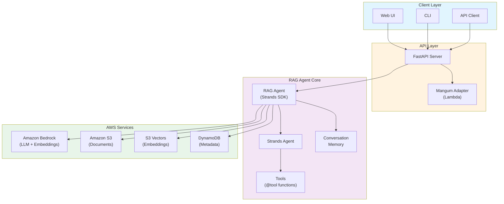
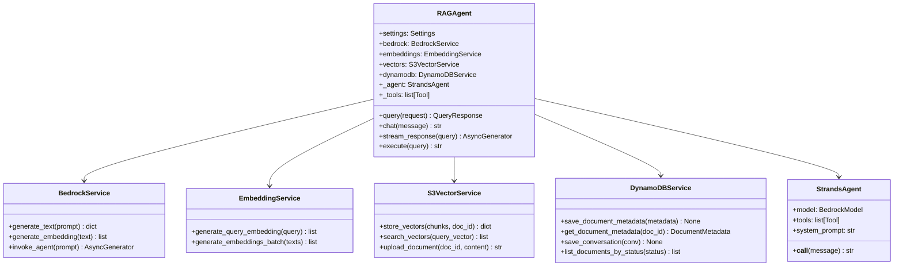
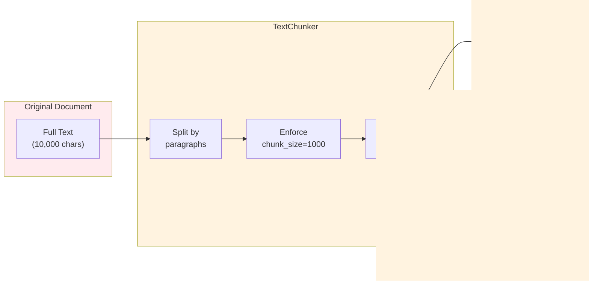
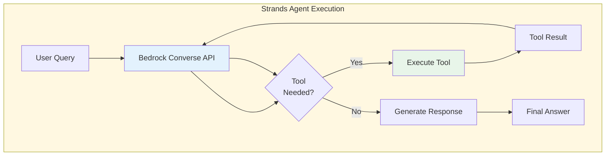
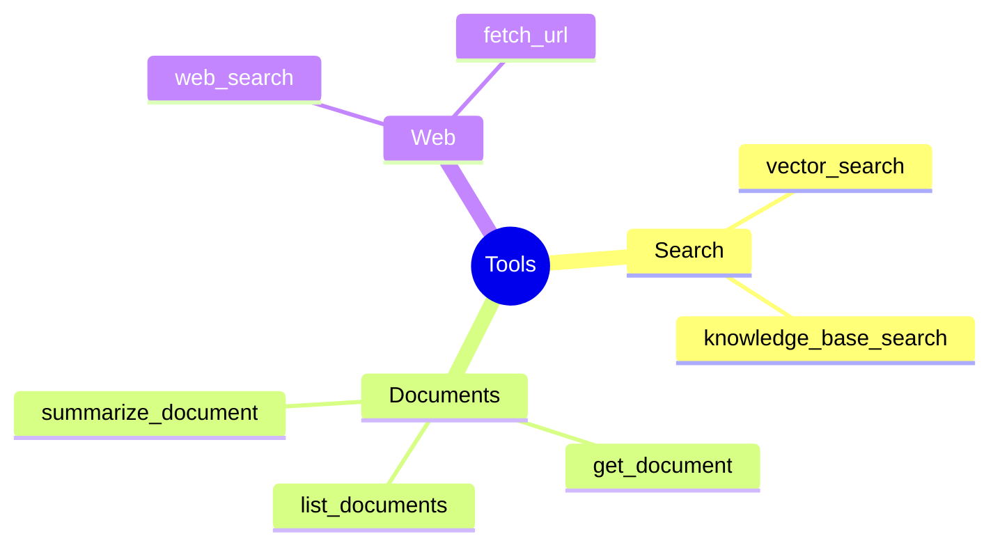
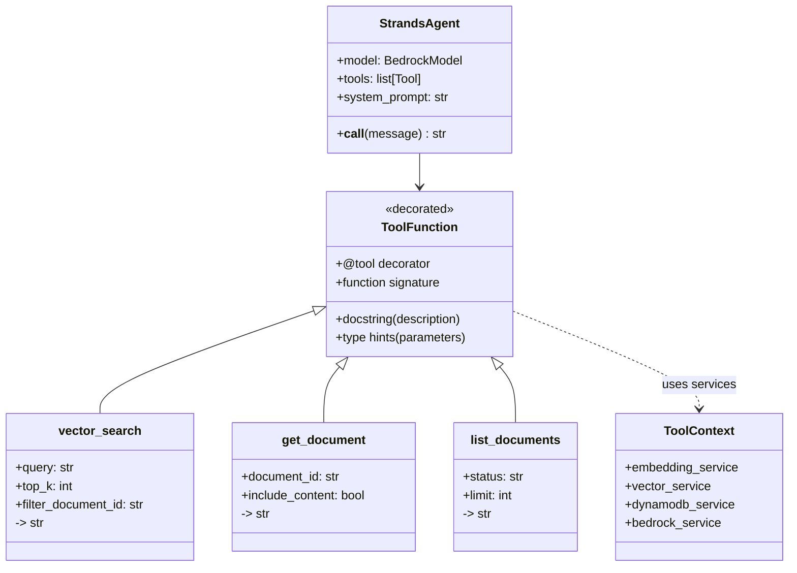
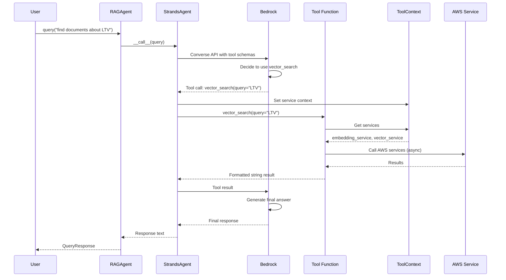
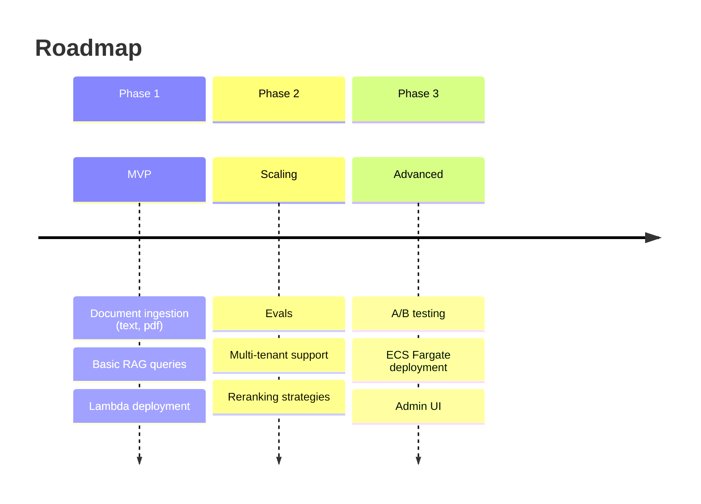

# AWS RAG Agent Architecture

This document provides a comprehensive overview of the RAG (Retrieval-Augmented Generation) Agent architecture, including system diagrams, data flows, and component interactions.

---

## Table of Contents

1. [System Overview](#system-overview)
2. [High-Level Architecture](#high-level-architecture)
3. [Component Architecture](#component-architecture)
4. [Document Ingestion Pipeline](#document-ingestion-pipeline)
5. [Query & Retrieval Flow](#query--retrieval-flow)
6. [Deployment Architecture](#deployment-architecture)
7. [Data Models](#data-models)
8. [Tool System](#tool-system)

---

## System Overview

The RAG Agent is an AI-powered question-answering system that combines:

- **Retrieval**: Finding relevant documents from a knowledge base
- **Augmentation**: Enriching prompts with retrieved context
- **Generation**: Using LLMs to generate accurate, grounded responses

### Key Technologies

| Component        | Technology                  |
| ---------------- | --------------------------- |
| LLM Provider     | AWS Bedrock (Claude, Titan, Qwen) |
| Agent Framework  | Strands Agents SDK           |
| Vector Storage   | Amazon S3 Vectors           |
| Metadata Storage | Amazon DynamoDB             |
| Document Storage | Amazon S3                   |
| Embeddings       | Bedrock Titan Embeddings    |
| API Framework    | FastAPI                     |
| Infrastructure   | AWS CDK                     |

---

## High-Level Architecture



---

## Component Architecture

### Core Components



### Service Layer


---

## Document Ingestion Pipeline

The ingestion pipeline processes documents through several stages before they're available for retrieval.

### Pipeline Flow


### Chunking Strategy



### Embedding Generation


---

## Query & Retrieval Flow

### RAG Query Pipeline


### Detailed Query Sequence


### Agent Execution Flow (Strands SDK)

The Strands Agent uses Bedrock's native function calling capabilities, which automatically handles tool selection and multi-step reasoning.



**Key Differences from ReAct:**
- **Native Function Calling**: Bedrock handles tool selection automatically via Converse API
- **No Manual Parsing**: No need to parse THOUGHT/ACTION/ACTION_INPUT format
- **Automatic Orchestration**: Strands SDK manages tool execution and result integration
- **Multi-Step Reasoning**: Bedrock can chain multiple tool calls automatically

---

## Deployment Architecture

### AWS Lambda Deployment


### CDK Stack Structure


---

## Data Models

### DynamoDB Table Schema


**Key Patterns:**

| Entity              | PK (Partition Key)       | SK (Sort Key)         |
| ------------------- | ------------------------ | --------------------- |
| Document Metadata   | `DOC#<document_id>`      | `METADATA`            |
| Conversation        | `CONV#<conversation_id>` | `MESSAGE#<timestamp>` |
| GSI1 (Status Index) | `STATUS#<status>`        | `<created_at>`        |

**Status Values:** `PENDING` | `PROCESSING` | `INDEXED` | `FAILED`

### Core Data Classes


---

## Tool System

The agent uses a tool-based architecture powered by **Strands Agents SDK** for extensibility and automatic tool orchestration. Tools are defined as simple Python functions decorated with `@tool`, making them easy to create and maintain.

### Available Tools



**Tool Definition Example:**

Tools are now simple functions with the `@tool` decorator:

```python
from strands import tool
from rag_agent.tools.base import get_vector_service, run_async_sync

@tool
def vector_search(
    query: str,
    top_k: int = 5,
    filter_document_id: str | None = None,
) -> str:
    """
    Search for relevant documents in the knowledge base using semantic similarity.
    
    Use this tool when you need to find information related to a specific topic.
    
    Args:
        query: The search query to find relevant documents
        top_k: Number of results to return (default: 5)
        filter_document_id: Optional document ID to filter results
        
    Returns:
        Formatted list of relevant document chunks with similarity scores
    """
    vector_service = get_vector_service()
    # ... implementation using run_async_sync for async services
    return formatted_results
```

**Key Benefits:**
- **Simpler Code**: No need for Tool classes or ToolDefinition objects
- **Type Safety**: Function signatures and type hints define the tool schema
- **Automatic Discovery**: Strands extracts tool metadata from docstrings and types
- **Native Integration**: Works seamlessly with Bedrock's Converse API

### Tool Architecture (Strands SDK)

Tools are defined as simple Python functions using the `@tool` decorator from Strands Agents SDK. The SDK automatically handles tool discovery, schema generation, and execution orchestration.



**Key Features:**
- **Simple Function-Based**: Tools are regular Python functions with `@tool` decorator
- **Automatic Schema Generation**: Strands extracts parameter types and descriptions from function signatures and docstrings
- **Native Bedrock Integration**: Tools work seamlessly with Bedrock's Converse API for function calling
- **Service Injection**: Tools access AWS services through `ToolContext` for dependency injection

### Tool Execution Flow (Strands SDK)



**Execution Model:**
1. User query is passed to RAGAgent
2. RAGAgent delegates to Strands Agent with tool context
3. Strands Agent sends query + tool schemas to Bedrock
4. Bedrock decides which tool(s) to use based on the query
5. Tool functions execute with injected AWS services
6. Results are returned as formatted strings
7. Bedrock incorporates tool results into final response

---

## API Endpoints

### REST API Structure


---

## Configuration

### Environment Variables


---

## Security Architecture


---

## Performance Considerations

| Component         | Optimization                                   |
| ----------------- | ---------------------------------------------- |
| **Embeddings**    | Batch processing (25 texts/batch)              |
| **Vector Search** | Top-K limiting, similarity threshold filtering |
| **Lambda**        | 1024MB memory, 60s timeout                     |
| **DynamoDB**      | On-demand capacity, GSI for status queries     |
| **S3**            | Lifecycle rules for old versions               |

---

## Future Enhancements



---

## Architecture Evolution

### Migration from Google ADK to Strands Agents SDK

The system was migrated from Google ADK patterns to **Strands Agents SDK** for better integration with AWS Bedrock and simplified tool management.

**Key Changes:**

| Aspect | Before (Google ADK) | After (Strands SDK) |
|--------|---------------------|---------------------|
| **Tool Definition** | `Tool` class with `ToolDefinition` | `@tool` decorated functions |
| **Tool Registry** | Custom `ToolRegistry` class | Strands Agent manages tools |
| **Tool Execution** | Manual ReAct loop parsing | Native Bedrock function calling |
| **Schema Generation** | `to_function_schema()` method | Automatic from function signature |
| **Agent Orchestration** | Custom ReAct implementation | Strands Agent with Bedrock Converse API |

**Benefits:**
- ✅ Native Bedrock integration via Converse API
- ✅ Simpler tool definitions (functions vs classes)
- ✅ Automatic tool schema generation
- ✅ Better error handling and retry logic
- ✅ Reduced code complexity

## References

- [Amazon Bedrock Documentation](https://docs.aws.amazon.com/bedrock/)
- [Amazon S3 Vectors](https://docs.aws.amazon.com/s3/vectors/)
- [Strands Agents SDK](https://strandsagents.com/)
- [AWS CDK Python Reference](https://docs.aws.amazon.com/cdk/api/v2/python/)
- [FastAPI Documentation](https://fastapi.tiangolo.com/)

# NOTE: THis is an unrelated graph showing multi account accecss in Bedrock
```mermaid
graph TD
    subgraph Enterprise_Identity[Enterprise Identity]
        IDP[Enterprise IdP<br/>Okta / Azure AD / IAM Identity Center]
    end

    subgraph Central_Account[Central GenAI Gateway Account]
        OIDC[OIDC Provider<br/>backed by Enterprise IdP]
        ECS[ECS Tasks<br/>GenAI Gateway]
    end

    subgraph Shared_Model_Account_1[Shared Model Account A]
        RoleA[Role: GenAIGateway-UseCaseA-BedrockInvokeRole]
        BedrockA[Amazon Bedrock Runtime]
    end

    subgraph Shared_Model_Account_2[Shared Model Account B]
        RoleB[Role: GenAIGateway-UseCaseB-BedrockInvokeRole]
        BedrockB[Amazon Bedrock Runtime]
    end

    IDP -->|Issues Web Identity Token<br/>for use case identity| OIDC
    ECS -->|Uses Web Identity Token<br/>in AssumeRoleWithWebIdentity| RoleA
    ECS -->|Uses Web Identity Token<br/>in AssumeRoleWithWebIdentity| RoleB

    RoleA -->|Trusts OIDC Provider<br/>sts:AssumeRoleWithWebIdentity| OIDC
    RoleB -->|Trusts OIDC Provider<br/>sts:AssumeRoleWithWebIdentity| OIDC

    ECS -->|InvokeModel /<br/>InvokeModelWithResponseStream<br/>using STS creds| BedrockA
    ECS -->|InvokeModel /<br/>InvokeModelWithResponseStream<br/>using STS creds| BedrockB
```


---

## Diagram showing the trust relationships

```mermaid
graph TD
    subgraph Enterprise_Identity[Enterprise Identity]
        IDP[Enterprise IdP<br/>Okta / Azure AD / IAM Identity Center]
    end

    subgraph Central_Account[Central GenAI Gateway Account]
        OIDC[OIDC Provider<br/>backed by Enterprise IdP]
        ECS[ECS Tasks<br/>GenAI Gateway]
    end

    subgraph Shared_Model_Account_1[Shared Model Account A]
        RoleA[Role: GenAIGateway-UseCaseA-BedrockInvokeRole]
        BedrockA[Amazon Bedrock Runtime]
    end

    subgraph Shared_Model_Account_2[Shared Model Account B]
        RoleB[Role: GenAIGateway-UseCaseB-BedrockInvokeRole]
        BedrockB[Amazon Bedrock Runtime]
    end

    IDP -->|Issues Web Identity Token<br/>for use case identity| OIDC
    ECS -->|Uses Web Identity Token<br/>in AssumeRoleWithWebIdentity| RoleA
    ECS -->|Uses Web Identity Token<br/>in AssumeRoleWithWebIdentity| RoleB

    RoleA -->|Trusts OIDC Provider<br/>sts:AssumeRoleWithWebIdentity| OIDC
    RoleB -->|Trusts OIDC Provider<br/>sts:AssumeRoleWithWebIdentity| OIDC

    ECS -->|InvokeModel /<br/>InvokeModelWithResponseStream<br/>using STS creds| BedrockA
    ECS -->|InvokeModel /<br/>InvokeModelWithResponseStream<br/>using STS creds| BedrockB
```


**Key ideas:**

- Shared model account roles **trust** the OIDC provider in the central account.
- ECS tasks **assume those roles with Web Identity** using IdP‑issued tokens.
- Each role is **scoped per use case and per model set**.

---

## Multi‑use‑case IAM layout for large enterprises

### 1. High‑level pattern

- **Central account**
  - **OIDC provider** configured against enterprise IdP.
  - **ECS tasks** that:
    - Receive requests tagged with `use_case_id`.
    - Obtain Web Identity tokens for that use case.
    - Call `AssumeRoleWithWebIdentity` into shared model accounts.
- **N shared model accounts**
  - Each has **one or more IAM roles per use case** (or per use‑case group).
  - Each role:
    - Trusts the central account’s OIDC provider.
    - Grants least‑privilege Bedrock permissions.

### 2. Example role layout across accounts

| Layer                    | Entity / Pattern                                      | Purpose                                      |
|--------------------------|--------------------------------------------------------|----------------------------------------------|
| Central account          | `OIDCProvider/enterprise-idp`                         | Federated identity from IdP                  |
| Central account          | `ECS Task Role: GenAIGatewayTaskRole`                 | Calls STS, ElastiCache, logging, etc.        |
| Shared model account A   | `Role: GenAIGateway-UseCaseA-BedrockInvokeRole`       | Use Case A → specific models in Account A    |
| Shared model account A   | `Role: GenAIGateway-UseCaseB-BedrockInvokeRole`       | Use Case B → specific models in Account A    |
| Shared model account B   | `Role: GenAIGateway-UseCaseA-BedrockInvokeRole`       | Use Case A → specific models in Account B    |
| Shared model account B   | `Role: GenAIGateway-UseCaseC-BedrockInvokeRole`       | Use Case C → specific models in Account B    |

You can choose:

- **Per‑use‑case roles** (most explicit, best for strong isolation).
- Or **per‑domain roles** (e.g., `GenAIGateway-Marketing-BedrockInvokeRole`) if you want coarser grouping.

### 3. Example trust policy for multiple use cases

Shared model account role that allows **multiple use cases** from the same IdP group:

```json
{
  "Version": "2012-10-17",
  "Statement": [
    {
      "Effect": "Allow",
      "Principal": {
        "Federated": "arn:aws:iam::<CENTRAL_ACCOUNT_ID>:oidc-provider/<IDP_PROVIDER>"
      },
      "Action": "sts:AssumeRoleWithWebIdentity",
      "Condition": {
        "ForAnyValue:StringEquals": {
          "<IDP_PROVIDER>:groups": [
            "genai-usecase-marketing",
            "genai-usecase-analytics"
          ]
        }
      }
    }
  ]
}
```

### 4. Example permissions policy per role

```json
{
  "Version": "2012-10-17",
  "Statement": [
    {
      "Sid": "AllowSpecificModels",
      "Effect": "Allow",
      "Action": [
        "bedrock:InvokeModel",
        "bedrock:InvokeModelWithResponseStream"
      ],
      "Resource": [
        "arn:aws:bedrock:us-east-1::foundation-model/anthropic.claude-3-sonnet-20240229-v1:0",
        "arn:aws:bedrock:us-east-1::foundation-model/amazon.titan-text-premier-v1:0"
      ]
    }
  ]
}
```

You’d vary the `Resource` list per role to encode:

- **Which models** a use case can access.
- **Which accounts/regions** they can hit.

----


# Core Principles Behind the Naming Convention

A good naming system must:

- Encode **account type** (central vs. shared model account)
- Encode **use case identity**
- Encode **model access scope**
- Be **machine‑parsable** for automation (Terraform, CDK, pipelines)
- Support **hundreds of roles** without collisions
- Support **grouping** (e.g., domain‑level roles)

The pattern below does all of that.

---

# Recommended Naming Convention

## 1. IAM Roles (in Shared Model Accounts)

### **Pattern**
```
<OrgPrefix>-<Layer>-<UseCaseOrGroup>-<Capability>Role
```

### **Example**
```
ACME-GenAI-UseCaseA-BedrockInvokeRole
ACME-GenAI-UseCaseB-BedrockInvokeRole
ACME-GenAI-Marketing-BedrockInvokeRole
ACME-GenAI-Analytics-BedrockInvokeRole
```

### Field meanings
- **OrgPrefix** — your company prefix (`ACME`, `CONTOSO`, etc.)
- **Layer** — `GenAI` or `GenAIGateway`
- **UseCaseOrGroup** — `UseCaseA`, `FraudDetection`, `Marketing`, etc.
- **Capability** — `BedrockInvoke`, `ModelAccess`, etc.

---

## 2. IAM Policies (Permissions Policies)

### **Pattern**
```
<OrgPrefix>-<Layer>-<UseCaseOrGroup>-<ModelProvider>-<PermissionType>Policy
```

### **Example**
```
ACME-GenAI-UseCaseA-Anthropic-InvokePolicy
ACME-GenAI-UseCaseA-AmazonTitan-InvokePolicy
ACME-GenAI-Analytics-MultiModel-InvokePolicy
```

### Why this works
- You can instantly see **which models** a use case can access.
- You can attach multiple model‑specific policies to the same role.
- You can automate policy generation per model provider.

---

## 3. Trust Policies (Role Trust Documents)

### **Pattern**
```
<OrgPrefix>-<Layer>-<UseCaseOrGroup>-TrustPolicy
```

### **Example**
```
ACME-GenAI-UseCaseA-TrustPolicy
ACME-GenAI-Marketing-TrustPolicy
```

These are usually embedded inline, but naming them helps when stored in IaC repos.

---

## 4. OIDC Provider Naming (Central Account)

### **Pattern**
```
<OrgPrefix>-IdP-<ProviderName>
```

### **Example**
```
ACME-IdP-Okta
ACME-IdP-AzureAD
```

This makes trust relationships readable across accounts.

---

## 5. ECS Task Roles (Central Account)

### **Pattern**
```
<OrgPrefix>-GenAIGateway-TaskRole
```

### **Example**
```
ACME-GenAIGateway-TaskRole
```

This role is the one that calls STS.

---

# How This Scales Across Dozens of Accounts

Imagine you have:

- 1 central account  
- 20 shared model accounts  
- 40 use cases  

Using the naming convention:

### Shared Model Account 17
```
ACME-GenAI-UseCaseA-BedrockInvokeRole
ACME-GenAI-UseCaseB-BedrockInvokeRole
ACME-GenAI-UseCaseC-BedrockInvokeRole
...
```

### Shared Model Account 18
```
ACME-GenAI-UseCaseA-BedrockInvokeRole
ACME-GenAI-UseCaseD-BedrockInvokeRole
ACME-GenAI-Marketing-BedrockInvokeRole
...
```

### Policies
```
ACME-GenAI-UseCaseA-Anthropic-InvokePolicy
ACME-GenAI-UseCaseA-AmazonTitan-InvokePolicy
ACME-GenAI-UseCaseB-Meta-InvokePolicy
ACME-GenAI-Marketing-MultiModel-InvokePolicy
```

### Trust Policies
```
ACME-GenAI-UseCaseA-TrustPolicy
ACME-GenAI-Marketing-TrustPolicy
```

Everything is:

- Predictable  
- Scriptable  
- Easy to audit  
- Easy to rotate  
- Easy to onboard new use cases  

---

# Bonus: Naming Convention for Terraform Modules (Optional)

If you want to stamp out roles automatically:

```
module "usecaseA_bedrock_role" {
  source = "modules/genai-bedrock-role"
  use_case = "UseCaseA"
  model_providers = ["Anthropic", "AmazonTitan"]
}
```

This aligns perfectly with the naming scheme above.

---

## 🗺️ Diagram: Naming Convention Mapped Across Accounts

```mermaid
graph TD

    %% CENTRAL ACCOUNT
    subgraph Central_Account["Central GenAI Gateway Account"]
        OIDC["OIDC Provider\nACME-IdP-Okta"]
        TaskRole["ECS Task Role\nACME-GenAIGateway-TaskRole"]
    end

    %% SHARED MODEL ACCOUNT A
    subgraph SMA1["Shared Model Account A"]
        RoleA["ACME-GenAI-UseCaseA-BedrockInvokeRole"]
        PolicyA1["ACME-GenAI-UseCaseA-Anthropic-InvokePolicy"]
        PolicyA2["ACME-GenAI-UseCaseA-AmazonTitan-InvokePolicy"]
    end

    %% SHARED MODEL ACCOUNT B
    subgraph SMA2["Shared Model Account B"]
        RoleB["ACME-GenAI-Marketing-BedrockInvokeRole"]
        PolicyB1["ACME-GenAI-Marketing-MultiModel-InvokePolicy"]
    end

    %% SHARED MODEL ACCOUNT C
    subgraph SMA3["Shared Model Account C"]
        RoleC["ACME-GenAI-Analytics-BedrockInvokeRole"]
        PolicyC1["ACME-GenAI-Analytics-Anthropic-InvokePolicy"]
    end

    %% TRUST RELATIONSHIPS
    OIDC -->|"Trusts OIDC Provider\n(sts:AssumeRoleWithWebIdentity)"| RoleA
    OIDC -->|"Trusts OIDC Provider"| RoleB
    OIDC -->|"Trusts OIDC Provider"| RoleC

    %% ROLE → POLICY ATTACHMENTS
    RoleA --> PolicyA1
    RoleA --> PolicyA2

    RoleB --> PolicyB1

    RoleC --> PolicyC1

    %% ECS TASK ROLE → ASSUME ROLE
    TaskRole -->|"AssumeRoleWithWebIdentity\nper use case"| RoleA
    TaskRole -->|"AssumeRoleWithWebIdentity"| RoleB
    TaskRole -->|"AssumeRoleWithWebIdentity"| RoleC
```

---

## 🧠 What This Diagram Shows

### **1. Central Account**
- Hosts the **OIDC provider** (`ACME-IdP-Okta`)
- Hosts the **ECS Task Role** (`ACME-GenAIGateway-TaskRole`)
- ECS tasks use Web Identity tokens to assume roles in shared model accounts.

### **2. Shared Model Accounts**
Each shared model account contains:

- **One or more roles per use case or domain**
  - `ACME-GenAI-UseCaseA-BedrockInvokeRole`
  - `ACME-GenAI-Marketing-BedrockInvokeRole`
  - `ACME-GenAI-Analytics-BedrockInvokeRole`

- **Model‑specific permission policies**
  - `ACME-GenAI-UseCaseA-Anthropic-InvokePolicy`
  - `ACME-GenAI-UseCaseA-AmazonTitan-InvokePolicy`
  - `ACME-GenAI-Marketing-MultiModel-InvokePolicy`

### **3. Trust Relationships**
Every role in every shared model account trusts:

```
ACME-IdP-Okta
```

via:

```
sts:AssumeRoleWithWebIdentity
```

### **4. How Naming Helps**
The naming convention encodes:

- **Org** (`ACME`)
- **Layer** (`GenAI`, `GenAIGateway`)
- **Use case or domain** (`UseCaseA`, `Marketing`, `Analytics`)
- **Capability** (`BedrockInvoke`)
- **Model provider** (`Anthropic`, `AmazonTitan`, `MultiModel`)

This makes the system:

- Machine‑parsable  
- Easy to audit  
- Easy to automate  
- Easy to scale across dozens of accounts  

----

# NOTE: THis is an unrelated graph showing multi account accecss in Bedrock
```mermaid
graph TD
    subgraph Enterprise_Identity[Enterprise Identity]
        IDP[Enterprise IdP<br/>Okta / Azure AD / IAM Identity Center]
    end

    subgraph Central_Account[Central GenAI Gateway Account]
        OIDC[OIDC Provider<br/>backed by Enterprise IdP]
        ECS[ECS Tasks<br/>GenAI Gateway]
    end

    subgraph Shared_Model_Account_1[Shared Model Account A]
        RoleA[Role: GenAIGateway-UseCaseA-BedrockInvokeRole]
        BedrockA[Amazon Bedrock Runtime]
    end

    subgraph Shared_Model_Account_2[Shared Model Account B]
        RoleB[Role: GenAIGateway-UseCaseB-BedrockInvokeRole]
        BedrockB[Amazon Bedrock Runtime]
    end

    IDP -->|Issues Web Identity Token<br/>for use case identity| OIDC
    ECS -->|Uses Web Identity Token<br/>in AssumeRoleWithWebIdentity| RoleA
    ECS -->|Uses Web Identity Token<br/>in AssumeRoleWithWebIdentity| RoleB

    RoleA -->|Trusts OIDC Provider<br/>sts:AssumeRoleWithWebIdentity| OIDC
    RoleB -->|Trusts OIDC Provider<br/>sts:AssumeRoleWithWebIdentity| OIDC

    ECS -->|InvokeModel /<br/>InvokeModelWithResponseStream<br/>using STS creds| BedrockA
    ECS -->|InvokeModel /<br/>InvokeModelWithResponseStream<br/>using STS creds| BedrockB
```


---
Here’s a compact but complete take on both.

---

## Diagram showing the trust relationships

```mermaid
graph TD
    subgraph Enterprise_Identity[Enterprise Identity]
        IDP[Enterprise IdP<br/>Okta / Azure AD / IAM Identity Center]
    end

    subgraph Central_Account[Central GenAI Gateway Account]
        OIDC[OIDC Provider<br/>backed by Enterprise IdP]
        ECS[ECS Tasks<br/>GenAI Gateway]
    end

    subgraph Shared_Model_Account_1[Shared Model Account A]
        RoleA[Role: GenAIGateway-UseCaseA-BedrockInvokeRole]
        BedrockA[Amazon Bedrock Runtime]
    end

    subgraph Shared_Model_Account_2[Shared Model Account B]
        RoleB[Role: GenAIGateway-UseCaseB-BedrockInvokeRole]
        BedrockB[Amazon Bedrock Runtime]
    end

    IDP -->|Issues Web Identity Token<br/>for use case identity| OIDC
    ECS -->|Uses Web Identity Token<br/>in AssumeRoleWithWebIdentity| RoleA
    ECS -->|Uses Web Identity Token<br/>in AssumeRoleWithWebIdentity| RoleB

    RoleA -->|Trusts OIDC Provider<br/>sts:AssumeRoleWithWebIdentity| OIDC
    RoleB -->|Trusts OIDC Provider<br/>sts:AssumeRoleWithWebIdentity| OIDC

    ECS -->|InvokeModel /<br/>InvokeModelWithResponseStream<br/>using STS creds| BedrockA
    ECS -->|InvokeModel /<br/>InvokeModelWithResponseStream<br/>using STS creds| BedrockB
```


**Key ideas:**

- Shared model account roles **trust** the OIDC provider in the central account.
- ECS tasks **assume those roles with Web Identity** using IdP‑issued tokens.
- Each role is **scoped per use case and per model set**.

---

## Multi‑use‑case IAM layout for large enterprises

### 1. High‑level pattern

- **Central account**
  - **OIDC provider** configured against enterprise IdP.
  - **ECS tasks** that:
    - Receive requests tagged with `use_case_id`.
    - Obtain Web Identity tokens for that use case.
    - Call `AssumeRoleWithWebIdentity` into shared model accounts.
- **N shared model accounts**
  - Each has **one or more IAM roles per use case** (or per use‑case group).
  - Each role:
    - Trusts the central account’s OIDC provider.
    - Grants least‑privilege Bedrock permissions.

### 2. Example role layout across accounts

| Layer                    | Entity / Pattern                                      | Purpose                                      |
|--------------------------|--------------------------------------------------------|----------------------------------------------|
| Central account          | `OIDCProvider/enterprise-idp`                         | Federated identity from IdP                  |
| Central account          | `ECS Task Role: GenAIGatewayTaskRole`                 | Calls STS, ElastiCache, logging, etc.        |
| Shared model account A   | `Role: GenAIGateway-UseCaseA-BedrockInvokeRole`       | Use Case A → specific models in Account A    |
| Shared model account A   | `Role: GenAIGateway-UseCaseB-BedrockInvokeRole`       | Use Case B → specific models in Account A    |
| Shared model account B   | `Role: GenAIGateway-UseCaseA-BedrockInvokeRole`       | Use Case A → specific models in Account B    |
| Shared model account B   | `Role: GenAIGateway-UseCaseC-BedrockInvokeRole`       | Use Case C → specific models in Account B    |

You can choose:

- **Per‑use‑case roles** (most explicit, best for strong isolation).
- Or **per‑domain roles** (e.g., `GenAIGateway-Marketing-BedrockInvokeRole`) if you want coarser grouping.

### 3. Example trust policy for multiple use cases

Shared model account role that allows **multiple use cases** from the same IdP group:

```json
{
  "Version": "2012-10-17",
  "Statement": [
    {
      "Effect": "Allow",
      "Principal": {
        "Federated": "arn:aws:iam::<CENTRAL_ACCOUNT_ID>:oidc-provider/<IDP_PROVIDER>"
      },
      "Action": "sts:AssumeRoleWithWebIdentity",
      "Condition": {
        "ForAnyValue:StringEquals": {
          "<IDP_PROVIDER>:groups": [
            "genai-usecase-marketing",
            "genai-usecase-analytics"
          ]
        }
      }
    }
  ]
}
```

### 4. Example permissions policy per role

```json
{
  "Version": "2012-10-17",
  "Statement": [
    {
      "Sid": "AllowSpecificModels",
      "Effect": "Allow",
      "Action": [
        "bedrock:InvokeModel",
        "bedrock:InvokeModelWithResponseStream"
      ],
      "Resource": [
        "arn:aws:bedrock:us-east-1::foundation-model/anthropic.claude-3-sonnet-20240229-v1:0",
        "arn:aws:bedrock:us-east-1::foundation-model/amazon.titan-text-premier-v1:0"
      ]
    }
  ]
}
```

You’d vary the `Resource` list per role to encode:

- **Which models** a use case can access.
- **Which accounts/regions** they can hit.

