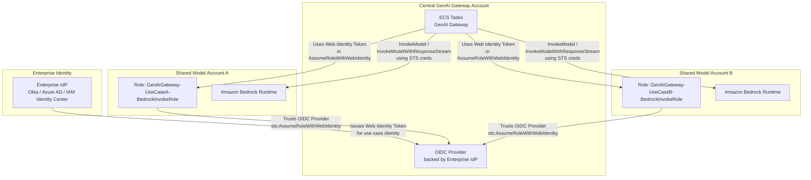
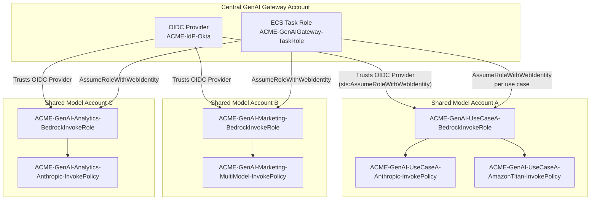
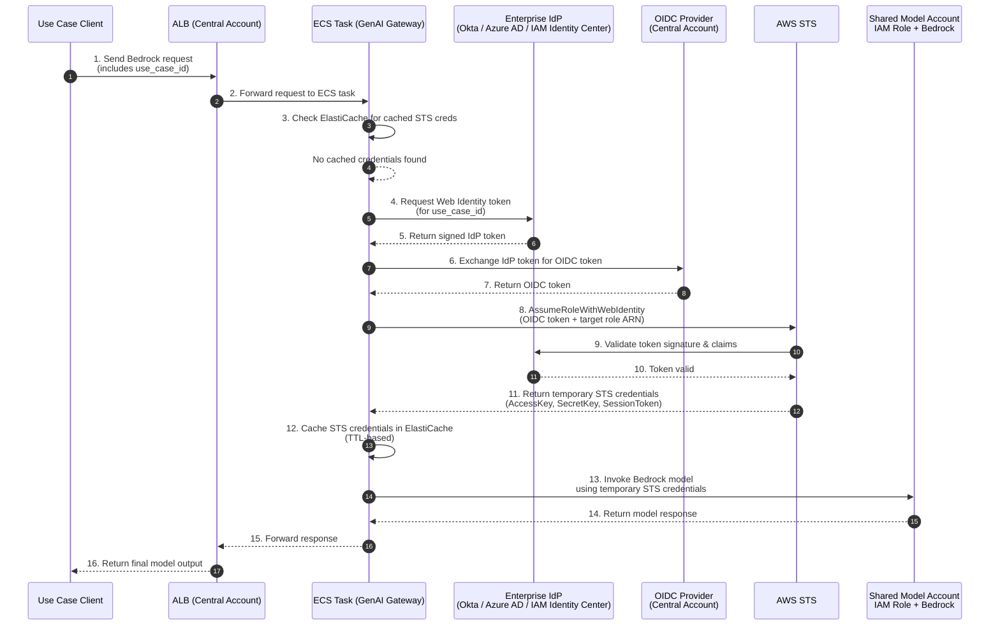
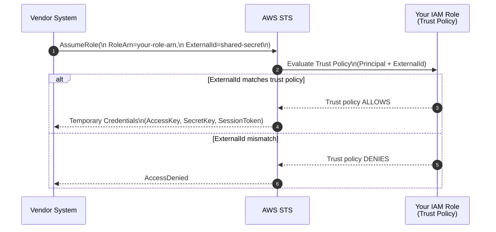

# AWS Architecture and Security Setup

A comprehensive guide covering multi-account access patterns, IAM naming conventions, and security flows for AWS Bedrock integration.

---

## Table of Contents

1. [Multi-Account Access in Amazon Bedrock](#1-multi-account-access-in-amazon-bedrock)
   - [1.1 Overview Diagram](#11-overview-diagram)
   - [1.2 Trust Relationships Diagram](#12-trust-relationships-diagram)
   - [1.3 Key Concepts](#13-key-concepts)

2. [Multi-Use-Case IAM Layout for Large Enterprises](#2-multi-use-case-iam-layout-for-large-enterprises)
   - [2.1 High-Level Pattern](#21-high-level-pattern)
   - [2.2 Example Role Layout Across Accounts](#22-example-role-layout-across-accounts)
   - [2.3 Example Trust Policy for Multiple Use Cases](#23-example-trust-policy-for-multiple-use-cases)
   - [2.4 Example Permissions Policy Per Role](#24-example-permissions-policy-per-role)

3. [Enterprise-Grade IAM Naming Convention](#3-enterprise-grade-iam-naming-convention)
   - [3.1 Core Principles](#31-core-principles)
   - [3.2 IAM Roles (in Shared Model Accounts)](#32-iam-roles-in-shared-model-accounts)
   - [3.3 IAM Policies (Permissions Policies)](#33-iam-policies-permissions-policies)
   - [3.4 Trust Policies (Role Trust Documents)](#34-trust-policies-role-trust-documents)
   - [3.5 OIDC Provider Naming (Central Account)](#35-oidc-provider-naming-central-account)
   - [3.6 ECS Task Roles (Central Account)](#36-ecs-task-roles-central-account)

4. [Scaling Across Dozens of Accounts](#4-scaling-across-dozens-of-accounts)
   - [4.1 Example Role Distribution](#41-example-role-distribution)
   - [4.2 Terraform Module Naming](#42-terraform-module-naming)

5. [Naming Convention Mapped Across Accounts (Diagram)](#5-naming-convention-mapped-across-accounts-diagram)
   - [5.1 Visual Diagram](#51-visual-diagram)
   - [5.2 Diagram Explanation](#52-diagram-explanation)

6. [AssumeRoleWithWebIdentity Flow](#6-assumerolewithwebidentity-flow)
   - [6.1 Full Sequence Diagram](#61-full-sequence-diagram)
   - [6.2 Flow Explanation](#62-flow-explanation)

7. [Understanding ECS Tasks in This Architecture](#7-understanding-ecs-tasks-in-this-architecture)
   - [7.1 What is an ECS Task?](#71-what-is-an-ecs-task)
   - [7.2 Request Flow Through ECS Task](#72-request-flow-through-ecs-task)
   - [7.3 Why ECS Tasks Over Lambda](#73-why-ecs-tasks-over-lambda)

8. [External ID Flow for Third-Party Vendors](#8-external-id-flow-for-third-party-vendors)
   - [8.1 External ID Flow Diagram](#81-external-id-flow-diagram)
   - [8.2 How It Works](#82-how-it-works)
   - [8.3 Why This Matters](#83-why-this-matters)

---

## 1. Multi-Account Access in Amazon Bedrock

### 1.1 Overview Diagram



### 1.2 Trust Relationships Diagram


### 1.3 Key Concepts

- Shared model account roles **trust** the OIDC provider in the central account.
- ECS tasks **assume those roles with Web Identity** using IdP‑issued tokens.
- Each role is **scoped per use case and per model set**.

---

## 2. Multi-Use-Case IAM Layout for Large Enterprises

### 2.1 High-Level Pattern

- **Central account**
  - **OIDC provider** configured against enterprise IdP.
  - **ECS tasks** that:
    - Receive requests tagged with `use_case_id`.
    - Obtain Web Identity tokens for that use case.
    - Call `AssumeRoleWithWebIdentity` into shared model accounts.
- **N shared model accounts**
  - Each has **one or more IAM roles per use case** (or per use‑case group).
  - Each role:
    - Trusts the central account's OIDC provider.
    - Grants least‑privilege Bedrock permissions.

### 2.2 Example Role Layout Across Accounts

| Layer                    | Entity / Pattern                                      | Purpose                                      |
|--------------------------|--------------------------------------------------------|----------------------------------------------|
| Central account          | `OIDCProvider/enterprise-idp`                         | Federated identity from IdP                  |
| Central account          | `ECS Task Role: GenAIGatewayTaskRole`                 | Calls STS, ElastiCache, logging, etc.        |
| Shared model account A   | `Role: GenAIGateway-UseCaseA-BedrockInvokeRole`       | Use Case A → specific models in Account A    |
| Shared model account A   | `Role: GenAIGateway-UseCaseB-BedrockInvokeRole`       | Use Case B → specific models in Account A    |
| Shared model account B   | `Role: GenAIGateway-UseCaseA-BedrockInvokeRole`       | Use Case A → specific models in Account B    |
| Shared model account B   | `Role: GenAIGateway-UseCaseC-BedrockInvokeRole`       | Use Case C → specific models in Account B    |

You can choose:

- **Per‑use‑case roles** (most explicit, best for strong isolation).
- Or **per‑domain roles** (e.g., `GenAIGateway-Marketing-BedrockInvokeRole`) if you want coarser grouping.

### 2.3 Example Trust Policy for Multiple Use Cases

Shared model account role that allows **multiple use cases** from the same IdP group:

```json
{
  "Version": "2012-10-17",
  "Statement": [
    {
      "Effect": "Allow",
      "Principal": {
        "Federated": "arn:aws:iam::<CENTRAL_ACCOUNT_ID>:oidc-provider/<IDP_PROVIDER>"
      },
      "Action": "sts:AssumeRoleWithWebIdentity",
      "Condition": {
        "ForAnyValue:StringEquals": {
          "<IDP_PROVIDER>:groups": [
            "genai-usecase-marketing",
            "genai-usecase-analytics"
          ]
        }
      }
    }
  ]
}
```

### 2.4 Example Permissions Policy Per Role

```json
{
  "Version": "2012-10-17",
  "Statement": [
    {
      "Sid": "AllowSpecificModels",
      "Effect": "Allow",
      "Action": [
        "bedrock:InvokeModel",
        "bedrock:InvokeModelWithResponseStream"
      ],
      "Resource": [
        "arn:aws:bedrock:us-east-1::foundation-model/anthropic.claude-3-sonnet-20240229-v1:0",
        "arn:aws:bedrock:us-east-1::foundation-model/amazon.titan-text-premier-v1:0"
      ]
    }
  ]
}
```

You'd vary the `Resource` list per role to encode:

- **Which models** a use case can access.
- **Which accounts/regions** they can hit.

---

## 3. Enterprise-Grade IAM Naming Convention

A clean, scalable naming convention for IAM roles and policies that works across **dozens or even hundreds of AWS accounts**, including the multi‑account Bedrock model‑access pattern.

### 3.1 Core Principles

A good naming system must:

- Encode **account type** (central vs. shared model account)
- Encode **use case identity**
- Encode **model access scope**
- Be **machine‑parsable** for automation (Terraform, CDK, pipelines)
- Support **hundreds of roles** without collisions
- Support **grouping** (e.g., domain‑level roles)

### 3.2 IAM Roles (in Shared Model Accounts)

#### Pattern

```
<OrgPrefix>-<Layer>-<UseCaseOrGroup>-<Capability>Role
```

#### Examples

```
ACME-GenAI-UseCaseA-BedrockInvokeRole
ACME-GenAI-UseCaseB-BedrockInvokeRole
ACME-GenAI-Marketing-BedrockInvokeRole
ACME-GenAI-Analytics-BedrockInvokeRole
```

#### Field Meanings

- **OrgPrefix** — your company prefix (`ACME`, `CONTOSO`, etc.)
- **Layer** — `GenAI` or `GenAIGateway`
- **UseCaseOrGroup** — `UseCaseA`, `FraudDetection`, `Marketing`, etc.
- **Capability** — `BedrockInvoke`, `ModelAccess`, etc.

### 3.3 IAM Policies (Permissions Policies)

#### Pattern

```
<OrgPrefix>-<Layer>-<UseCaseOrGroup>-<ModelProvider>-<PermissionType>Policy
```

#### Examples

```
ACME-GenAI-UseCaseA-Anthropic-InvokePolicy
ACME-GenAI-UseCaseA-AmazonTitan-InvokePolicy
ACME-GenAI-Analytics-MultiModel-InvokePolicy
```

#### Why This Works

- You can instantly see **which models** a use case can access.
- You can attach multiple model‑specific policies to the same role.
- You can automate policy generation per model provider.

### 3.4 Trust Policies (Role Trust Documents)

#### Pattern

```
<OrgPrefix>-<Layer>-<UseCaseOrGroup>-TrustPolicy
```

#### Examples

```
ACME-GenAI-UseCaseA-TrustPolicy
ACME-GenAI-Marketing-TrustPolicy
```

These are usually embedded inline, but naming them helps when stored in IaC repos.

### 3.5 OIDC Provider Naming (Central Account)

#### Pattern

```
<OrgPrefix>-IdP-<ProviderName>
```

#### Examples

```
ACME-IdP-Okta
ACME-IdP-AzureAD
```

This makes trust relationships readable across accounts.

### 3.6 ECS Task Roles (Central Account)

#### Pattern

```
<OrgPrefix>-GenAIGateway-TaskRole
```

#### Example

```
ACME-GenAIGateway-TaskRole
```

This role is the one that calls STS.

---

## 4. Scaling Across Dozens of Accounts

Imagine you have:

- 1 central account  
- 20 shared model accounts  
- 40 use cases  

### 4.1 Example Role Distribution

#### Shared Model Account 17

```
ACME-GenAI-UseCaseA-BedrockInvokeRole
ACME-GenAI-UseCaseB-BedrockInvokeRole
ACME-GenAI-UseCaseC-BedrockInvokeRole
...
```

#### Shared Model Account 18

```
ACME-GenAI-UseCaseA-BedrockInvokeRole
ACME-GenAI-UseCaseD-BedrockInvokeRole
ACME-GenAI-Marketing-BedrockInvokeRole
...
```

#### Policies

```
ACME-GenAI-UseCaseA-Anthropic-InvokePolicy
ACME-GenAI-UseCaseA-AmazonTitan-InvokePolicy
ACME-GenAI-UseCaseB-Meta-InvokePolicy
ACME-GenAI-Marketing-MultiModel-InvokePolicy
```

#### Trust Policies

```
ACME-GenAI-UseCaseA-TrustPolicy
ACME-GenAI-Marketing-TrustPolicy
```

Everything is:

- Predictable  
- Scriptable  
- Easy to audit  
- Easy to rotate  
- Easy to onboard new use cases  

### 4.2 Terraform Module Naming

If you want to stamp out roles automatically:

```hcl
module "usecaseA_bedrock_role" {
  source = "modules/genai-bedrock-role"
  use_case = "UseCaseA"
  model_providers = ["Anthropic", "AmazonTitan"]
}
```

This aligns perfectly with the naming scheme above.

---

## 5. Naming Convention Mapped Across Accounts (Diagram)

### 5.1 Visual Diagram



### 5.2 Diagram Explanation

#### Central Account

- Hosts the **OIDC provider** (`ACME-IdP-Okta`)
- Hosts the **ECS Task Role** (`ACME-GenAIGateway-TaskRole`)
- ECS tasks use Web Identity tokens to assume roles in shared model accounts.

#### Shared Model Accounts

Each shared model account contains:

- **One or more roles per use case or domain**
  - `ACME-GenAI-UseCaseA-BedrockInvokeRole`
  - `ACME-GenAI-Marketing-BedrockInvokeRole`
  - `ACME-GenAI-Analytics-BedrockInvokeRole`

- **Model‑specific permission policies**
  - `ACME-GenAI-UseCaseA-Anthropic-InvokePolicy`
  - `ACME-GenAI-UseCaseA-AmazonTitan-InvokePolicy`
  - `ACME-GenAI-Marketing-MultiModel-InvokePolicy`

#### Trust Relationships

Every role in every shared model account trusts:

```
ACME-IdP-Okta
```

via:

```
sts:AssumeRoleWithWebIdentity
```

#### How Naming Helps

The naming convention encodes:

- **Org** (`ACME`)
- **Layer** (`GenAI`, `GenAIGateway`)
- **Use case or domain** (`UseCaseA`, `Marketing`, `Analytics`)
- **Capability** (`BedrockInvoke`)
- **Model provider** (`Anthropic`, `AmazonTitan`, `MultiModel`)

This makes the system:

- Machine‑parsable  
- Easy to audit  
- Easy to automate  
- Easy to scale across dozens of accounts  

---

## 6. AssumeRoleWithWebIdentity Flow

### 6.1 Full Sequence Diagram



### 6.2 Flow Explanation

#### 1. Identity Verification

- The use case identity is validated by the **Enterprise IdP**.
- The OIDC provider in the central account issues a token trusted by AWS STS.

#### 2. Cross‑Account Access

- ECS assumes a role in the **Shared Model Account** using `AssumeRoleWithWebIdentity`.
- The role's trust policy restricts access to specific use cases.

#### 3. Governance & Performance

- Temporary credentials are cached in **ElastiCache**.
- Future requests skip the identity flow until TTL expires.

#### 4. Least‑Privilege Model Access

- The IAM role in the shared model account grants access only to:
  - Specific Bedrock models  
  - Specific model versions  
  - Specific actions (`InvokeModel`, `InvokeModelWithResponseStream`)  

---

## 7. Understanding ECS Tasks in This Architecture

### 7.1 What is an ECS Task?

An **ECS task** is **a running containerized workload** inside Amazon ECS (Elastic Container Service).  
Think of it as:

- A **Docker container** running your GenAI Gateway code  
- Managed by ECS  
- Scaled automatically  
- Receiving requests from the ALB  

It is **not** an AWS API call.  
It is **your application code**, running inside a container.

When documentation says:

> "The ECS task checks ElastiCache… The ECS task calls AssumeRoleWithWebIdentity…"

It means:

- Your **running container** (the gateway service)  
- Executes code that:
  - Reads from Redis  
  - Calls AWS STS  
  - Calls Bedrock  
  - Applies governance logic  

So the ECS task is the **execution environment** for your gateway logic.

### 7.2 Request Flow Through ECS Task

Here's the lifecycle:

1. **ALB receives the request**  
2. ALB forwards it to an **ECS task**  
3. The ECS task runs your code:
   - Parse request  
   - Check quotas  
   - Check cached credentials  
   - If needed, call `AssumeRoleWithWebIdentity`  
   - Forward to Bedrock  
4. ECS task returns the response to ALB  
5. ALB returns it to the client  

So the ECS task is the **brains** of the gateway.

### 7.3 Why ECS Tasks Over Lambda

ECS tasks are used because:

- Bedrock requests can be **large** (multi‑MB prompts)  
- Streaming responses are easier in ECS  
- You can run **stateful caching clients**  
- You can run **high‑throughput, low‑latency** workloads  
- You can scale horizontally across many tasks  

Lambda would struggle with:

- Large payloads  
- Long‑running streaming  
- High concurrency  
- Connection reuse  

ECS gives you:

- Long‑lived containers  
- Warm connections  
- High throughput  
- Predictable performance  

**Summary:** An ECS task is a **running container** that *makes* API calls.

Specifically, it makes calls to:

- AWS STS (`AssumeRoleWithWebIdentity`)
- Amazon Bedrock (`InvokeModel`)
- ElastiCache (Redis)
- CloudWatch Logs
- Internal governance logic

---

## 8. External ID Flow for Third-Party Vendors

### 8.1 External ID Flow Diagram



### 8.2 How It Works

#### 1. Vendor includes External ID in the AssumeRole call

The vendor's backend calls:

```json
{
  "RoleArn": "arn:aws:iam::<YOUR_ACCOUNT>:role/<YourRole>",
  "RoleSessionName": "vendor-session",
  "ExternalId": "your-external-id"
}
```

#### 2. AWS STS checks your trust policy

Your trust policy contains:

```json
"Condition": {
  "StringEquals": {
    "sts:ExternalId": "your-external-id"
  }
}
```

#### 3. If the External ID matches, STS issues temporary credentials

These credentials allow the vendor to act *as your role*.

#### 4. If it doesn't match, AWS denies the request

Even if the vendor's AWS account ID is correct.

### 8.3 Why This Matters

External IDs prevent a **confused‑deputy attack** by ensuring:

- Only the vendor **acting on behalf of you** can assume your role  
- Other customers of the vendor **cannot** reuse the same vendor account to access your resources  
- The trust relationship is bound to a **shared secret**, not just an AWS account ID  

---

## Further Reading & Next Steps

Based on this document, you may want to explore:

- A **full enterprise naming standard document**  
- A **Terraform module template** that implements this naming convention  
- A **diagram** showing how naming maps across accounts  
- A **parallel diagram** showing multiple use cases hitting multiple shared model accounts  
- A **diagram showing credential caching logic**  
- A **diagram showing quota routing + model selection**
- A **trust‑policy template** for third‑party vendors  
- A **diagram of the confused‑deputy attack** itself  
- A **step‑by‑step checklist** for securely onboarding vendors
