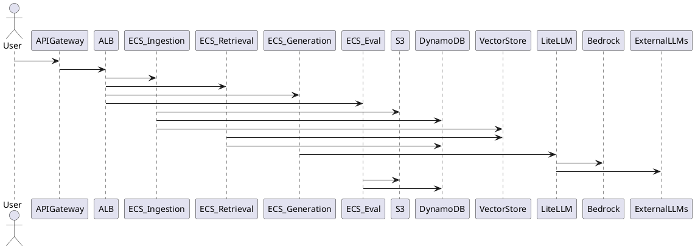

# SPEC-1-RAG-on-AWS

## Background

This document proposes an AWS-native architecture for an enterprise Retrieval-Augmented Generation (RAG) system similar to the described project (LiteLLM, Google ADK, S3, Pinecone, AI Gateway, experimentation, evaluations). The goal is to redesign this system using AWS managed services, with AWS Fargate as the primary compute layer, while preserving flexibility for multi-model providers, experimentation, and evaluation workflows.

**Assumptions (can be adjusted):**

* Target users are internal enterprise teams (not consumer-scale public traffic)
* System must support multi-LLM providers (OpenAI, Anthropic, Bedrock, etc.) via a gateway
* Vector database should be AWS-native. Use S3's vector database features if possible otherwise use PGVector
* Security, isolation, and auditability are enterprise-grade requirements

### Confirmed Assumptions

* AWS-native services are preferred wherever possible
* DynamoDB will be used for metadata, configuration, and evaluation artifacts
* Vector storage will use AWS-native solutions (S3 with Vectors, OpenSearch Serverless or Aurora PostgreSQL with pgvector)
* LLM inference will rely on managed APIs (Amazon Bedrock, OpenAI, Anthropic, etc.)
* An AI Gateway layer (e.g., LiteLLM) will abstract provider/model switching

---

## Requirements

### Must Have

* API-based RAG service supporting enterprise document Q&A
* Containerized workloads running on **AWS Fargate**
* AI Gateway to route and abstract calls to multiple LLM providers
* Pluggable embedding models and chunking strategies
* AWS-native vector storage for embeddings
* Secure document ingestion pipeline
* Metadata storage for documents, chunks, prompts, runs, and evaluations
* Support for multiple indexes and retrieval strategies
* Offline and online evaluation using golden/silver datasets
* Human feedback capture and persistence
* End-to-end observability (logs, metrics, traces)
* An admin UI for viewing and managing configurations like embeddings, AI services used etc.

### Should Have

* Reranking strategies (cross-encoder or LLM-based)
* Prompt/version management
* A/B testing between retrieval and generation strategies
* Cost tracking per request / per model
* Tenant-level isolation (logical, not necessarily physical)

### Could Have

* UI for experimentation and evaluation
* Scheduled re-embedding and re-indexing jobs
* Fine-grained access control (RBAC) for datasets and experiments

### Won’t Have (MVP)

* Self-hosted GPU inference
* Real-time streaming ingestion from third-party SaaS systems
* Fully automated model fine-tuning pipelines

## Method

### High-Level Architecture

The system is decomposed into loosely coupled, containerized services running on **AWS Fargate**, fronted by managed AWS networking and security services.

**Primary Components:**

* **API Layer**: Amazon API Gateway (HTTP API) for external access
* **Application Load Balancer (ALB)**: Routes traffic to internal Fargate services
* **Compute**: Amazon ECS on Fargate
* **Storage**:

  * Amazon S3 – raw documents, processed chunks, evaluation datasets
  * Amazon DynamoDB – metadata, configs, experiments, feedback
  * Vector Store – Amazon OpenSearch Serverless (primary) or Aurora PostgreSQL (pgvector)
* **AI Gateway**: LiteLLM running as a dedicated Fargate service
* **LLM Providers**: Amazon Bedrock + external APIs
* **Observability**: CloudWatch Logs, Metrics, AWS X-Ray

### Core Services (ECS Tasks)

1. **Ingestion Service**

   * Accepts documents via API or batch upload
   * Stores raw files in S3
   * Performs chunking (strategy configurable)
   * Calls Embedding Service via AI Gateway
   * Writes embeddings to vector store
   * Persists metadata to DynamoDB

2. **Retrieval Service**

   * Accepts user queries
   * Selects index + retrieval strategy
   * Queries vector store
   * Optionally applies reranking
   * Returns top-k context chunks

3. **Generation Service**

   * Builds prompts from templates + retrieved context
   * Calls AI Gateway (LiteLLM)
   * Returns final response + citations

4. **Evaluation Service**

   * Runs offline evaluations using golden/silver datasets
   * Executes multiple RAG configurations
   * Stores scores, traces, and outputs in DynamoDB + S3

5. **Admin / Config Service**

   * Manages embeddings, models, chunking strategies
   * Controls routing rules for LiteLLM
   * Provides configuration APIs for UI

### AI Gateway (LiteLLM)

* Deployed as its own ECS Fargate service
* Responsibilities:

  * Model/provider abstraction
  * Routing and fallback
  * Rate limiting and retries
  * Cost and usage logging
* Integrates with:

  * Amazon Bedrock
  * External LLM APIs (via VPC NAT)

### Data Model (DynamoDB – Logical)

* **Documents** (PK: document_id)
* **Chunks** (PK: chunk_id, GSI: document_id)
* **Indexes** (PK: index_id)
* **Experiments** (PK: experiment_id)
* **Runs** (PK: run_id, GSI: experiment_id)
* **Feedback** (PK: feedback_id, GSI: run_id)

### Architecture Diagram (PlantUML)

## Implementation

### Infrastructure Setup

1. **Networking**

   * Create a dedicated VPC with public and private subnets across 2–3 AZs
   * Public subnets: ALB, NAT Gateway
   * Private subnets: ECS Fargate tasks, OpenSearch Serverless access

2. **Compute (ECS on Fargate)**

   * One ECS cluster for the RAG platform
   * Separate ECS services for:

     * Ingestion
     * Retrieval
     * Generation
     * Evaluation
     * Admin / Config
     * LiteLLM Gateway
   * Each service:

     * Uses its own task definition
     * Scales independently via Application Auto Scaling

3. **API & Routing**

   * Amazon API Gateway (HTTP API) as public entry point
   * API Gateway → ALB (VPC Link)
   * ALB path-based routing to ECS services

4. **Storage**

   * **S3** buckets:

     * `rag-raw-documents`
     * `rag-processed-chunks`
     * `rag-evaluations`
   * **DynamoDB tables** (on-demand capacity):

     * Documents
     * Chunks
     * Indexes
     * Experiments
     * Runs
     * Feedback
   * **Vector Store**:

     * OpenSearch Serverless (Vector Engine)
     * One collection per logical index

5. **AI Gateway (LiteLLM)**

   * Deployed as Fargate service
   * Configured via environment variables + DynamoDB-backed config
   * IAM role grants Bedrock access
   * NAT Gateway for outbound calls to external LLM APIs

6. **Security**

   * IAM task roles per service (least privilege)
   * S3 bucket policies scoped to ECS roles
   * API Gateway authentication via IAM or Cognito
   * Secrets stored in AWS Secrets Manager

7. **Observability**

   * CloudWatch Logs for all ECS tasks
   * CloudWatch metrics for latency, errors, token usage
   * AWS X-Ray enabled on API Gateway + ECS

---

## Milestones

1. **Week 1–2**

   * VPC, ECS cluster, CI/CD skeleton
   * S3 and DynamoDB provisioning

2. **Week 3–4**

   * Ingestion pipeline + OpenSearch indexing
   * LiteLLM Gateway integration

3. **Week 5–6**

   * Retrieval + Generation services
   * Prompt templates and citations

4. **Week 7**

   * Evaluation service (golden/silver datasets)
   * Feedback capture

5. **Week 8**

   * Admin/config UI
   * Load testing, cost validation

---

## Gathering Results

* **Functional Validation**

  * Verify RAG responses against golden datasets
  * Compare retrieval strategies and chunking methods

* **Quality Metrics**

  * Answer relevance
  * Context precision/recall
  * Human feedback scores

* **System Metrics**

  * Latency per stage (retrieval, generation)
  * Cost per query and per model
  * Error rates and throttling events

* **Go/No-Go Criteria**

  * Meets Must-Have requirements
  * Predictable cost envelope
  * Acceptable latency for enterprise users

---
